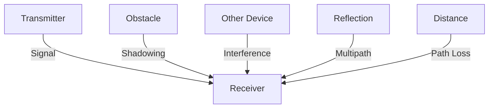
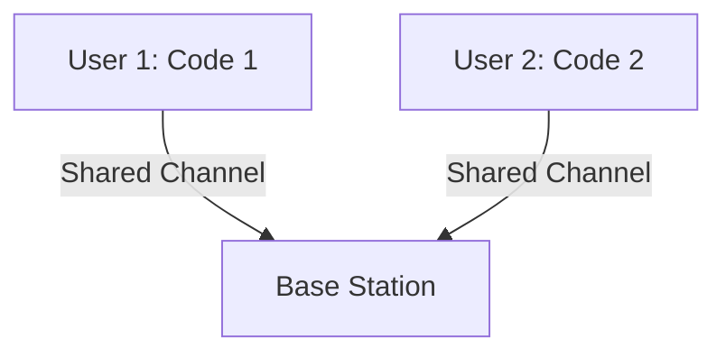

# 7.2 Wireless Links and Network Characteristics

- Wireless links use radio waves for communication.
- **Types:** Infrared, radio, microwave.
- **Impairments:** Path loss, interference, multipath fading, shadowing.

---

## Wireless Link Characteristics: Fading (Attenuation)

### Free Space Path Loss
- **Wireless radio signal attenuates (loses power) as it propagates (free space "path loss")**
- **Free space path loss ~ (fd)²**
  - **f: frequency**
  - **d: distance**
- **Higher frequency or longer distance → larger free space path loss**

### Mathematical Relationship
- **Path loss increases with frequency and distance**
- **Higher frequencies suffer more attenuation**
- **Longer distances result in exponential signal loss**

---

## Wireless Link Characteristics: Multipath

### Multipath Propagation
- **Radio signal reflects off objects ground, built environment, arriving at destination at slightly different times**
- **Line of sight (LOS) path**
- **Reflected paths**

### Coherence Time (Tc)
- **Amount of time bit is present in channel to be received**
- **Influences maximum possible transmission rate, since coherence times cannot overlap**
- **Inversely proportional to:**
  - **Frequency**
  - **Receiver velocity**

### Multipath Effects
- **Transmitted pulses**
- **Received pulse (LOS)**
- **Received multipath pulses**
- **Time-based signal variations**

---

## Wireless Link Characteristics: Noise

### Interference Sources
- **Interference from other sources on wireless network frequencies: motors, appliances**
- **SNR: signal-to-noise ratio**
- **Larger SNR – easier to extract signal from noise (a "good thing")**

### SNR Versus BER Tradeoff
- **Given physical layer: increase power → increase SNR → decrease BER**
- **SNR may change with mobility: dynamically adapt physical layer (modulation technique, rate)**

### Modulation Techniques
- **QAM256 (8 Mbps): High SNR required**
- **QAM16 (4 Mbps): Medium SNR required**
- **BPSK (1 Mbps): Low SNR acceptable**

### SNR vs BER Graph
```
SNR(dB): 10  20  30  40
BER:     10⁻¹ 10⁻² 10⁻³ 10⁻⁴ 10⁻⁵ 10⁻⁶ 10⁻⁷
```

---

## Hidden Terminal Problem

### Problem Description
- **B, A hear each other**
- **B, C hear each other**
- **A, C cannot hear each other means A, C unaware of their interference at B**

### Signal Strength Analysis
- **A's signal strength**
- **C's signal strength**
- **Attenuation also causes "hidden terminals"**

### Impact
- **B, A hear each other**
- **B, C hear each other**
- **A, C cannot hear each other interfering at B**

---

## Code Division Multiple Access (CDMA)

### Overview
- **Unique "code" assigned to each user; i.e., code set partitioning**
- **All users share same frequency, but each user has own "chipping" sequence (i.e., code) to encode data**
- **Allows multiple users to "coexist" and transmit simultaneously with minimal interference (if codes are "orthogonal")**

### Encoding and Decoding
- **Encoding: inner product: (original data) × (chipping sequence)**
- **Decoding: summed inner-product: (encoded data) × (chipping sequence)**

---

## CDMA Encode/Decode Process

### Sender Process
- **Slot 0: d₀ = 1**
- **Slot 1: d₁ = -1**
- **Code sequence: 1,1,1,1,1,-1,-1,-1,-1,-1**
- **Channel output: Zi,m = di × cm**

### Receiver Process
- **Received input processing**
- **Decoding: Di = Σ Zi,m × cm (m=1 to M)**
- **Recovers original data**

### Two-Sender Interference
- **Channel sums together transmissions by sender 1 and 2**
- **Using same code as sender 1, receiver recovers sender 1's original data from summed channel data**

---

## Wireless Link Types
- **Infrared:** Short range, line-of-sight (TV remotes).
- **Radio:** WiFi, Bluetooth, cellular.
- **Microwave:** Long distance, point-to-point (cell towers).

---

## Diagram: Wireless Impairments


---

## Summary Table
| Impairment   | Cause                | Effect         | Solution        |
|-------------|----------------------|---------------|-----------------|
| Path loss   | Distance             | Weak signal   | Increase power  |
| Interference| Other transmitters   | Errors        | CDMA, frequency planning |
| Fading      | Reflections          | Fluctuations  | Diversity, coding |
| Shadowing   | Obstacles            | Blocked signal| Multiple paths  |
| Hidden Terminal | Attenuation      | Collisions     | RTS/CTS         |

---

## Practice Questions
1. **List three types of wireless link impairments.**
2. **What is multipath fading?**
3. **Draw a diagram showing wireless impairments.**
4. **Explain the hidden terminal problem.**
5. **How does CDMA work?**

---

**Exam Tips:**
- Know wireless link types and impairments.
- Be able to draw and explain impairment diagrams.
- Understand SNR vs BER relationship.
- Know CDMA principles and applications.

---

## 7.2.1 CDMA
- **Code Division Multiple Access:** Each user has a unique code; signals overlap in frequency/time.
- **Benefits:** High capacity, resistance to interference.
- **Diagram:**


---

## Summary Table
| Feature      | Description                |
|--------------|----------------------------|
| Attenuation  | Signal loss over distance  |
| Interference | Overlapping signals        |
| CDMA         | Code-based sharing         |
| Multipath    | Signal reflections          |
| Hidden Terminal | Collision detection issues |

---

**Exam Tips:**
- Know wireless link challenges and CDMA basics.
- Be able to draw and explain CDMA diagrams.
- Understand multipath and hidden terminal problems.

---

## More on Wireless Propagation Issues
- **Fading:** Rapid fluctuations in signal strength due to multiple paths.
- **Doppler Shift:** Frequency change due to movement.
- **Co-channel Interference:** Multiple transmitters using the same frequency.

## LTE/EPC Architecture
- **LTE (Long Term Evolution):** 4G cellular standard, all-IP, high data rates.
- **EPC (Evolved Packet Core):** Core network for LTE, handles mobility, authentication, and Internet access. 