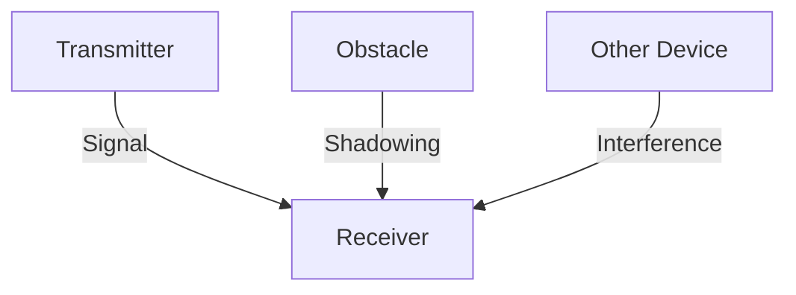
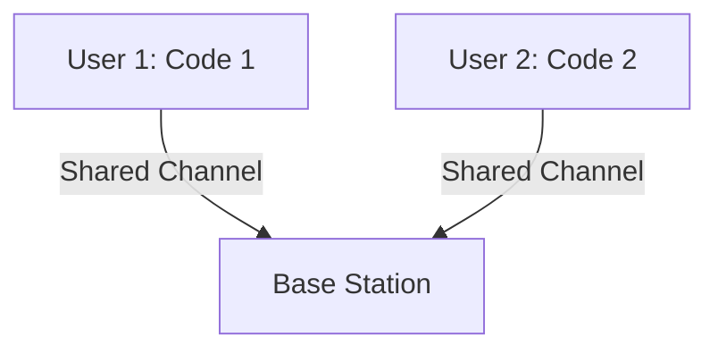

# 7.2 Wireless Links and Network Characteristics

- Wireless links use radio waves for communication.
- **Types:** Infrared, radio, microwave.
- **Impairments:** Path loss, interference, multipath fading, shadowing.

---

## Wireless Link Types
- **Infrared:** Short range, line-of-sight (TV remotes).
- **Radio:** WiFi, Bluetooth, cellular.
- **Microwave:** Long distance, point-to-point (cell towers).

---

## Impairments
- **Path loss:** Signal weakens with distance.
- **Interference:** Other devices disrupt signal.
- **Multipath fading:** Reflections cause signal variation.
- **Shadowing:** Obstacles block signal.

---

## Diagram: Wireless Impairments

---

## Summary Table
| Impairment   | Cause                | Effect         |
|-------------|----------------------|---------------|
| Path loss   | Distance             | Weak signal   |
| Interference| Other transmitters   | Errors        |
| Fading      | Reflections          | Fluctuations  |
| Shadowing   | Obstacles            | Blocked signal|

---

## Practice Questions
1. **List three types of wireless link impairments.**
2. **What is multipath fading?**
3. **Draw a diagram showing wireless impairments.**

---

**Exam Tips:**
- Know wireless link types and impairments.
- Be able to draw and explain impairment diagrams.

---

## 7.2.1 CDMA
- **Code Division Multiple Access:** Each user has a unique code; signals overlap in frequency/time.
- **Benefits:** High capacity, resistance to interference.
- **Diagram:**

---

## Summary Table
| Feature      | Description                |
|--------------|----------------------------|
| Attenuation  | Signal loss over distance  |
| Interference | Overlapping signals        |
| CDMA         | Code-based sharing         |

---

**Exam Tips:**
- Know wireless link challenges and CDMA basics.
- Be able to draw and explain CDMA diagrams.

---

## More on Wireless Propagation Issues
- **Fading:** Rapid fluctuations in signal strength due to multiple paths.
- **Doppler Shift:** Frequency change due to movement.
- **Co-channel Interference:** Multiple transmitters using the same frequency.

## LTE/EPC Architecture
- **LTE (Long Term Evolution):** 4G cellular standard, all-IP, high data rates.
- **EPC (Evolved Packet Core):** Core network for LTE, handles mobility, authentication, and Internet access. 