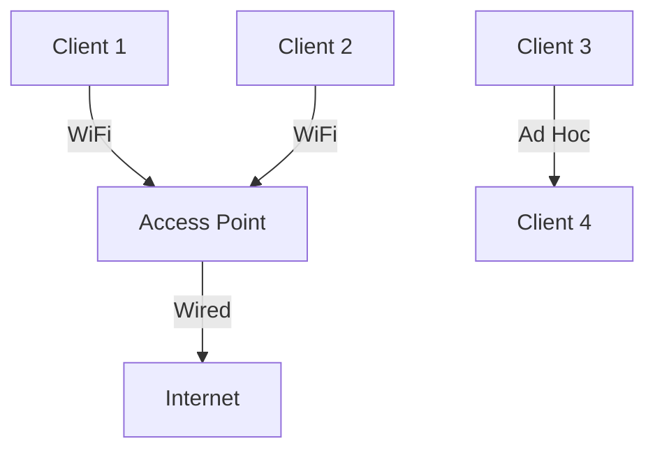
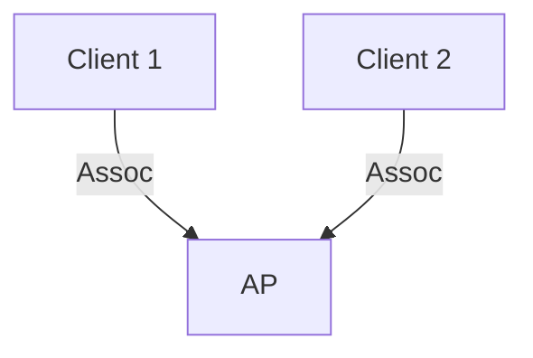

# 7.3 WiFi: 802.11 Wireless LANs

- WiFi (IEEE 802.11) provides wireless connectivity in local areas.
- **Components:** Access points (AP), stations (clients).
- **MAC:** CSMA/CA for medium access.
- **Security:** WPA2/WPA3, encryption.

---

## IEEE 802.11 Wireless LAN Standards

### Evolution of 802.11 Standards
| IEEE 802.11 Standard | Year | Max Data Rate | Range | Frequency |
|---------------------|------|---------------|-------|-----------|
| 802.11b | 1999 | 11 Mbps | 30 m | 2.4 GHz |
| 802.11g | 2003 | 54 Mbps | 30m | 2.4 GHz |
| 802.11n (WiFi 4) | 2009 | 600 Mbps | 70m | 2.4, 5 GHz |
| 802.11ac (WiFi 5) | 2013 | 3.47 Gbps | 70m | 5 GHz |
| 802.11ax (WiFi 6) | 2020 | 14 Gbps | 70m | 2.4, 5 GHz |
| 802.11af | 2014 | 35-560 Mbps | 1 Km | TV bands (54-790 MHz) |
| 802.11ah | 2017 | 347 Mbps | 1 Km | 900 MHz |

### Common Characteristics
- **All use CSMA/CA for multiple access**
- **Have base-station and ad-hoc network versions**

---

## 802.11 LAN Architecture

### Basic Service Set (BSS)
- **Wireless host communicates with base station**
- **Base station = access point (AP)**
- **BSS (aka "cell") in infrastructure mode contains:**
  - **Wireless hosts**
  - **Access point (AP): base station**
- **Ad hoc mode: hosts only**

### Network Layout
- **BSS 1 and BSS 2**
- **Internet connection**
- **Switch or router**

---

## 802.11: Channels

### Frequency Spectrum
- **Spectrum divided into channels at different frequencies**
- **AP admin chooses frequency for AP**
- **Interference possible: channel can be same as that chosen by neighboring AP!**

### Example: 2.4 GHz Band
- **Multiple channels available**
- **Channel overlap can cause interference**
- **Proper channel planning essential**

---

## 802.11: Association

### Association Process
- **Arriving host: must associate with an AP**
- **Scans channels, listening for beacon frames containing AP's name (SSID) and MAC address**
- **Selects AP to associate with**
- **Then may perform authentication [Chapter 8]**
- **Then typically run DHCP to get IP address in AP's subnet**

---

## 802.11: Passive/Active Scanning

### Passive Scanning
1. **Beacon frames sent from APs**
2. **Association Request frame sent: H1 to selected AP**
3. **Association Response frame sent from selected AP to H1**

### Active Scanning
1. **Probe Request frame broadcast from H1**
2. **Probe Response frames sent from APs**
3. **Association Request frame sent: H1 to selected AP**
4. **Association Response frame sent from selected AP to H1**

---

## IEEE 802.11: Multiple Access

### Collision Avoidance
- **Avoid collisions: 2+ nodes transmitting at same time**
- **802.11: CSMA - sense before transmitting**
- **Don't collide with detected ongoing transmission by another node**

### No Collision Detection
- **802.11: no collision detection!**
- **Difficult to sense collisions: high transmitting signal, weak received signal due to fading**
- **Can't sense all collisions in any case: hidden terminal, fading**
- **Goal: avoid collisions: CSMA/CollisionAvoidance**

---

## IEEE 802.11 MAC Protocol: CSMA/CA

### 802.11 Sender
1. **If sense channel idle for DIFS then transmit entire frame (no CD)**
2. **If sense channel busy then start random backoff time**
   - **Timer counts down while channel idle**
   - **Transmit when timer expires**
   - **If no ACK, increase random backoff interval, repeat 2**

### 802.11 Receiver
- **If frame received OK return ACK after SIFS (ACK needed due to hidden terminal problem)**

### Timing
- **DIFS: Distributed Inter-Frame Space**
- **SIFS: Short Inter-Frame Space**
- **Random backoff for collision avoidance**

---

## Avoiding Collisions (More)

### RTS/CTS Exchange
- **Idea: sender "reserves" channel use for data frames using small reservation packets**
- **Sender first transmits small request-to-send (RTS) packet to BS using CSMA**
- **RTSs may still collide with each other (but they're short)**
- **BS broadcasts clear-to-send CTS in response to RTS**
- **CTS heard by all nodes**
- **Sender transmits data frame**
- **Other stations defer transmissions**

---

## Collision Avoidance: RTS-CTS Exchange

### Process Flow
- **AP, A, B involved**
- **RTS(A), RTS(B) - reservation collision**
- **RTS(A), CTS(A) - successful reservation**
- **DATA(A), ACK(A) - data transmission**
- **Other stations defer during transmission**

### Benefits
- **Reduces collision probability**
- **Especially useful for hidden terminal problem**
- **Overhead for small packets**

---

## 802.11 Frame: Addressing

### Frame Structure
- **2 bytes: frame control, duration**
- **6 bytes each: address 1, address 2, address 3, address 4**
- **2 bytes: sequence control**
- **0-2312 bytes: payload**
- **4 bytes: CRC**

### Address Fields
- **Address 1: MAC address of wireless host or AP to receive this frame**
- **Address 2: MAC address of wireless host or AP transmitting this frame**
- **Address 3: MAC address of router interface to which AP is attached**
- **Address 4: used only in ad hoc mode**

---

## 802.11 Frame: Addressing Examples

### Infrastructure Mode
- **Internet → H1 → R1 → AP**
- **802.11 WiFi frame:**
  - **Address 1: AP MAC addr**
  - **Address 2: H1 MAC addr**
  - **Address 3: R1 MAC addr**
- **802.3 Ethernet frame:**
  - **MAC dest addr: H2 MAC addr**
  - **MAC source addr: H1 MAC addr**

### Frame Control Fields
- **Protocol version, type, subtype**
- **To/from AP flags**
- **More fragments, retry, power management**
- **WEP, more data flags**

---

## 802.11: Mobility Within Same Subnet

### Seamless Movement
- **H1 remains in same IP subnet: IP address can remain same**
- **Switch: which AP is associated with H1?**
- **Self-learning (Ch. 6): switch will see frame from H1 and "remember" which switch port can be used to reach H1**

---

## 802.11: Advanced Capabilities

### Rate Adaptation
- **Base station, mobile dynamically change transmission rate (physical layer modulation technique) as mobile moves, SNR varies**
- **Operating point adjustment based on SNR**
- **When SNR decreases, BER increases as node moves away from base station**
- **When BER becomes too high, switch to lower transmission rate but with lower BER**

### Power Management
- **Node-to-AP: "I am going to sleep until next beacon frame"**
- **AP knows not to transmit frames to this node**
- **Node wakes up before next beacon frame**
- **Beacon frame: contains list of mobiles with AP-to-mobile frames waiting to be sent**
- **Node will stay awake if AP-to-mobile frames to be sent; otherwise sleep again until next beacon frame**

---

## Personal Area Networks: Bluetooth

### Overview
- **Less than 10 m diameter**
- **Replacement for cables (mouse, keyboard, headphones)**
- **Ad hoc: no infrastructure**
- **2.4-2.5 GHz ISM radio band, up to 3 Mbps**

### Architecture
- **Master controller / client devices:**
  - **Master polls clients, grants requests for client transmissions**
- **Radius of coverage**
- **C: client device**
- **P: parked device (inactive)**
- **M: master controller**

---

## Personal Area Networks: Bluetooth Details

### Technical Characteristics
- **TDM, 625 μsec sec. slot**
- **FDM: sender uses 79 frequency channels in known, pseudo-random order slot-to-slot (spread spectrum)**
- **Other devices/equipment not in piconet only interfere in some slots**
- **Parked mode: clients can "go to sleep" (park) and later wakeup (to preserve battery)**
- **Bootstrapping: nodes self-assemble (plug and play) into piconet**

### Pandemic + Bluetooth
- **Contact tracing applications**
- **Exposure notification systems**
- **Privacy-preserving proximity detection**

---

## WiFi Architecture
- **Infrastructure mode:** AP connects clients to wired network.
- **Ad hoc mode:** Devices communicate directly.

---

## MAC Protocol
- **CSMA/CA:** Listen before transmit, avoid collisions with backoff.
- **ACKs:** Confirm successful reception.

---

## Security
- **WPA2/WPA3:** Strong encryption, authentication.

---

## Diagram: WiFi Infrastructure

---

## Summary Table
| Feature   | Value         | Details                    |
|-----------|--------------|----------------------------|
| MAC       | CSMA/CA      | Collision avoidance        |
| Security  | WPA2/WPA3    | Strong encryption          |
| Modes     | Infra, Ad hoc| Infrastructure vs peer-to-peer |
| Standards | 802.11a/b/g/n/ac/ax | Evolution over time |

---

## Practice Questions
1. **What is the function of an access point?**
2. **How does CSMA/CA work in WiFi?**
3. **List two WiFi security protocols.**
4. **Explain the RTS/CTS mechanism.**
5. **What is the difference between passive and active scanning?**

---

**Exam Tips:**
- Know WiFi architecture and MAC protocol.
- Be able to draw and explain WiFi diagrams.
- Understand 802.11 frame structure and addressing.
- Know the evolution of 802.11 standards.

---

## 7.3.1 The 802.11 Architecture
- **Access Point (AP):** Central device for wireless clients.
- **BSS/ESS:** Basic/Extended Service Set (single/multiple APs).
- **Diagram:**

---

## 7.3.2 The IEEE 802.11 Frame
- **Fields:** Frame control, duration, addresses, sequence, data, CRC.

---

## 7.3.4 Mobility in the Same IP Subnet
- **Roaming:** Client moves between APs, maintains IP address.

---

## 7.3.5 Advanced Features in 802.11
- **Power saving, QoS, security (WPA2/WPA3).**

---

## 7.3.6 Personal Area Networks: Bluetooth and Zigbee
- **Bluetooth:** Short-range, low-power, PANs.
- **Zigbee:** Low-rate, low-power, IoT devices.

---

## Summary Table
| Feature   | WiFi         | Bluetooth   | Zigbee      |
|-----------|-------------|-------------|-------------|
| Range     | 100m        | 10m         | 10-100m     |
| Use-case  | LAN         | PAN         | IoT         |
| Protocol  | 802.11      | 802.15.1    | 802.15.4    |

---

**Exam Tips:**
- Know WiFi architecture, MAC, and frame format.
- Be able to compare WiFi, Bluetooth, and Zigbee.

---

## More on WiFi Security
- **WPA2:** Uses AES encryption, strong authentication.
- **WPA3:** Improved security, forward secrecy, better protection against brute-force attacks.
- **Authentication Methods:** Pre-shared key (PSK), enterprise (802.1X/EAP).

## 802.11 Frame Structure
- **Fields:** Frame control, duration, address 1/2/3/4, sequence, data, CRC.
- **Control Frames:** Manage access (RTS/CTS, ACK).

## Association and Authentication
- **Association:** Client joins an AP, receives network parameters.
- **Authentication:** Open, WPA2-PSK, WPA3-SAE, or enterprise (802.1X).

## Hidden and Exposed Terminal Problem
- **Hidden Terminal:** Two clients can't sense each other, but collide at AP.
- **Exposed Terminal:** A client refrains from transmitting unnecessarily.

## WiFi 6/6E/7
- **WiFi 6 (802.11ax):** Higher efficiency, OFDMA, MU-MIMO.
- **WiFi 6E:** Adds 6 GHz band.
- **WiFi 7:** Even higher speeds, lower latency (future standard). 