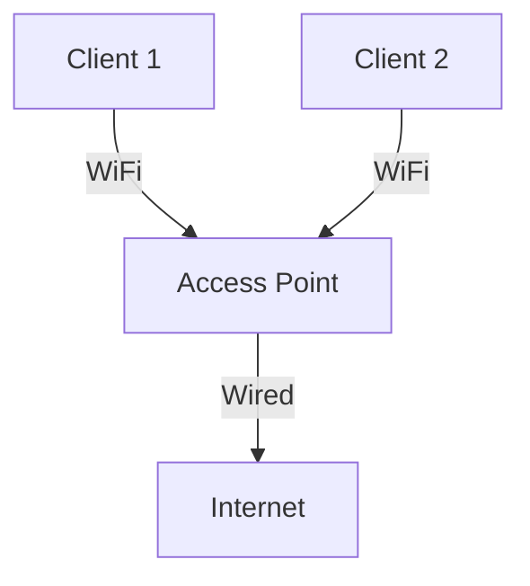
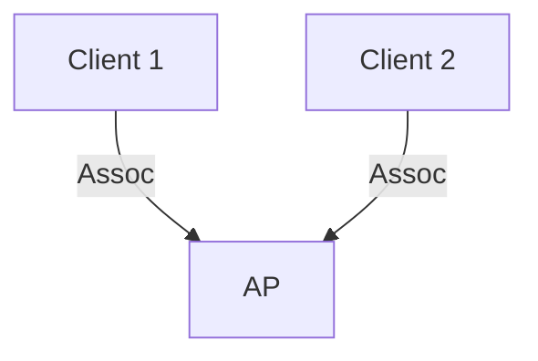

# 7.3 WiFi: 802.11 Wireless LANs

- WiFi (IEEE 802.11) provides wireless connectivity in local areas.
- **Components:** Access points (AP), stations (clients).
- **MAC:** CSMA/CA for medium access.
- **Security:** WPA2/WPA3, encryption.

---

## WiFi Architecture
- **Infrastructure mode:** AP connects clients to wired network.
- **Ad hoc mode:** Devices communicate directly.

---

## MAC Protocol
- **CSMA/CA:** Listen before transmit, avoid collisions with backoff.
- **ACKs:** Confirm successful reception.

---

## Security
- **WPA2/WPA3:** Strong encryption, authentication.

---

## Diagram: WiFi Infrastructure

---

## Summary Table
| Feature   | Value         |
|-----------|--------------|
| MAC       | CSMA/CA      |
| Security  | WPA2/WPA3    |
| Modes     | Infra, Ad hoc|

---

## Practice Questions
1. **What is the function of an access point?**
2. **How does CSMA/CA work in WiFi?**
3. **List two WiFi security protocols.**

---

**Exam Tips:**
- Know WiFi architecture and MAC protocol.
- Be able to draw and explain WiFi diagrams.

---

## 7.3.1 The 802.11 Architecture
- **Access Point (AP):** Central device for wireless clients.
- **BSS/ESS:** Basic/Extended Service Set (single/multiple APs).
- **Diagram:**

---

## 7.3.2 The IEEE 802.11 Frame
- **Fields:** Frame control, duration, addresses, sequence, data, CRC.

---

## 7.3.4 Mobility in the Same IP Subnet
- **Roaming:** Client moves between APs, maintains IP address.

---

## 7.3.5 Advanced Features in 802.11
- **Power saving, QoS, security (WPA2/WPA3).**

---

## 7.3.6 Personal Area Networks: Bluetooth and Zigbee
- **Bluetooth:** Short-range, low-power, PANs.
- **Zigbee:** Low-rate, low-power, IoT devices.

---

## Summary Table
| Feature   | WiFi         | Bluetooth   | Zigbee      |
|-----------|-------------|-------------|-------------|
| Range     | 100m        | 10m         | 10-100m     |
| Use-case  | LAN         | PAN         | IoT         |
| Protocol  | 802.11      | 802.15.1    | 802.15.4    |

---

**Exam Tips:**
- Know WiFi architecture, MAC, and frame format.
- Be able to compare WiFi, Bluetooth, and Zigbee. 