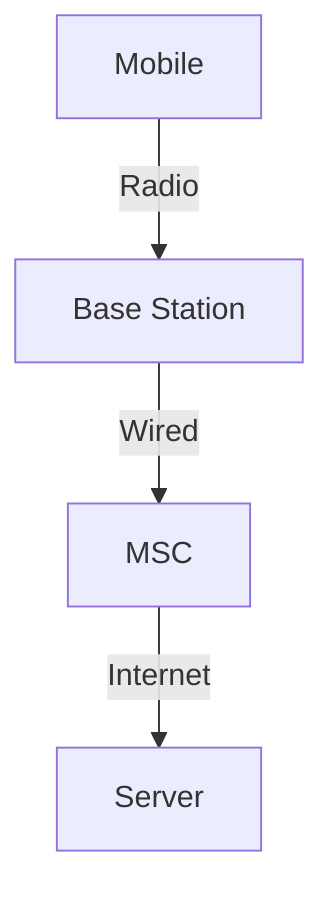
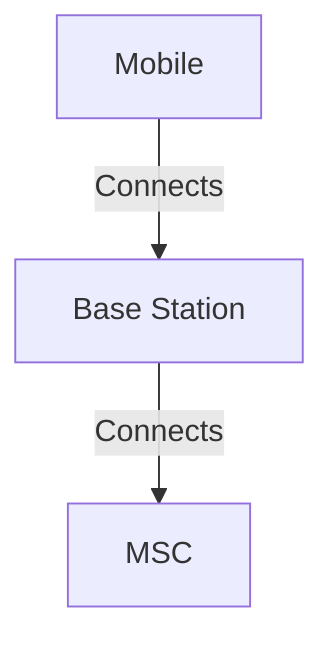

# 7.4 Cellular Internet Access

- Cellular networks provide wide-area wireless connectivity using base stations and cells.
- **Architecture:** Cells, base stations, mobile switching center (MSC).
- **Handoff:** Mobile devices switch cells as they move.

## Cellular Architecture
- **Cells:** Geographic areas covered by base stations.
- **Base station:** Connects mobiles to network.
- **MSC:** Manages calls, mobility, handoff.

## Handoff
- **Hard handoff:** Abrupt switch between cells.
- **Soft handoff:** Overlap, smoother transition (CDMA).

## Diagram: Cellular Network

## Summary Table
| Component | Function           |
|-----------|-------------------|
| Cell      | Coverage area     |
| Base Stn  | Connects mobiles  |
| MSC       | Manages mobility  |

## Practice Questions
1. **What is a cell in cellular networks?**
2. **Describe the handoff process.**
3. **Draw a diagram of cellular architecture.**

**Exam Tips:**
- Know cellular architecture and handoff types.
- Be able to draw and explain cellular diagrams.

## 7.4.1 An Overview of Cellular Network Architecture
- **Cells:** Geographic areas covered by base stations.
- **Handoff:** Mobile moves between cells.
- **MSC:** Mobile Switching Center manages calls/data.
- **Diagram:**

## 7.4.2 3G Cellular Data Networks: Extending the Internet to Cellular Subscribers
- **3G:** Packet-switched data, higher speeds, supports Internet access.

## 7.4.3 On to 4G: LTE
- **4G/LTE:** All-IP, higher data rates, lower latency, supports multimedia.

## Summary Table
| Generation | Key Feature         | Example      |
|------------|--------------------|-------------|
| 3G         | Packet data, Internet| UMTS       |
| 4G/LTE     | All-IP, high speed | LTE         |

**Exam Tips:**
- Know cellular architecture and handoff.
- Be able to compare 3G and 4G/LTE.

## Cellular Generations
- **1G:** Analog voice, low capacity.
- **2G:** Digital voice, SMS, basic data (GSM, CDMA).
- **3G:** Packet data, higher speeds (UMTS, HSPA).
- **4G (LTE):** All-IP, high speed, low latency.
- **5G:** Ultra-high speed, low latency, massive IoT support.

## Handover Types
- **Hard Handover:** Abrupt switch, old connection dropped before new one established.
- **Soft Handover:** Overlap, both connections maintained briefly (CDMA).

## LTE/EPC Architecture
- **EPC (Evolved Packet Core):** Centralized core for LTE, manages mobility, authentication, and Internet access. 