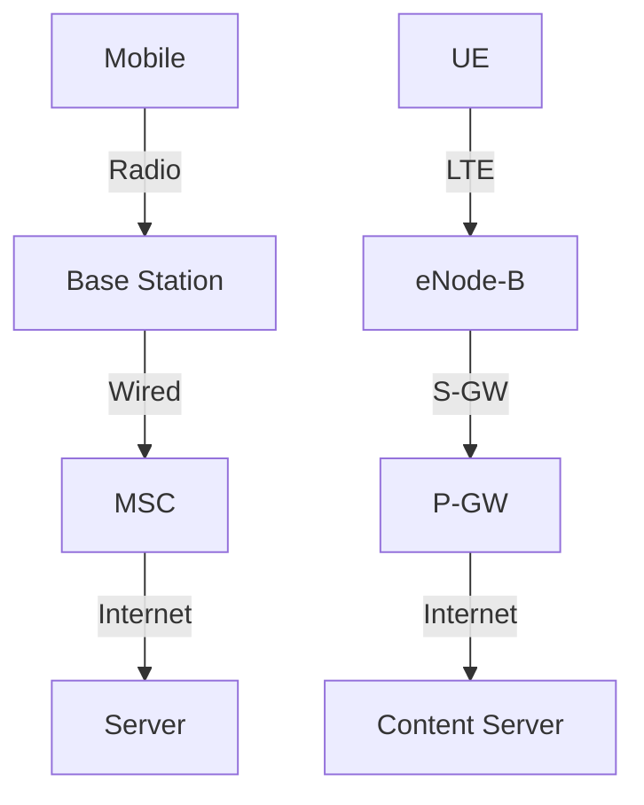
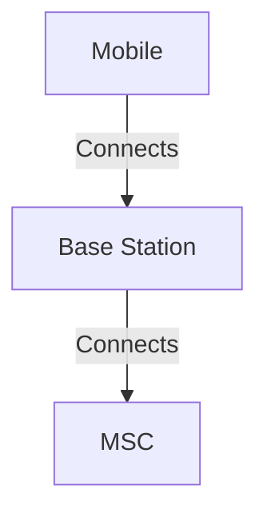

# 7.4 Cellular Internet Access

- Cellular networks provide wide-area wireless connectivity using base stations and cells.
- **Architecture:** Cells, base stations, mobile switching center (MSC).
- **Handoff:** Mobile devices switch cells as they move.

---

## 4G/5G Cellular Networks

### The Solution for Wide-Area Mobile Internet
- **Widespread deployment/use:**
  - **More mobile-broadband-connected devices than fixed-broadband-connected devices (5-1 in 2019)!**
  - **4G availability: 97% of time in Korea (90% in US)**
  - **Transmission rates up to 100's Mbps**
- **Technical standards: 3rd Generation Partnership Project (3GPP)**
- **Website: www.3gpp.org**

### 4G: Long-Term Evolution (LTE) Standard

---

## 4G/5G Cellular Networks: Similarities to Wired Internet

### Common Characteristics
- **Edge/core distinction, but both belong to same carrier**
- **Global cellular network: a network of networks**
- **Widespread use of protocols we've studied: HTTP, DNS, TCP, UDP, IP, NAT, separation of data/control planes, SDN, Ethernet, tunneling**
- **Interconnected to wired Internet**

### Differences from Wired Internet
- **Different wireless link layer**
- **Mobility as a 1st class service**
- **User "identity" (via SIM card)**
- **Business model: users subscribe to a cellular provider**
- **Strong notion of "home network" versus roaming on visited nets**
- **Global access, with authentication infrastructure, and inter-carrier settlements**

---

## Elements of 4G LTE Architecture

### Mobile Device (UE)
- **Smartphone, tablet, laptop, IoT, ... with 4G LTE radio**
- **64-bit International Mobile Subscriber Identity (IMSI), stored on SIM (Subscriber Identity Module) card**
- **LTE jargon: User Equipment (UE)**

### Base Station (eNode-B)
- **At "edge" of carrier's network**
- **Manages wireless radio resources, mobile devices in its coverage area ("cell")**
- **Coordinates device authentication with other elements**
- **Similar to WiFi AP but:**
  - **Active role in user mobility**
  - **Coordinates with nearby base stations to optimize radio use**
- **LTE jargon: eNode-B**

---

## Radio Access Network: 4G Radio

### Connection Process
- **Connects device (UE) to a base station (eNode-B)**
- **Multiple devices connected to each base station**
- **Many different possible frequencies bands, multiple channels in each band**
- **Popular bands: 600, 700, 850, 1500, 1700, 1900, 2100, 2600, 3500 MHz**
- **Separate upstream and downstream channels**

### Sharing 4G Radio Channel Among Users
- **OFDM: Orthogonal Frequency Division Multiplexing**
- **Combination of FDM, TDM**
- **100's Mbps possible per user/device**

---

## OFDMA: Time Division (LTE)

### Physical Resource Block (PRB)
- **Blocks of 7×12=84 resource elements**
- **Unit of transmission scheduling**
- **Time to transmit one OFDM symbol on subcarrier frequency**

### Transmission Time Interval (TTI)
- **1 ms duration**
- **Transmission scheduling example:**
  - **Send to 7 UEs in 7 blocks of REs in one PRB**
  - **UE1, UE2, UE3, UE4, UE5, UE6, UE7**

---

## Elements of 4G LTE Architecture: Core Components

### Home Subscriber Service (HSS)
- **Stores info about mobile devices for which the HSS's network is their "home network"**
- **Works with MME in device authentication**

### Serving Gateway (S-GW), PDN Gateway (P-GW)
- **Lie on data path from mobile to/from Internet**
- **P-GW: gateway to mobile cellular network**
- **Looks like any other internet gateway router**
- **Provides NAT services**
- **Other routers: extensive use of tunneling**

### Mobility Management Entity (MME)
- **Device authentication (device-to-network, network-to-device) coordinated with mobile home network HSS**
- **Mobile device management:**
  - **Device handover between cells**
  - **Tracking/paging device location**
  - **Path (tunneling) setup from mobile device to P-GW**

---

## LTE: Data Plane Control Plane Separation

### Control Plane
- **New protocols for mobility management, security, authentication (later)**
- **MME, HSS coordination**

### Data Plane
- **New protocols at link, physical layers**
- **IP tunnels**
- **Extensive use of tunneling to facilitate mobility**

---

## LTE Data Plane Protocol Stack: First Hop

### Protocol Layers
- **Application**
- **Transport**
- **IP**
- **Packet Data Convergence**
- **Radio Link**
- **Medium Access**
- **Physical**

### LTE Link Layer Protocols
- **Packet Data Convergence: header compression, encryption**
- **Radio Link Control (RLC) Protocol: fragmentation/reassembly, reliable data transfer**
- **Medium Access: requesting, use of radio transmission slots (OFDM)**

---

## LTE Data Plane Protocol Stack: Packet Core

### Tunneling Process
- **Mobile datagram encapsulated using GPRS Tunneling Protocol (GTP), sent inside UDP datagram to S-GW**
- **S-GW re-tunnels datagrams to P-GW**
- **Supporting mobility: only tunneling endpoints change when mobile user moves**

### Protocol Stack
- **GTP-U, UDP, IP, link, Physical layers**

---

## LTE Data Plane: Associating with a BS

### Association Process
1. **BS broadcasts primary synch signal every 5 ms on all frequencies**
   - **BSs from multiple carriers may be broadcasting synch signals**
2. **Mobile finds a primary synch signal, then locates 2nd synch signal on this freq.**
   - **Mobile then finds info broadcast by BS: channel bandwidth, configurations; BS's cellular carrier info**
   - **Mobile may get info from multiple base stations, multiple cellular networks**
3. **Mobile selects which BS to associate with (e.g., preference for home carrier)**
4. **More steps still needed to authenticate, establish state, set up data plane**

---

## LTE Mobiles: Sleep Modes

### Power Conservation
- **As in WiFi, Bluetooth: LTE mobile may put radio to "sleep" to conserve battery:**
  - **Light sleep: after 100's msec of inactivity**
  - **Wake up periodically (100's msec) to check for downstream transmissions**
  - **Deep sleep: after 5-10 secs of inactivity**
  - **Mobile may change cells while deep sleeping – need to re-establish association**

---

## Global Cellular Network: A Network of IP Networks

### Network Structure
- **Visited mobile carrier network**
- **Public Internet and inter-carrier IPX**
- **Home mobile carrier network**
- **Home Subscriber Server in home network**
- **Roaming in visited network**
- **SIM card: global identify info in home network**

### All IP Architecture
- **Carriers interconnect with each other, and public internet at exchange points**
- **Legacy 2G, 3G: not all IP, handled otherwise**
- **Home network HSS: identify & services info, while in home network and roaming**

---

## On to 5G: Motivation

### Industry Verticals
- **Manufacturing, Construction, Transport, Health**
- **Smart communities, Education, Tourism, Agriculture, Finance**
- **K. Schwab, "The Fourth Industrial Revolution," World Economic Forum**

### 5G Use Cases
- **eMBB: Enhanced Mobile Broadband**
- **URLLC: Ultra-reliable and Low Latency Communications**
- **mMTC: massive Machine Type Communications**

---

## On to 5G: Radio

### Goals
- **10x increase in peak bitrate**
- **10x decrease in latency**
- **100x increase in traffic capacity over 4G**

### 5G NR (New Radio)
- **Two frequency bands:**
  - **FR1 (450 MHz–6 GHz)**
  - **FR2 (24 GHz–52 GHz): millimeter wave frequencies**
- **Not backwards-compatible with 4G**
- **MIMO: multiple directional antennae**
- **Millimeter wave frequencies: much higher data rates, but over shorter distances**
- **Pico-cells: cells diameters: 10-100 m**
- **Massive, dense deployment of new base stations required**

---

## 5G: Microservice-Like Architecture

### Evolution from 4G
- **4G mobile core: boxes and protocols**
- **5G: functional elements: communication, computation, data**
- **User control, Mobile Core implemented in "edge" data center (DC)**

### Edge and Core Distribution
- **Far Edge DC, Edge DC, Core DC**
- **Edge Network (Operator A), Edge Network (Operator B)**
- **Global Core**

---

## On to 5G: SDN-Like Architecture

### Control Plane: Resource Control
- **Real-time (< ms)**
- **Near real-time (> ms)**
- **Non real-time (>> ms)**

### User Plane: Resources
- **"Local breakout" within one operator edge/core**
- **Multi-operator end-end edge/core**

---

## On Beyond 5G?

### Evolution Path
- **"6G" not obviously next: "NextG" and "Beyond 5G" heard more often than "6G"**
- **5G on an evolutionary path (like the Internet)**

### Agility and Customization
- **Agility: cloud technologies (SDN) mean new features can be introduced rapidly, deployed continuously**
- **Customization: change can be introduced bottom-up (e.g., by enterprises and edge cloud partners with Private 5G)**
- **No need to wait for standardization**
- **No need to reach agreement (among all incumbent stakeholders)**

---

## Cellular Architecture
- **Cells:** Geographic areas covered by base stations.
- **Base station:** Connects mobiles to network.
- **MSC:** Manages calls, mobility, handoff.

---

## Handoff
- **Hard handoff:** Abrupt switch between cells.
- **Soft handoff:** Overlap, smoother transition (CDMA).

---

## Diagram: Cellular Network

---

## Summary Table
| Component | Function           | 4G/5G Name    |
|-----------|-------------------|---------------|
| Cell      | Coverage area     | Cell          |
| Base Stn  | Connects mobiles  | eNode-B (4G)  |
| MSC       | Manages mobility  | MME (4G)      |
| Gateway   | Internet access   | P-GW (4G)     |

---

## Practice Questions
1. **What is a cell in cellular networks?**
2. **Describe the handoff process.**
3. **Draw a diagram of cellular architecture.**
4. **What are the key differences between 4G and 5G?**
5. **Explain the LTE protocol stack.**

---

**Exam Tips:**
- Know cellular architecture and handoff types.
- Be able to draw and explain cellular diagrams.
- Understand 4G LTE components and protocols.
- Know 5G evolution and key features.

---

## 7.4.1 An Overview of Cellular Network Architecture
- **Cells:** Geographic areas covered by base stations.
- **Handoff:** Mobile moves between cells.
- **MSC:** Mobile Switching Center manages calls/data.
- **Diagram:**

---

## 7.4.2 3G Cellular Data Networks: Extending the Internet to Cellular Subscribers
- **3G:** Packet-switched data, higher speeds, supports Internet access.

---

## 7.4.3 On to 4G: LTE
- **4G/LTE:** All-IP, higher data rates, lower latency, supports multimedia.

---

## Summary Table
| Generation | Key Feature         | Example      | Data Rate    |
|------------|--------------------|-------------|--------------|
| 3G         | Packet data, Internet| UMTS       | 2-14 Mbps    |
| 4G/LTE     | All-IP, high speed | LTE         | 100+ Mbps    |
| 5G         | Ultra-high speed   | 5G NR       | 1+ Gbps      |

---

**Exam Tips:**
- Know cellular architecture and handoff.
- Be able to compare 3G, 4G, and 5G.
- Understand LTE protocol stack and components.

---

## Cellular Generations
- **1G:** Analog voice, low capacity.
- **2G:** Digital voice, SMS, basic data (GSM, CDMA).
- **3G:** Packet data, higher speeds (UMTS, HSPA).
- **4G (LTE):** All-IP, high speed, low latency.
- **5G:** Ultra-high speed, low latency, massive IoT support.

## Handover Types
- **Hard Handover:** Abrupt switch, old connection dropped before new one established.
- **Soft Handover:** Overlap, both connections maintained briefly (CDMA).

## LTE/EPC Architecture
- **EPC (Evolved Packet Core):** Centralized core for LTE, manages mobility, authentication, and Internet access. 