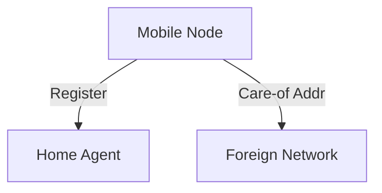

# 7.5 Mobility Management: Principles

- Mobility management enables devices to move across networks while staying connected.
- **Key tasks:** Addressing, location management, handoff.

---

## Addressing
- **Home address:** Permanent, used for identification.
- **Care-of address:** Temporary, used in visited network.

---

## Registration
- **Mobile device registers care-of address with home agent.**

---

## Diagram: Mobility Management

---

## Summary Table
| Concept     | Description                |
|-------------|----------------------------|
| Home Addr   | Permanent, ID              |
| Care-of Addr| Temporary, visited network |
| Registration| Update home agent          |

---

## Practice Questions
1. **What is a care-of address?**
2. **How does registration work in mobility management?**
3. **Draw a diagram of mobility management.**

---

**Exam Tips:**
- Know addressing and registration concepts.
- Be able to draw and explain mobility diagrams. 