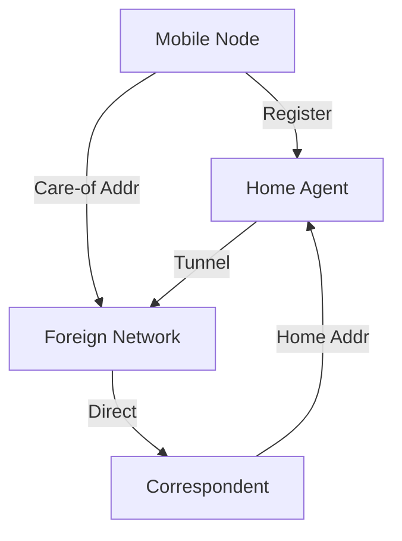

# 7.5 Mobility Management: Principles

- Mobility management enables devices to move across networks while staying connected.
- **Key tasks:** Addressing, location management, handoff.

---

## What is Mobility?

### Spectrum of Mobility, from the Network Perspective

#### No Mobility
- **Device stays in same network**

#### High Mobility
- **Device moves between networks, but powers down while moving**

#### Moderate Mobility
- **Device moves within same AP in one provider network**

#### Complex Mobility
- **Device moves among multiple provider networks, while maintaining ongoing connections**

#### Advanced Mobility
- **Device moves among APs in one provider network**

**We're interested in these complex mobility scenarios!**

---

## Mobility Challenge

### The Core Problem
- **If a device moves from one network to another:**
- **How will the "network" know to forward packets to the new network?**

### Example Scenario
- **Public Internet**
- **AT&T and Verizon networks**
- **Client moves from Verizon to AT&T**
- **Datacenter network**
- **Content provider network**

---

## Mobility Approaches

### Approach 1: Let Network (Routers) Handle It
- **Routers advertise well-known name, address (e.g., permanent 32-bit IP address), or number (e.g., cell #) of visiting mobile node via usual routing table exchange**
- **Internet routing could do this already with no changes!**
- **Routing tables indicate where each mobile located via longest prefix match!**

### Problems with Network-Based Approach
- **Not scalable to billions of mobiles**
- **Would require massive routing table updates**
- **Security and privacy concerns**

---

## Alternative Approach: Let End-Systems Handle It

### Indirect Routing
- **Communication from correspondent to mobile goes through home network, then forwarded to remote mobile**

### Direct Routing
- **Correspondent gets foreign address of mobile, sends directly to mobile**

### Benefits
- **More scalable approach**
- **Leverages existing Internet infrastructure**
- **Better privacy and security**

---

## Contacting a Mobile Friend: Real-World Analogy

### The Problem
- **I wonder where Alice moved to?**
- **Consider friend frequently changing locations, how do you find him/her?**

### Possible Solutions
- **Search all phone books?**
- **Expect her to let you know where he/she is?**
- **Call his/her parents?**
- **Facebook!**

### The Importance of Having a "Home"
- **A definitive source of information about you**
- **A place where people can find out where you are**

---

## Home Network, Visited Network: 4G/5G

### Network Structure
- **Visited mobile carrier network**
- **Public Internet and inter-carrier IPX**
- **Home mobile carrier network**
- **Home Subscriber Server in home network**
- **Roaming in visited network**
- **SIM card: global identify info including home network**

### Home Network
- **(Paid) service plan with cellular provider, e.g., Verizon, Orange**
- **Home network HSS stores identify & services info**

### Visited Network
- **Any network other than your home network**
- **Service agreement with other networks: to provide access to visiting mobile**

---

## Home Network, Visited Network: ISP/WiFi

### ISP/WiFi Characteristics
- **No notion of global "home"**
- **Credentials from ISP (e.g., username, password) stored on device or with user**
- **ISPs may have national, international presence**
- **Different networks: different credentials**
- **Some exceptions (e.g., eduroam)**
- **Architectures exist (mobile IP) for 4G-like mobility, but not used**

---

## Home Network, Visited Network: Generic

### Network Components
- **Home gateway**
- **Home Network (e.g., 128.119/16)**
- **Home network gateway**
- **Permanent IP: 128.119.40.186**
- **IMSI: 78:4f:43:98:d9:27**
- **Visited network gateway**
- **NAT IP: 10.0.0.99**
- **Public or private Internet**
- **Home Subscriber Server**
- **Mobility manager**
- **Correspondent**
- **Visited Network (e.g., 79.129/16)**

---

## Registration: Home Needs to Know Where You Are!

### Registration Process
1. **Mobile associates with visited mobility manager**
2. **Visited mobility manager registers mobile's location with home HSS**

### End Result
- **Visited mobility manager knows about mobile**
- **Home HSS knows location of mobile**

---

## Mobility with Indirect Routing

### Process Flow
1. **Correspondent uses home address as datagram destination address**
2. **Home gateway receives datagram, forwards (tunnels) to remote gateway**
3. **Visited gateway router forwards to mobile**
4. **Visited gateway router forwards reply to correspondent via home network (4a) or directly (4b)**

### Triangle Routing
- **Inefficient when correspondent and mobile are in same network**
- **All traffic goes through home network**

---

## Mobility with Indirect Routing: Comments

### Benefits
- **Mobile moves among visited networks: transparent to correspondent!**
- **Registers in new visited network**
- **New visited network registers with home HSS**
- **Datagrams continue to be forwarded from home network to mobile in new network**
- **On-going (e.g., TCP) connections between correspondent and mobile can be maintained!**

---

## Mobility with Direct Routing

### Process Flow
1. **Correspondent contacts home HSS, gets mobile's visited network**
2. **Correspondent addresses datagram to visited network address**
3. **Visited gateway router forwards to mobile**

### Benefits
- **Overcomes triangle routing inefficiencies**
- **More direct communication path**

### Challenges
- **Non-transparent to correspondent: correspondent must get care-of-address from home agent**
- **What if mobile changes visited network?**
- **Can be handled, but with additional complexity**

---

## Addressing
- **Home address:** Permanent, used for identification.
- **Care-of address:** Temporary, used in visited network.

---

## Registration
- **Mobile device registers care-of address with home agent.**

---

## Diagram: Mobility Management

---

## Summary Table
| Concept     | Description                | Approach     |
|-------------|----------------------------|--------------|
| Home Addr   | Permanent, ID              | Both         |
| Care-of Addr| Temporary, visited network | Both         |
| Registration| Update home agent          | Both         |
| Routing     | Indirect vs Direct         | Choice       |
| Scalability | End-system approach        | Preferred    |

---

## Practice Questions
1. **What is a care-of address?**
2. **How does registration work in mobility management?**
3. **Draw a diagram of mobility management.**
4. **What is the difference between indirect and direct routing?**
5. **Why is the end-system approach preferred over network-based routing?**

---

**Exam Tips:**
- Know addressing and registration concepts.
- Be able to draw and explain mobility diagrams.
- Understand the trade-offs between different mobility approaches.
- Know the importance of home networks in mobility management. 