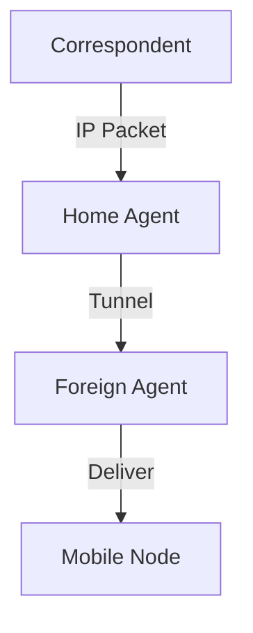

# 7.6 Mobile IP

- Mobile IP allows devices to move between networks while maintaining ongoing connections.
- **Operation:** Uses home agent, foreign agent, tunneling.

---

## Mobile IP Operation
- **Home agent:** Maintains device's home address.
- **Foreign agent:** Provides care-of address in visited network.
- **Tunneling:** Home agent forwards packets to care-of address.

---

## Diagram: Mobile IP Tunneling

---

## Summary Table
| Component      | Function           |
|---------------|--------------------|
| Home Agent    | Maintains address  |
| Foreign Agent | Assigns care-of    |
| Tunnel        | Forwards packets   |

---

## Practice Questions
1. **What is the role of the home agent in Mobile IP?**
2. **How does tunneling work in Mobile IP?**
3. **Draw a diagram of Mobile IP operation.**

---

**Exam Tips:**
- Know Mobile IP operation and tunneling.
- Be able to draw and explain Mobile IP diagrams. 