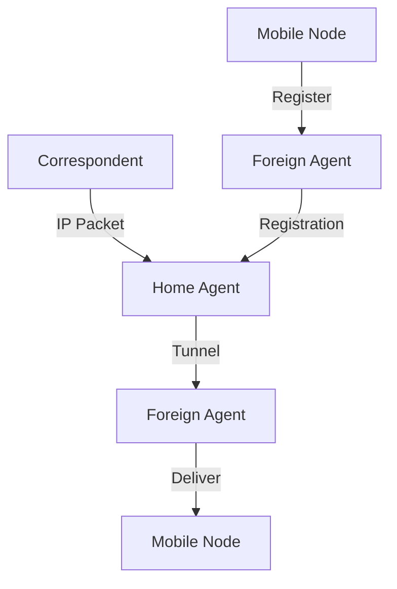

# 7.6 Mobile IP

- Mobile IP allows devices to move between networks while maintaining ongoing connections.
- **Operation:** Uses home agent, foreign agent, tunneling.

---

## Mobile IP: Historical Context

### Development Timeline
- **Mobile IP architecture standardized ~20 years ago [RFC 5944]**
- **Long before ubiquitous smartphones, 4G support for Internet protocols**
- **Did not see wide deployment/use**
- **Perhaps WiFi for Internet, and 2G/3G phones for voice were "good enough" at the time**

### Why Limited Adoption
- **WiFi provided sufficient mobility for most use cases**
- **2G/3G networks focused on voice, not data**
- **Complexity of deployment and configuration**
- **Limited need for IP-level mobility at the time**

---

## Mobile IP Architecture

### Core Components
- **Mobile IP home agent: combined roles of 4G HSS and home P-GW**
- **Mobile IP foreign agent: combined roles of 4G MME and S-GW**
- **Protocols for agent discovery in visited network**
- **Registration of visited location in home network via ICMP extensions**

### Comparison with 4G Approach
- **Mobile IP: Single protocol for all mobility**
- **4G: Separate protocols for different aspects (HSS, MME, P-GW, S-GW)**
- **Mobile IP: More general-purpose**
- **4G: Optimized for cellular networks**

---

## Mobile IP Operation
- **Home agent:** Maintains device's home address.
- **Foreign agent:** Provides care-of address in visited network.
- **Tunneling:** Home agent forwards packets to care-of address.

---

## Diagram: Mobile IP Tunneling

---

## Summary Table
| Component      | Function           | 4G Equivalent    |
|---------------|--------------------|------------------|
| Home Agent    | Maintains address  | HSS + P-GW       |
| Foreign Agent | Assigns care-of    | MME + S-GW       |
| Tunnel        | Forwards packets   | GTP tunneling    |
| Registration  | Location update    | HSS registration |

---

## Practice Questions
1. **What is the role of the home agent in Mobile IP?**
2. **How does tunneling work in Mobile IP?**
3. **Draw a diagram of Mobile IP operation.**
4. **Why did Mobile IP not see widespread adoption?**
5. **How does Mobile IP compare to 4G mobility management?**

---

**Exam Tips:**
- Know Mobile IP operation and tunneling.
- Be able to draw and explain Mobile IP diagrams.
- Understand the historical context and limitations of Mobile IP.
- Compare Mobile IP with 4G mobility approaches.

---

## Triangle Routing in Mobile IP
- **Triangle Routing:** Packets from correspondent node go to home agent, then tunneled to mobile node, causing suboptimal path.
- **Optimization:** Route optimization allows direct delivery after registration.

## Registration Process
- **Mobile node registers care-of address with home agent and foreign agent (if present).**
- **Home agent updates binding for mobile node.**

## Mobile IP vs 4G Mobility
- **Mobile IP: General-purpose IP mobility**
- **4G: Cellular-optimized mobility with specialized components**
- **Mobile IP: Single protocol approach**
- **4G: Multi-protocol, layered approach** 