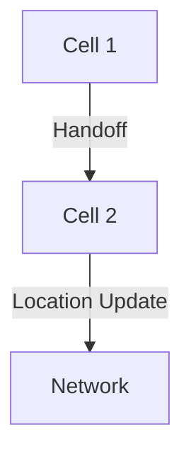

# 7.7 Managing Mobility in Cellular Networks

- Cellular networks manage mobility using handoff and location management.
- **Handoff:** Switch connection as device moves between cells.
- **Location management:** Track device location for call/data delivery.

---

## Handoff Types
- **Hard handoff:** Abrupt switch, possible brief disconnect.
- **Soft handoff:** Overlap, smoother transition (CDMA).

---

## Location Management
- **Paging:** Network locates device for incoming call/data.
- **Registration:** Device updates location with network.

---

## Diagram: Handoff Process

---

## Summary Table
| Concept   | Description                |
|-----------|----------------------------|
| Handoff   | Switch cells, maintain conn|
| Paging    | Find device for delivery   |
| Reg.      | Update location            |

---

## Practice Questions
1. **What is the difference between hard and soft handoff?**
2. **How does location management work?**
3. **Draw a diagram of the handoff process.**

---

**Exam Tips:**
- Know handoff and location management concepts.
- Be able to draw and explain handoff diagrams. 