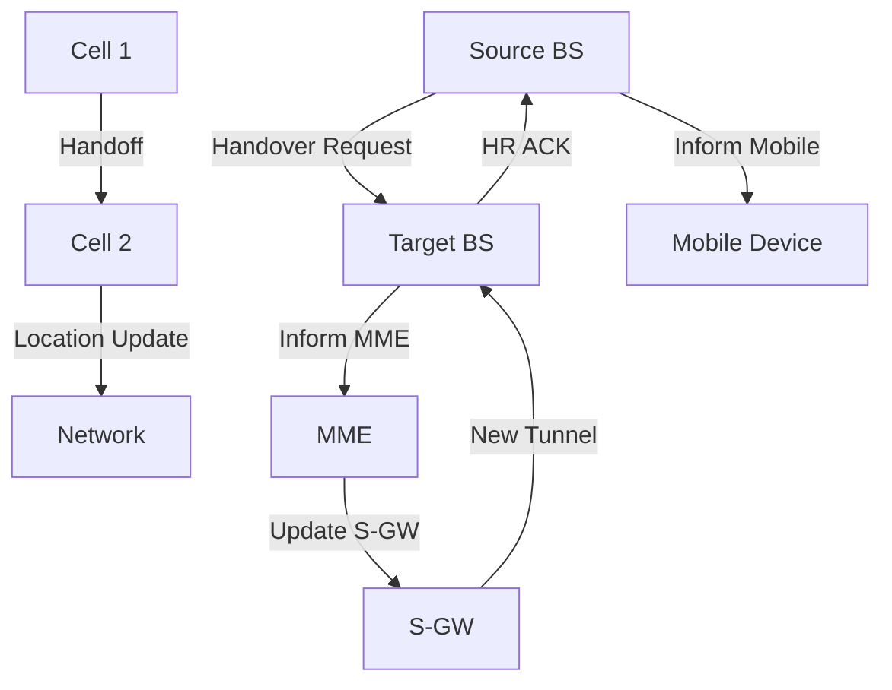

# 7.7 Managing Mobility in Cellular Networks

- Cellular networks manage mobility using handoff and location management.
- **Handoff:** Switch connection as device moves between cells.
- **Location management:** Track device location for call/data delivery.

---

## Mobility in 4G Networks: Major Mobility Tasks

### Overview of Mobility Tasks
1. **Base station association: covered earlier**
2. **Control-plane configuration**
3. **Data-plane configuration**
4. **Mobile handover**

### Network Components
- **Visited network**
- **P-GW (Packet Data Network Gateway)**
- **Streaming server**
- **Home network**
- **Internet**
- **Base station**
- **MME (Mobility Management Entity)**
- **Home Subscriber Server**
- **S-GW (Serving Gateway)**

---

## Base Station Association Process

### Step 1: Base Station Association
- **Mobile provides IMSI – identifying itself, home network**
- **Base station association process**

### Step 2: Control-Plane Configuration
- **MME, home HSS establish control-plane state - mobile is in visited network**

### Step 3: Data-Plane Configuration
- **MME configures forwarding tunnels for mobile**
- **Visited, home network establish tunnels from home P-GW to mobile**

### Step 4: Mobile Handover
- **Mobile device changes its point of attachment to visited network**

---

## Configuring LTE Control-Plane Elements

### Control Plane Setup
- **Mobile communicates with local MME via BS control-plane channel**
- **MME uses mobile's IMSI info to contact mobile's home HSS**
- **Retrieve authentication, encryption, network service information**
- **Home HHS knows mobile now resident in visited network**
- **BS, mobile select parameters for BS-mobile data-plane radio channel**

### Network Components Involved
- **Visited network**
- **P-GW**
- **Home network**
- **Base station**
- **MME**
- **Home Subscriber Server**
- **S-GW**
- **P-GW**
- **Mobility manager**

---

## Configuring Data-Plane Tunnels for Mobile

### Tunnel Configuration
- **S-GW to BS tunnel: when mobile changes base stations, simply change endpoint IP address of tunnel**
- **S-GW to home P-GW tunnel: implementation of indirect routing**
- **Tunneling via GTP (GPRS tunneling protocol): mobile's datagram to streaming server encapsulated using GTP inside UDP, inside datagram**

### Supporting Mobility
- **Only tunneling endpoints change when mobile user moves**
- **Maintains connection continuity**

---

## Handover Between BSs in Same Cellular Network

### Handover Process Steps 1-3
1. **Current (source) BS selects target BS, sends Handover Request message to target BS**
2. **Target BS pre-allocates radio time slots, responds with HR ACK with info for mobile**
3. **Source BS informs mobile of new BS**
   - **Mobile can now send via new BS - handover looks complete to mobile**
4. **Source BS stops sending datagrams to mobile, instead forwards to new BS (who forwards to mobile over radio channel)**

### Network Components
- **P-GW**
- **S-GW**
- **MME**
- **Source BS**
- **Target BS**

---

## Handover Between BSs: Completion Steps

### Steps 4-7
4. **Target BS informs MME that it is new BS for mobile**
5. **MME instructs S-GW to change tunnel endpoint to be (new) target BS**
6. **Target BS ACKs back to source BS: handover complete, source BS can release resources**
7. **Mobile's datagrams now flow through new tunnel from target BS to S-GW**

### Data Path Changes
- **Data path before handover**
- **Data path after handover**

---

## Handoff Types
- **Hard handoff:** Abrupt switch, possible brief disconnect.
- **Soft handoff:** Overlap, smoother transition (CDMA).

---

## Location Management
- **Paging:** Network locates device for incoming call/data.
- **Registration:** Device updates location with network.

---

## Diagram: Handoff Process

---

## Summary Table
| Concept   | Description                | 4G Implementation    |
|-----------|----------------------------|---------------------|
| Handoff   | Switch cells, maintain conn| GTP tunneling       |
| Paging    | Find device for delivery   | MME coordination    |
| Reg.      | Update location            | HSS registration    |
| Control   | Authentication, security   | MME-HSS interaction |
| Data      | Tunneling, forwarding       | GTP-U tunnels       |

---

## Practice Questions
1. **What is the difference between hard and soft handoff?**
2. **How does location management work?**
3. **Draw a diagram of the handoff process.**
4. **What are the four major mobility tasks in 4G networks?**
5. **How does GTP tunneling support mobility?**

---

**Exam Tips:**
- Know handoff and location management concepts.
- Be able to draw and explain handoff diagrams.
- Understand 4G LTE mobility architecture.
- Know the role of MME, HSS, and GTP in mobility management. 