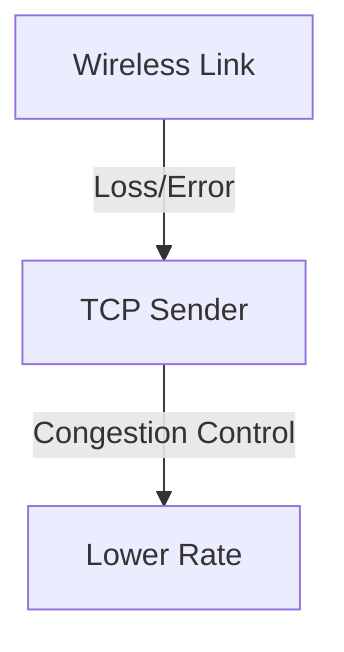

# 7.8 Wireless and Mobility: Impact on Higher-Layer Protocols

- Wireless and mobility affect transport, application, and security protocols.
- Issues: variable delay, loss, handoff, security risks.

---

## Practice Questions
1. **How does mobility affect TCP performance?**
2. **What security risks are unique to wireless networks?**

---

## Summary Table
| Issue      | Impact                    |
|------------|---------------------------|
| Mobility   | Handoffs, variable delay  |
| Wireless   | Loss, interference        |
| Security   | Eavesdropping, spoofing   |

---

**Exam Tips:**
- Know how wireless/mobility impact higher-layer protocols.
- Be able to explain security risks.

# 7.8 Wireless and Mobility Impact on Higher Layer Protocols

- Wireless links have higher error rates and variable delays, affecting TCP/UDP performance.
- **TCP:** May mistake wireless loss for congestion, reduce rate unnecessarily.
- **UDP:** More tolerant of loss, used for real-time apps.

---

## Impact on TCP
- **Loss:** TCP triggers congestion control, lowers throughput.
- **Delay:** Variable, can cause timeouts.
- **Solutions:** Link-layer retransmissions, split connections.

---

## Impact on UDP
- **Loss-tolerant:** Used for voice/video.
- **No congestion control:** Maintains rate.

---

## Diagram: Wireless Impact on TCP

---

## Summary Table
| Protocol | Impact         | Solution           |
|----------|---------------|--------------------|
| TCP      | Loss, delay   | Retransmit, split  |
| UDP      | Loss-tolerant | N/A                |

---

## Practice Questions
1. **How does wireless loss affect TCP?**
2. **Why is UDP preferred for real-time apps?**
3. **Draw a diagram of wireless impact on TCP.**

---

**Exam Tips:**
- Know wireless impact on TCP/UDP.
- Be able to draw and explain impact diagrams. 