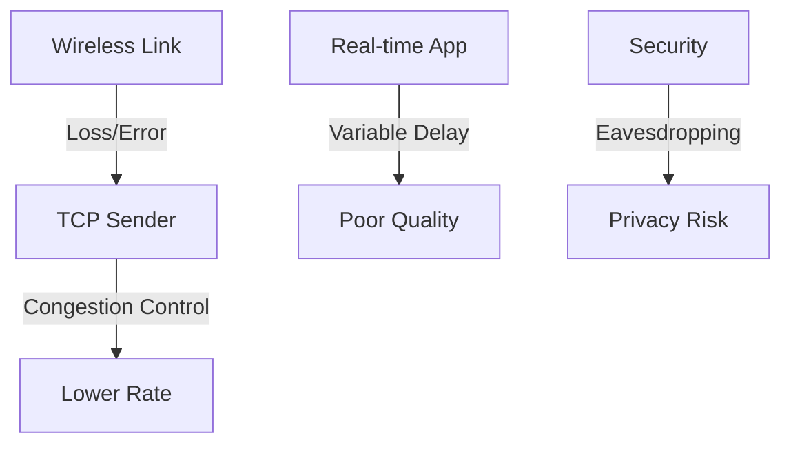

# 7.8 Wireless and Mobility: Impact on Higher-Layer Protocols

- Wireless and mobility affect transport, application, and security protocols.
- Issues: variable delay, loss, handoff, security risks.

---

## Logical Impact Analysis

### Best Effort Service Model
- **Logically, impact should be minimal …**
- **Best effort service model remains unchanged**
- **TCP and UDP can (and do) run over wireless, mobile**

### Performance-Wise Impact
- **… but performance-wise:**
  - **Packet loss/delay due to bit-errors (discarded packets, delays for link-layer retransmissions), and handover loss**
  - **TCP interprets loss as congestion, will decrease congestion window unnecessarily**
  - **Delay impairments for real-time traffic**
  - **Bandwidth a scarce resource for wireless links**

---

## Impact on TCP Performance

### TCP Congestion Control Issues
- **TCP interprets loss as congestion**
- **Will decrease congestion window unnecessarily**
- **Wireless losses are not due to congestion**
- **Results in poor performance on wireless links**

### Solutions for TCP
- **Link-layer retransmissions**
- **Split TCP connections**
- **TCP modifications for wireless**
- **Explicit congestion notification**

---

## Impact on Real-Time Applications

### Delay Impairments
- **Variable delays affect real-time traffic**
- **Voice and video applications sensitive to delay**
- **Jitter can cause playback issues**
- **Handover delays can cause interruptions**

### Bandwidth Constraints
- **Bandwidth a scarce resource for wireless links**
- **Applications must adapt to available bandwidth**
- **Quality of service considerations important**

---

## Impact on Application Layer

### HTTP and Web Applications
- **Variable delays affect web browsing experience**
- **Mobile-optimized websites important**
- **Progressive loading and caching strategies**

### Streaming Applications
- **Adaptive bitrate streaming**
- **Buffering strategies for variable bandwidth**
- **Quality adaptation based on network conditions**

---

## Security Implications

### Wireless Security Risks
- **Eavesdropping on wireless transmissions**
- **Man-in-the-middle attacks**
- **Spoofing of access points**
- **Rogue access points**

### Mobility Security
- **Handover security**
- **Authentication during mobility**
- **Privacy concerns with location tracking**

---

## Practice Questions
1. **How does mobility affect TCP performance?**
2. **What security risks are unique to wireless networks?**
3. **How do real-time applications handle wireless impairments?**
4. **What are the main performance issues with wireless networks?**
5. **How can TCP be optimized for wireless networks?**

---

## Summary Table
| Issue      | Impact                    | Solutions              |
|------------|---------------------------|------------------------|
| Mobility   | Handoffs, variable delay  | Fast handover, buffering|
| Wireless   | Loss, interference        | Retransmission, coding |
| Security   | Eavesdropping, spoofing   | Encryption, authentication|
| TCP        | Congestion control issues | Split connections      |
| Real-time  | Delay, jitter             | Adaptive streaming     |

---

**Exam Tips:**
- Know how wireless/mobility impact higher-layer protocols.
- Be able to explain security risks.
- Understand TCP performance issues on wireless.
- Know solutions for wireless network challenges.

---

# 7.8 Wireless and Mobility Impact on Higher Layer Protocols

- Wireless links have higher error rates and variable delays, affecting TCP/UDP performance.
- **TCP:** May mistake wireless loss for congestion, reduce rate unnecessarily.
- **UDP:** More tolerant of loss, used for real-time apps.

---

## Impact on TCP
- **Loss:** TCP triggers congestion control, lowers throughput.
- **Delay:** Variable, can cause timeouts.
- **Solutions:** Link-layer retransmissions, split connections.

---

## Impact on UDP
- **Loss-tolerant:** Used for voice/video.
- **No congestion control:** Maintains rate.

---

## Diagram: Wireless Impact on TCP

---

## Summary Table
| Protocol | Impact         | Solution           | Application    |
|----------|---------------|--------------------|----------------|
| TCP      | Loss, delay   | Retransmit, split  | Web, email    |
| UDP      | Loss-tolerant | N/A                | Voice, video   |
| HTTP     | Variable delay| Mobile optimization| Web browsing  |
| Security | Eavesdropping | Encryption         | All protocols  |

---

## Practice Questions
1. **How does wireless loss affect TCP?**
2. **Why is UDP preferred for real-time apps?**
3. **Draw a diagram of wireless impact on TCP.**
4. **What security measures are needed for wireless networks?**
5. **How do applications adapt to wireless network conditions?**

---

**Exam Tips:**
- Know wireless impact on TCP/UDP.
- Be able to draw and explain impact diagrams.
- Understand security implications of wireless networks.
- Know adaptation strategies for wireless applications. 