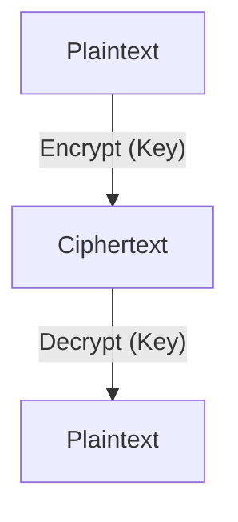
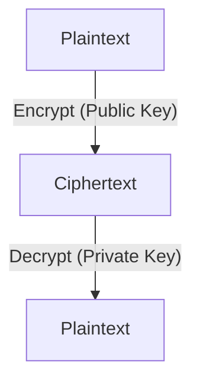

# 8.2 Principles of Cryptography

- Cryptography secures data by transforming it into unreadable form (encryption).
- Two main types: symmetric key and public key (asymmetric) cryptography.

---

## The Language of Cryptography

### Basic Notation
- **m: plaintext message**
- **KA(m): ciphertext, encrypted with key KA**
- **m = KB(KA(m)): decryption process**

### Encryption/Decryption Process
- **Plaintext → Encryption Algorithm (with Alice's encryption key) → Ciphertext**
- **Ciphertext → Decryption Algorithm (with Bob's decryption key) → Plaintext**

---

## Breaking an Encryption Scheme

### Three Types of Attacks

#### 1. Cipher-Text Only Attack
- **Trudy has ciphertext she can analyze**
- **Two approaches:**
  - **Brute force: search through all keys**
  - **Statistical analysis**

#### 2. Known-Plaintext Attack
- **Trudy has plaintext corresponding to ciphertext**
- **Example: in monoalphabetic cipher, Trudy determines pairings for a,l,i,c,e,b,o**

#### 3. Chosen-Plaintext Attack
- **Trudy can get ciphertext for chosen plaintext**

---

## Symmetric Key Cryptography

### Basic Concept
- **Bob and Alice share same (symmetric) key: K**
- **Same key used for both encryption and decryption**
- **Example: key is knowing substitution pattern in monoalphabetic substitution cipher**

### Key Distribution Challenge
- **Q: how do Bob and Alice agree on key value?**
- **This is the fundamental challenge of symmetric key cryptography**

---

## Simple Encryption Scheme

### Substitution Cipher
- **Substituting one thing for another**
- **Monoalphabetic cipher: substitute one letter for another**

### Example
- **Plaintext: abcdefghijklmnopqrstuvwxyz**
- **Ciphertext: mnbvcxzasdfghjklpoiuytrewq**
- **Plaintext: bob. i love you. alice**
- **Ciphertext: nkn. s gktc wky. mgsbc**

### Encryption Key
- **Mapping from set of 26 letters to set of 26 letters**

---

## A More Sophisticated Encryption Approach

### Multiple Substitution Ciphers
- **n substitution ciphers, M1,M2,…,Mn**
- **Cycling pattern: e.g., n=4: M1,M3,M4,M3,M2; M1,M3,M4,M3,M2; ..**
- **For each new plaintext symbol, use subsequent substitution pattern in cyclic pattern**
- **Example: dog: d from M1, o from M3, g from M4**

### Encryption Key
- **n substitution ciphers, and cyclic pattern**
- **Key need not be just n-bit pattern**

---

## Symmetric Key Crypto: DES

### DES: Data Encryption Standard
- **US encryption standard [NIST 1993]**
- **56-bit symmetric key, 64-bit plaintext input**
- **Block cipher with cipher block chaining**

### Security Assessment
- **How secure is DES?**
- **DES Challenge: 56-bit-key-encrypted phrase decrypted (brute force) in less than a day**
- **No known good analytic attack**

### Making DES More Secure
- **3DES: encrypt 3 times with 3 different keys**
- **AES: Advanced Encryption Standard**

---

## AES: Advanced Encryption Standard

### Characteristics
- **Symmetric-key NIST standard, replaced DES (Nov 2001)**
- **Processes data in 128 bit blocks**
- **128, 192, or 256 bit keys**

### Security Comparison
- **Brute force decryption (try each key) taking 1 sec on DES, takes 149 trillion years for AES**

---

## Public Key Cryptography

### Fundamental Difference
- **Symmetric key crypto: requires sender, receiver know shared secret key**
- **Q: how to agree on key in first place (particularly if never "met")?**

### Public Key Approach
- **Radically different approach [Diffie-Hellman76, RSA78]**
- **Sender, receiver do not share secret key**
- **Public encryption key known to all**
- **Private decryption key known only to receiver**

### Revolutionary Impact
- **Wow - public key cryptography revolutionized 2000-year-old (previously only symmetric key) cryptography!**
- **Similar ideas emerged at roughly same time, independently in US and UK (classified)**

---

## Public Key Cryptography Process

### Encryption/Decryption
- **m = KB+(KB-(m))**
- **Plaintext → Encryption Algorithm (Bob's public key) → Ciphertext**
- **Ciphertext → Decryption Algorithm (Bob's private key) → Plaintext**

### Key Properties
- **Bob's public key (KB+)**
- **Bob's private key (KB-)**

---

## Public Key Encryption Algorithms

### Requirements
1. **Need KB+( ) and KB-( ) such that KB-(KB+(m)) = m**
2. **Given public key KB+, it should be impossible to compute private key KB-**

### RSA Algorithm
- **Rivest, Shamir, Adelson algorithm**

---

## Prerequisite: Modular Arithmetic

### Basic Operations
- **x mod n = remainder of x when divide by n**

### Facts
- **[(a mod n) + (b mod n)] mod n = (a+b) mod n**
- **[(a mod n) - (b mod n)] mod n = (a-b) mod n**
- **[(a mod n) * (b mod n)] mod n = (a*b) mod n**
- **Thus (a mod n)d mod n = ad mod n**

### Example
- **x=14, n=10, d=2:**
- **(x mod n)d mod n = 42 mod 10 = 6**
- **xd = 142 = 196 xd mod 10 = 6**

---

## RSA: Getting Ready

### Message Representation
- **Message: just a bit pattern**
- **Bit pattern can be uniquely represented by an integer number**
- **Thus, encrypting a message is equivalent to encrypting a number**

### Example
- **m= 10010001. This message is uniquely represented by the decimal number 145.**
- **To encrypt m, we encrypt the corresponding number, which gives a new number (the ciphertext).**

---

## RSA: Creating Public/Private Key Pair

### Step-by-Step Process
1. **Choose two large prime numbers p, q. (e.g., 1024 bits each)**
2. **Compute n = pq, z = (p-1)(q-1)**
3. **Choose e (with e<n) that has no common factors with z (e, z are "relatively prime").**
4. **Choose d such that ed-1 is exactly divisible by z. (in other words: ed mod z = 1).**
5. **Public key is (n,e). Private key is (n,d).**

### Key Notation
- **KB+ = (n,e)**
- **KB- = (n,d)**

---

## RSA: Encryption, Decryption

### Process
1. **Given (n,e) and (n,d) as computed above**
2. **To encrypt message m (<n), compute c = me mod n**
3. **To decrypt received bit pattern, c, compute m = cd mod n**

### Mathematical Magic
- **m = (me mod n)d mod n**
- **Magic happens!**

---

## RSA Example

### Key Generation
- **Bob chooses p=5, q=7. Then n=35, z=24.**
- **e=5 (so e, z relatively prime).**
- **d=29 (so ed-1 exactly divisible by z).**

### Encryption
- **Bit pattern m: 0000l000**
- **m: 12**
- **me: 24832**
- **c = me mod n: 17**

### Decryption
- **c: 17**
- **cd: 481968572106750915091411825223071697**
- **m = cd mod n: 12**

---

## Why Does RSA Work?

### Mathematical Proof
- **Must show that cd mod n = m, where c = me mod n**
- **Fact: for any x and y: xy mod n = x(y mod z) mod n where n= pq and z = (p-1)(q-1)**
- **Thus, cd mod n = (me mod n)d mod n = med mod n = m(ed mod z) mod n = m1 mod n = m**

---

## RSA: Another Important Property

### Commutative Property
- **KB-(KB+(m)) = m**
- **KB+(KB-(m)) = m**
- **Use public key first, followed by private key**
- **Use private key first, followed by public key**
- **Result is the same!**

### Mathematical Basis
- **Follows directly from modular arithmetic:**
- **(me mod n)d mod n = med mod n = mde mod n = (md mod n)e mod n**

---

## Why Is RSA Secure?

### Security Basis
- **Suppose you know Bob's public key (n,e). How hard is it to determine d?**
- **Essentially need to find factors of n without knowing the two factors p and q**
- **Fact: factoring a big number is hard**

---

## RSA in Practice: Session Keys

### Performance Consideration
- **Exponentiation in RSA is computationally intensive**
- **DES is at least 100 times faster than RSA**

### Hybrid Approach
- **Use public key crypto to establish secure connection, then establish second key – symmetric session key – for encrypting data**
- **Session key, KS**
- **Bob and Alice use RSA to exchange a symmetric session key KS**
- **Once both have KS, they use symmetric key cryptography**

---

## 8.2.1 Symmetric Key Cryptography
- **Same key for encryption and decryption.**
- **Examples:** AES, DES.
- **Fast, but key distribution is a challenge.**
- **Diagram:**

---

## 8.2.2 Public Key Encryption
- **Uses a public/private key pair.**
- **Public key encrypts, private key decrypts.**
- **Examples:** RSA, ECC.
- **Solves key distribution problem, but slower.**
- **Diagram:**

---

## More Cryptographic Protocols
- **Diffie-Hellman:** Secure key exchange over insecure channels.
- **ECC (Elliptic Curve Cryptography):** Efficient public key cryptography, strong security with smaller keys.

## Block vs. Stream Ciphers
- **Block Cipher:** Encrypts fixed-size blocks (e.g., AES, DES).
- **Stream Cipher:** Encrypts data one bit/byte at a time (e.g., RC4).

| Cipher Type | Example | Block Size | Use Case         |
|-------------|---------|------------|-----------------|
| Block       | AES     | 128 bits   | File encryption |
| Stream      | RC4     | 1 bit/byte | Network streams |

---

## Practice Questions
1. **What is the main difference between symmetric and public key cryptography?**
2. **Give an example of a symmetric and a public key algorithm.**
3. **Explain the three types of attacks on encryption schemes.**
4. **How does RSA key generation work?**
5. **Why is RSA secure?**

---

## Summary Table
| Type        | Key Use         | Example | Security Basis    |
|-------------|-----------------|---------|-------------------|
| Symmetric   | Same key        | AES     | Key secrecy       |
| Public Key  | Key pair        | RSA     | Factoring problem |

---

**Exam Tips:**
- Know the difference between symmetric and public key cryptography.
- Be able to draw and explain encryption diagrams.
- Understand RSA key generation and encryption/decryption process.
- Know the security basis of different cryptographic algorithms. 