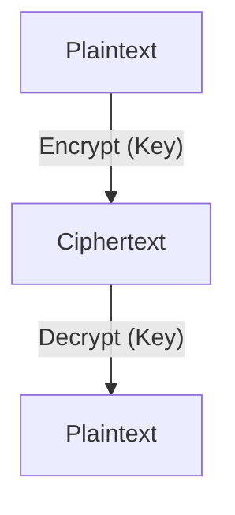
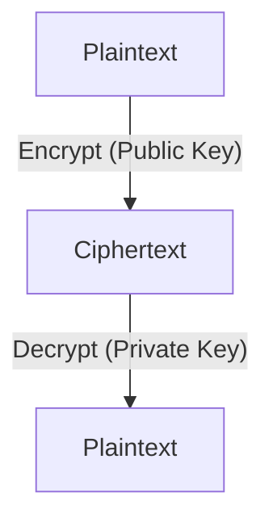

# 8.2 Principles of Cryptography

- Cryptography secures data by transforming it into unreadable form (encryption).
- Two main types: symmetric key and public key (asymmetric) cryptography.

---

## 8.2.1 Symmetric Key Cryptography
- **Same key for encryption and decryption.**
- **Examples:** AES, DES.
- **Fast, but key distribution is a challenge.**
- **Diagram:**

---

## 8.2.2 Public Key Encryption
- **Uses a public/private key pair.**
- **Public key encrypts, private key decrypts.**
- **Examples:** RSA, ECC.
- **Solves key distribution problem, but slower.**
- **Diagram:**

---

## More Cryptographic Protocols
- **Diffie-Hellman:** Secure key exchange over insecure channels.
- **ECC (Elliptic Curve Cryptography):** Efficient public key cryptography, strong security with smaller keys.

## Block vs. Stream Ciphers
- **Block Cipher:** Encrypts fixed-size blocks (e.g., AES, DES).
- **Stream Cipher:** Encrypts data one bit/byte at a time (e.g., RC4).

| Cipher Type | Example | Block Size | Use Case         |
|-------------|---------|------------|-----------------|
| Block       | AES     | 128 bits   | File encryption |
| Stream      | RC4     | 1 bit/byte | Network streams |

---

## Practice Questions
1. **What is the main difference between symmetric and public key cryptography?**
2. **Give an example of a symmetric and a public key algorithm.**

---

## Summary Table
| Type        | Key Use         | Example |
|-------------|-----------------|---------|
| Symmetric   | Same key        | AES     |
| Public Key  | Key pair        | RSA     |

---

**Exam Tips:**
- Know the difference between symmetric and public key cryptography.
- Be able to draw and explain encryption diagrams. 