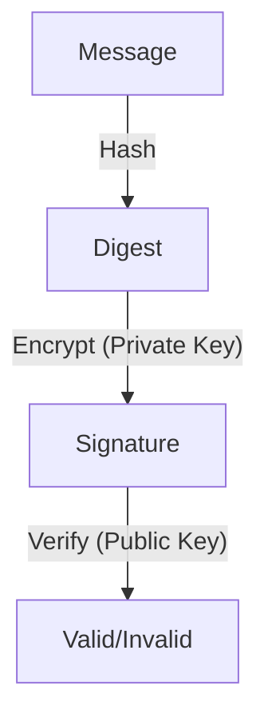

# 8.3 Message Integrity and Digital Signatures

- Message integrity ensures data is not altered in transit.
- Digital signatures provide authentication and non-repudiation.

---

## 8.3.1 Cryptographic Hash Functions
- **Hash function:** Maps data to fixed-size value (digest).
- **Properties:** One-way, collision-resistant.
- **Examples:** SHA-256, MD5.

---

## 8.3.2 Message Authentication Code
- **MAC:** Uses secret key and hash to verify message integrity.
- **Used in:** TLS, IPsec.

---

## 8.3.3 Digital Signatures
- **Created with sender's private key, verified with public key.**
- **Provides:** Authentication, integrity, non-repudiation.
- **Diagram:**

---

## Practice Questions
1. **What is a cryptographic hash function?**
2. **How does a digital signature work?**
3. **What is the purpose of a MAC?**

---

## Summary Table
| Concept   | Purpose                | Example      |
|-----------|------------------------|--------------|
| Hash      | Integrity              | SHA-256      |
| MAC       | Integrity, auth        | HMAC         |
| Signature | Auth, non-repudiation  | RSA, DSA     |

---

**Exam Tips:**
- Know hash, MAC, and signature differences.
- Be able to draw signature verification diagrams.

---

## PKI and Certificates
- **PKI (Public Key Infrastructure):** System for managing public keys and certificates.
- **Certificate Authority (CA):** Trusted entity that issues digital certificates.
- **Chain of Trust:** Certificates are validated up to a trusted root CA.
- **Certificate Revocation:** Certificates can be revoked if compromised (CRL, OCSP). 