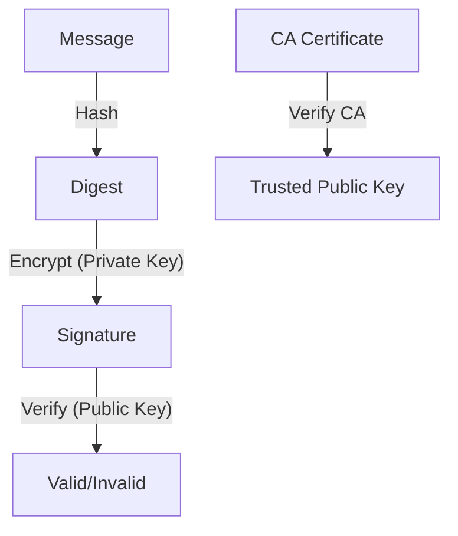

# 8.3 Message Integrity and Digital Signatures

- Message integrity ensures data is not altered in transit.
- Digital signatures provide authentication and non-repudiation.

---

## Authentication

### Goal
- **Bob wants Alice to "prove" her identity to him**

### Protocol ap1.0: Alice says "I am Alice"
- **Failure scenario: In a network, Bob cannot "see" Alice, so Trudy simply declares herself to be Alice**

---

## Authentication: Another Try

### Protocol ap2.0: Alice says "I am Alice" in an IP packet containing her source IP address
- **Failure scenario: Trudy can create a packet "spoofing" Alice's address**

---

## Authentication: A Third Try

### Protocol ap3.0: Alice says "I am Alice" and sends her secret password to "prove" it.
- **Failure scenario: Playback attack**
  - **Trudy records Alice's packet and later plays it back to Bob**

---

## Authentication: A Modified Third Try

### Protocol ap3.0: Alice says "I am Alice" and sends her encrypted secret password to "prove" it.
- **Failure scenario: Playback attack still works**
  - **Trudy records Alice's packet and later plays it back to Bob**

---

## Authentication: A Fourth Try

### Protocol ap4.0: To prove Alice "live", Bob sends Alice nonce, R
- **Alice must return R, encrypted with shared secret key**
- **Nonce: number (R) used only once-in-a-lifetime**
- **Result: Bob knows Alice is live, and only Alice knows key to encrypt nonce, so it must be Alice!**

---

## Authentication: ap5.0

### Public Key Approach
- **ap4.0 requires shared symmetric key - can we authenticate using public key techniques?**
- **ap5.0: use nonce, public key cryptography**

### Process
1. **"I am Alice"**
2. **"Send me your public key"**
3. **Bob computes KA+(KA-(R)) = R**
4. **Bob knows only Alice could have the private key, that encrypted R such that KA+(KA-(R)) = R**

---

## Authentication: ap5.0 – There's Still a Flaw!

### Man-in-the-Middle Attack
- **Trudy poses as Alice (to Bob) and as Bob (to Alice)**

### Attack Process
1. **Trudy intercepts "I am Alice" and "Send me your public key"**
2. **Trudy sends her own public key to Bob**
3. **Bob sends R to "Alice" (actually Trudy)**
4. **Trudy encrypts R with her private key**
5. **Bob computes KT+(KT-(R)) = R, authenticating Trudy as Alice**
6. **Bob sends personal message m to "Alice"**
7. **Trudy recovers Bob's m and can read it**

---

## Digital Signatures

### Basic Concept
- **Cryptographic technique analogous to hand-written signatures**
- **Sender (Bob) digitally signs document: he is document owner/creator**
- **Verifiable, nonforgeable: recipient (Alice) can prove to someone that Bob, and no one else (including Alice), must have signed document**

### Simple Digital Signature
- **Bob signs m by encrypting with his private key KB-, creating "signed" message, KB-(m)**

---

## Digital Signatures: Verification

### Alice's Verification Process
- **Alice receives msg m, with signature: m, KB-(m)**
- **Alice verifies m signed by Bob by applying Bob's public key KB+ to KB-(m)**
- **Then checks KB+(KB-(m)) = m**
- **If KB+(KB-(m)) = m, whoever signed m must have used Bob's private key**

### Properties Verified
- **Bob signed m**
- **No one else signed m**
- **Bob signed m and not m'**

### Non-repudiation
- **Alice can take m, and signature KB-(m) to court and prove that Bob signed m**

---

## Message Digests

### Hash Function Properties
- **Many-to-1**
- **Produces fixed-size msg digest (fingerprint)**
- **Given message digest x, computationally infeasible to find m such that x = H(m)**

### Goal
- **Fixed-length, easy-to-compute digital "fingerprint"**
- **Apply hash function H to m, get fixed size message digest, H(m)**
- **Computationally expensive to public-key-encrypt long messages**

---

## Internet Checksum: Poor Crypto Hash Function

### Internet Checksum Properties
- **Produces fixed length digest (16-bit sum) of message**
- **Is many-to-one**
- **But given message with given hash value, it is easy to find another message with same hash value**

### Example
- **"I O U 1 0 0 . 9 9 B O B" → B2 C1 D2 AC**
- **"I O U 9 0 0 . 1 9 B O B" → B2 C1 D2 AC**
- **Different messages but identical checksums!**

---

## Digital Signature = Signed Message Digest

### Bob's Process
- **Large message m → Hash Function H → H(m)**
- **H(m) → Bob's private key KB- → KB-(H(m)) (encrypted message digest)**
- **Bob sends digitally signed message**

### Alice's Verification Process
- **Large message m → Hash Function H → H(m)**
- **KB-(H(m)) → Bob's public key KB+ → H(m)**
- **Compare H(m) values**

---

## Hash Function Algorithms

### MD5
- **MD5 hash function widely used (RFC 1321)**
- **Computes 128-bit message digest in 4-step process**
- **Arbitrary 128-bit string x, appears difficult to construct msg m whose MD5 hash is equal to x**

### SHA-1
- **US standard [NIST, FIPS PUB 180-1]**
- **160-bit message digest**

---

## Authentication: ap5.0 – Let's Fix It!!

### The Problem
- **Recall the problem: Trudy poses as Alice (to Bob) and as Bob (to Alice)**
- **Need for certified public keys**

---

## Need for Certified Public Keys

### Motivation: Trudy Plays Pizza Prank on Bob
1. **Trudy creates e-mail order: "Dear Pizza Store, Please deliver to me four pepperoni pizzas. Thank you, Bob"**
2. **Trudy signs order with her private key**
3. **Trudy sends order to Pizza Store**
4. **Trudy sends to Pizza Store her public key, but says it's Bob's public key**
5. **Pizza Store verifies signature; then delivers four pepperoni pizzas to Bob**
6. **Bob doesn't even like pepperoni**

---

## Public Key Certification Authorities (CA)

### CA Function
- **Certification authority (CA): binds public key to particular entity, E**
- **Entity (person, website, router) registers its public key with CA**
- **Provides "proof of identity" to CA**
- **CA creates certificate binding identity E to E's public key**

### Certificate Creation
- **Certificate containing E's public key digitally signed by CA: CA says "this is E's public key"**
- **Bob's identifying information + Bob's public key KB+ → CA's private key KCA- → Certificate for Bob's public key, signed by CA**

---

## Public Key Certification Authorities (CA): Verification

### When Alice Wants Bob's Public Key
1. **Gets Bob's certificate (Bob or elsewhere)**
2. **Apply CA's public key to Bob's certificate, get Bob's public key**
3. **CA's public key KCA+ → Digital signature (decrypt) → Bob's public key KB+**

---

## 8.3.1 Cryptographic Hash Functions
- **Hash function:** Maps data to fixed-size value (digest).
- **Properties:** One-way, collision-resistant.
- **Examples:** SHA-256, MD5.

---

## 8.3.2 Message Authentication Code
- **MAC:** Uses secret key and hash to verify message integrity.
- **Used in:** TLS, IPsec.

---

## 8.3.3 Digital Signatures
- **Created with sender's private key, verified with public key.**
- **Provides:** Authentication, integrity, non-repudiation.
- **Diagram:**

---

## Practice Questions
1. **What is a cryptographic hash function?**
2. **How does a digital signature work?**
3. **What is the purpose of a MAC?**
4. **What is the man-in-the-middle attack in authentication?**
5. **How do certificate authorities work?**

---

## Summary Table
| Concept   | Purpose                | Example      | Security Property    |
|-----------|------------------------|--------------|---------------------|
| Hash      | Integrity              | SHA-256      | One-way, collision-resistant |
| MAC       | Integrity, auth        | HMAC         | Secret key required |
| Signature | Auth, non-repudiation  | RSA, DSA     | Private key required |
| CA        | Key certification      | Verisign     | Trusted third party |

---

**Exam Tips:**
- Know hash, MAC, and signature differences.
- Be able to draw signature verification diagrams.
- Understand authentication protocols and their vulnerabilities.
- Know the role of certificate authorities in PKI.

---

## PKI and Certificates
- **PKI (Public Key Infrastructure):** System for managing public keys and certificates.
- **Certificate Authority (CA):** Trusted entity that issues digital certificates.
- **Chain of Trust:** Certificates are validated up to a trusted root CA.
- **Certificate Revocation:** Certificates can be revoked if compromised (CRL, OCSP). 