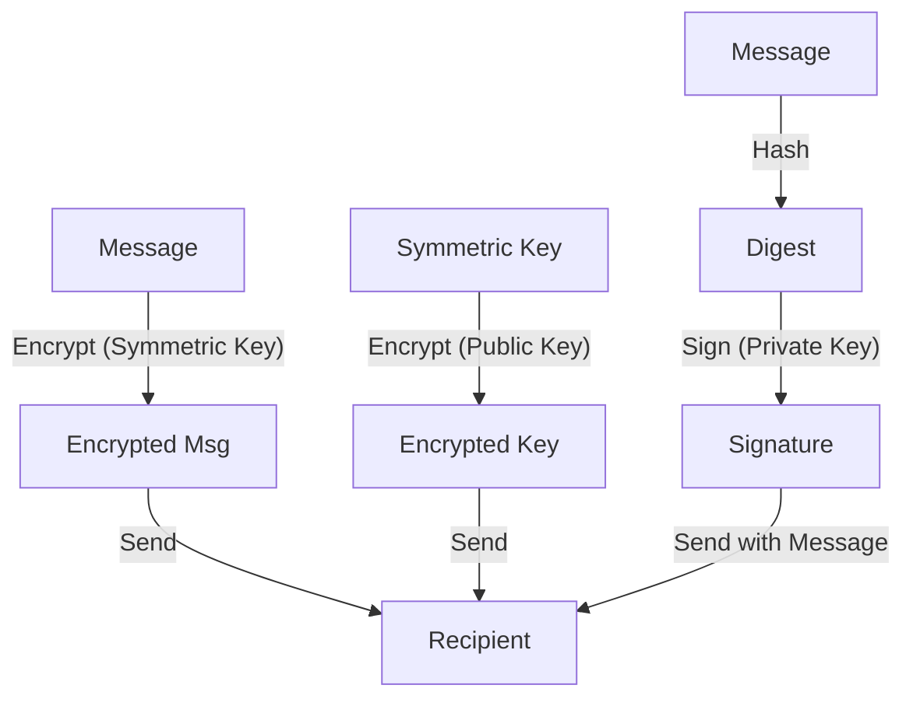

# 8.5 Securing E-Mail

- Secure email ensures confidentiality, integrity, and authentication of messages.
- Uses encryption, digital signatures, and certificates.

---

## Secure E-Mail: Confidentiality

### Alice's Process
- **Alice wants to send confidential e-mail, m, to Bob**
- **Alice generates random symmetric private key, KS**
- **Alice encrypts message with KS (for efficiency)**
- **Alice also encrypts KS with Bob's public key**
- **Alice sends both KS(m) and KB+(KS) to Bob**

### Bob's Process
- **Bob uses his private key to decrypt and recover KS**
- **Bob uses KS to decrypt KS(m) to recover m**

### Key Components
- **KS( ): Symmetric encryption**
- **KB+( ): Bob's public key encryption**
- **KS(m): Encrypted message**
- **KB+(KS): Encrypted symmetric key**

---

## Secure E-Mail: Integrity, Authentication

### Alice's Process
- **Alice wants to send m to Bob, with message integrity, authentication**
- **Alice digitally signs hash of her message with her private key, providing integrity and authentication**
- **Alice sends both message (in the clear) and digital signature**

### Components
- **H( ): Hash function**
- **KA-( ): Alice's private key**
- **H(m): Message digest**
- **KA-(H(m)): Digital signature**

---

## Secure E-Mail: Complete Security

### Alice's Process
- **Alice sends m to Bob, with confidentiality, message integrity, authentication**
- **Alice uses three keys: her private key, Bob's public key, new symmetric key**

### Bob's Complementary Actions
1. **Uses his private key to decrypt symmetric key**
2. **Uses symmetric key to decrypt message**
3. **Uses Alice's public key to verify signature**
4. **Compares hash of received message with decrypted signature**

---

## 8.5.1 Secure E-Mail
- **Encrypts message content and attachments.**
- **Uses digital signatures for sender authentication.**

---

## 8.5.2 PGP
- **Pretty Good Privacy:** Combines symmetric and public key cryptography.
- **Encrypts message with symmetric key, then encrypts key with recipient's public key.**
- **Diagram:**

---

## Email Security Protocols Comparison

### PGP (Pretty Good Privacy)
- **Web of trust model**
- **User-generated keys**
- **Widely used for personal email**

### S/MIME (Secure/Multipurpose Internet Mail Extensions)
- **X.509 certificate-based**
- **Enterprise standard**
- **Integrated with email clients**

### SPF (Sender Policy Framework)
- **Prevents sender address forgery**
- **DNS-based authentication**
- **Helps prevent spam and phishing**

### DKIM (DomainKeys Identified Mail)
- **Adds digital signature to emails**
- **Domain-level authentication**
- **Verifies message integrity**

### DMARC (Domain-based Message Authentication, Reporting & Conformance)
- **Builds on SPF and DKIM**
- **Provides policy and reporting**
- **Comprehensive email authentication**

---

## Secure Email Implementation

### Key Management
- **Symmetric keys: Generated per session**
- **Public keys: Distributed via certificates or web of trust**
- **Private keys: Securely stored on user devices**

### Performance Considerations
- **Symmetric encryption: Fast for large messages**
- **Public key encryption: Slow, used only for key exchange**
- **Hash functions: Very fast for integrity checking**

### Security Properties Achieved
- **Confidentiality: Message content is encrypted**
- **Integrity: Hash functions detect tampering**
- **Authentication: Digital signatures prove sender identity**
- **Non-repudiation: Sender cannot deny sending message**

---

## Practice Questions
1. **How does PGP secure email?**
2. **Why use both symmetric and public key encryption in PGP?**
3. **What are the three main security goals for email?**
4. **How does Alice achieve confidentiality in secure email?**
5. **What is the difference between PGP and S/MIME?**

---

## Summary Table
| Feature   | Secure E-Mail | PGP           | S/MIME        |
|-----------|---------------|---------------|---------------|
| Encryption| Yes           | Yes           | Yes           |
| Signature | Yes           | Yes           | Yes           |
| Key Mgmt  | Certs         | Web of trust  | X.509 certs   |
| Standard  | Various       | Open standard | RFC standard  |
| Use Case  | General       | Personal      | Enterprise    |

---

**Exam Tips:**
- Know how secure email and PGP work.
- Be able to draw PGP encryption diagrams.
- Understand the hybrid approach (symmetric + public key).
- Know the different email security protocols and their use cases.

---

## More Email Security Protocols
- **S/MIME:** Uses X.509 certificates for email encryption and signing.
- **SPF (Sender Policy Framework):** Prevents sender address forgery.
- **DKIM (DomainKeys Identified Mail):** Adds digital signature to emails.
- **DMARC:** Builds on SPF and DKIM, provides policy and reporting for email authentication. 