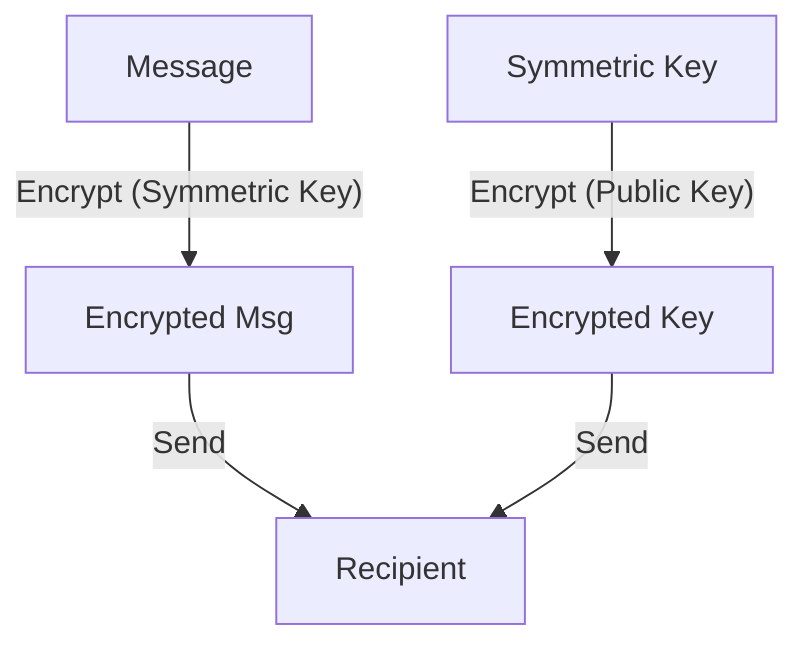

# 8.5 Securing E-Mail

- Secure email ensures confidentiality, integrity, and authentication of messages.
- Uses encryption, digital signatures, and certificates.

---

## 8.5.1 Secure E-Mail
- **Encrypts message content and attachments.**
- **Uses digital signatures for sender authentication.**

---

## 8.5.2 PGP
- **Pretty Good Privacy:** Combines symmetric and public key cryptography.
- **Encrypts message with symmetric key, then encrypts key with recipient's public key.**
- **Diagram:**

---

## Practice Questions
1. **How does PGP secure email?**
2. **Why use both symmetric and public key encryption in PGP?**

---

## Summary Table
| Feature   | Secure E-Mail | PGP           |
|-----------|---------------|---------------|
| Encryption| Yes           | Yes           |
| Signature | Yes           | Yes           |
| Key Mgmt  | Certs         | Web of trust  |

---

**Exam Tips:**
- Know how secure email and PGP work.
- Be able to draw PGP encryption diagrams.

---

## More Email Security Protocols
- **S/MIME:** Uses X.509 certificates for email encryption and signing.
- **SPF (Sender Policy Framework):** Prevents sender address forgery.
- **DKIM (DomainKeys Identified Mail):** Adds digital signature to emails.
- **DMARC:** Builds on SPF and DKIM, provides policy and reporting for email authentication. 