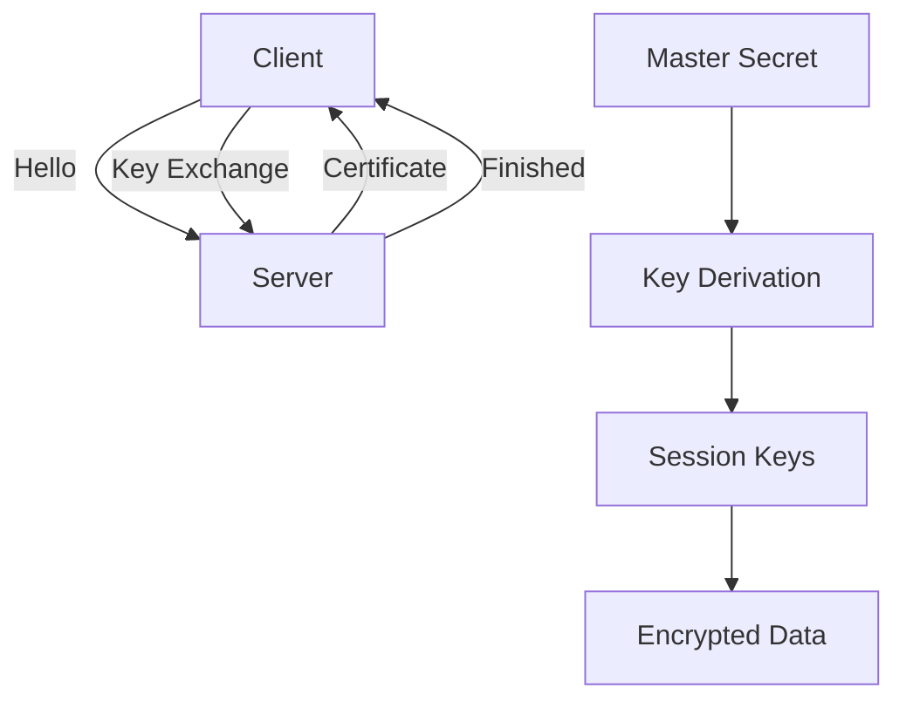

# 8.6 Securing TCP Connections: TLS

- SSL/TLS secures TCP connections with encryption, authentication, and integrity.
- Used for HTTPS, email, VPNs, etc.

---

## Transport-Layer Security (TLS)

### Overview
- **Widely deployed security protocol above the transport layer**
- **Supported by almost all browsers, web servers: https (port 443)**
- **Provides:**
  - **Confidentiality: via symmetric encryption**
  - **Integrity: via cryptographic hashing**
  - **Authentication: via public key cryptography**

### History
- **Early research, implementation: secure network programming, secure sockets**
- **Secure socket layer (SSL) deprecated [2015]**
- **TLS 1.3: RFC 8846 [2018]**

---

## Transport-Layer Security: What's Needed?

### Core Requirements
1. **Handshake: Alice, Bob use their certificates, private keys to authenticate each other, exchange or create shared secret**
2. **Key derivation: Alice, Bob use shared secret to derive set of keys**
3. **Data transfer: stream data transfer: data as a series of records**
4. **Connection closure: special messages to securely close connection**

### Building a Toy TLS Protocol
- **Let's build a toy TLS protocol, t-tls, to see what's needed!**
- **We've seen the "pieces" already**

---

## t-tls: Initial Handshake

### Handshake Process
1. **TCP SYN**
2. **SYNACK**
3. **ACK**
4. **t-tls hello**
5. **Public key certificate**
6. **KB+(MS) = EMS**

### t-tls Handshake Phase
- **Bob establishes TCP connection with Alice**
- **Bob verifies that Alice is really Alice**
- **Bob sends Alice a master secret key (MS), used to generate all other keys for TLS session**

### Potential Issues
- **3 RTT before client can start receiving data (including TCP handshake)**

---

## t-tls: Cryptographic Keys

### Key Separation Principle
- **Considered bad to use same key for more than one cryptographic function**
- **Different keys for message authentication code (MAC) and encryption**

### Four Keys Required
- **Kc: encryption key for data sent from client to server**
- **Mc: MAC key for data sent from client to server**
- **Ks: encryption key for data sent from server to client**
- **Ms: MAC key for data sent from server to client**

### Key Derivation
- **Keys derived from key derivation function (KDF)**
- **Takes master secret and (possibly) some additional random data to create new keys**

---

## t-tls: Encrypting Data

### Stream Processing Challenge
- **Recall: TCP provides data byte stream abstraction**
- **Q: can we encrypt data in-stream as written into TCP socket?**
- **A: where would MAC go? If at end, no message integrity until all data received and connection closed!**

### Solution: Records
- **Break stream in series of "records"**
- **Each client-to-server record carries a MAC, created using Mc**
- **Receiver can act on each record as it arrives**

### Record Structure
- **Data + MAC + length**
- **t-tls record encrypted using symmetric key, Kc, passed to TCP: Kc(data + MAC + length)**

---

## t-tls: Encrypting Data (More)

### Possible Attacks on Data Stream
- **Re-ordering: man-in middle intercepts TCP segments and reorders (manipulating sequence #s in unencrypted TCP header)**
- **Replay**

### Solutions
- **Use TLS sequence numbers (data, TLS-seq-# incorporated into MAC)**
- **Use nonce**

---

## t-tls: Connection Close

### Truncation Attack
- **Attacker forges TCP connection close segment**
- **One or both sides thinks there is less data than there actually is**

### Solution
- **Record types, with one type for closure**
- **Type 0 for data; type 1 for close**
- **MAC now computed using data, type, sequence #**

---

## Transport-Layer Security (TLS): Protocol Stack

### Protocol Layers
- **IP**
- **TCP**
- **TLS**
- **HTTP/2**

### Alternative Stacks
- **HTTP/2 over TCP**
- **HTTP/3: HTTP/2 over QUIC (which incorporates TLS) over UDP**
- **IP + UDP + QUIC + HTTP/2 (slimmed)**

### API Usage
- **TLS provides an API that any application can use**
- **An HTTP view of TLS**

---

## TLS: 1.3 Cipher Suite

### Cipher Suite Components
- **"Cipher suite": algorithms that can be used for key generation, encryption, MAC, digital signature**

### TLS 1.3 vs TLS 1.2
- **TLS: 1.3 (2018): more limited cipher suite choice than TLS 1.2 (2008)**
- **Only 5 choices, rather than 37 choices**
- **Requires Diffie-Hellman (DH) for key exchange, rather than DH or RSA**
- **Combined encryption and authentication algorithm ("authenticated encryption") for data rather than serial encryption, authentication**
- **4 based on AES**
- **HMAC uses SHA (256 or 284) cryptographic hash function**

---

## TLS 1.3 Handshake: 1 RTT

### Process
1. **Client hello: supported cipher suites, DH key agreement protocol, parameters**
2. **Server hello: selected cipher suite, DH key agreement protocol, parameters**
3. **Client: checks server certificate, generates key, can now make application request (e.g., HTTPS GET)**

### Client TLS Hello Message
- **Guesses key agreement protocol, parameters**
- **Indicates cipher suites it supports**

### Server TLS Hello Message
- **Chooses key agreement protocol, parameters**
- **Cipher suite**
- **Server-signed certificate**

---

## TLS 1.3 Handshake: 0 RTT

### Process
- **Client hello: supported cipher suites, DH key agreement protocol, parameters, application data**
- **Server hello: selected cipher suite, DH key agreement protocol, parameters, application data (reply)**

### Zero-RTT Feature
- **Initial hello message contains encrypted application data!**
- **"Resuming" earlier connection between client and server**
- **Application data encrypted using "resumption master secret" from earlier connection**

### Security Consideration
- **Vulnerable to replay attacks!**
- **Maybe OK for get HTTP GET or client requests not modifying server state**

---

## 8.6.1 The Big Picture
- **SSL handshake:** Negotiates keys, authenticates server, establishes session.
- **Diagram:**

---

## 8.6.2 A More Complete Picture
- **Session keys:** Used for bulk data encryption.
- **Certificates:** Bind public keys to identities.
- **Integrity:** MACs ensure data not altered.

---

## More on TLS Handshake and Certificate Validation
- **TLS Handshake Steps:**
  1. ClientHello: Client proposes parameters.
  2. ServerHello: Server selects parameters, sends certificate.
  3. Certificate Validation: Client checks server certificate against trusted CAs.
  4. Key Exchange: Securely establish session keys.
  5. Finished: Secure session established.
- **Certificate Validation:** Checks signature, expiration, revocation, and hostname match.

---

## TLS Security Features

### Confidentiality
- **Symmetric encryption for bulk data**
- **AES, ChaCha20 commonly used**
- **Session keys derived from master secret**

### Integrity
- **Message Authentication Codes (MACs)**
- **HMAC-SHA256 commonly used**
- **Prevents tampering and replay attacks**

### Authentication
- **Server authentication via certificates**
- **Client authentication (optional)**
- **Certificate chain validation**

### Forward Secrecy
- **Session keys not derived from long-term secrets**
- **Ephemeral key exchange (DHE, ECDHE)**
- **Protects past communications if long-term keys are compromised**

---

## Practice Questions
1. **What is the purpose of the SSL handshake?**
2. **How do certificates provide authentication?**
3. **What are the four keys in t-tls?**
4. **How does TLS 1.3 improve security over TLS 1.2?**
5. **What is the difference between 1-RTT and 0-RTT handshakes?**

---

## Summary Table
| Feature      | SSL/TLS Value         | TLS 1.3 Improvement    |
|--------------|----------------------|------------------------|
| Encryption   | Yes                  | Authenticated encryption|
| Auth         | Yes (certificates)   | DH required            |
| Integrity    | Yes (MAC)            | Combined with encryption|
| Handshake    | 2-3 RTT              | 1 RTT (0 RTT possible) |
| Cipher Suites| 37+ choices          | 5 choices              |

---

**Exam Tips:**
- Know SSL handshake steps and certificate use.
- Be able to draw SSL/TLS diagrams.
- Understand the key derivation process.
- Know the differences between TLS versions.
- Understand the security properties of TLS. 