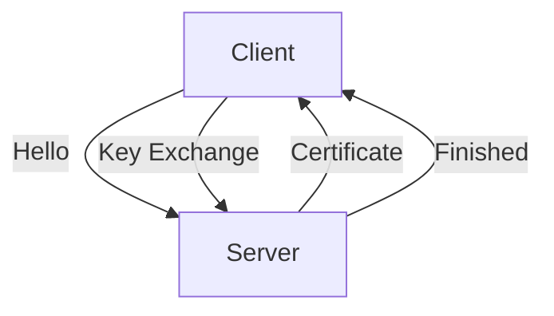

# 8.6 Securing TCP Connections: SSL

- SSL/TLS secures TCP connections with encryption, authentication, and integrity.
- Used for HTTPS, email, VPNs, etc.

---

## 8.6.1 The Big Picture
- **SSL handshake:** Negotiates keys, authenticates server, establishes session.
- **Diagram:**

---

## 8.6.2 A More Complete Picture
- **Session keys:** Used for bulk data encryption.
- **Certificates:** Bind public keys to identities.
- **Integrity:** MACs ensure data not altered.

---

## Practice Questions
1. **What is the purpose of the SSL handshake?**
2. **How do certificates provide authentication?**

---

## Summary Table
| Feature      | SSL/TLS Value         |
|--------------|----------------------|
| Encryption   | Yes                  |
| Auth         | Yes (certificates)   |
| Integrity    | Yes (MAC)            |

---

**Exam Tips:**
- Know SSL handshake steps and certificate use.
- Be able to draw SSL/TLS diagrams. 