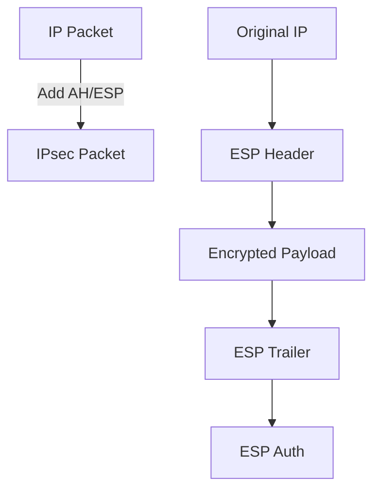

# 8.7 Network-Layer Security: IPsec and Virtual Private Networks

- IPsec secures IP packets with encryption and authentication.
- VPNs use IPsec to create secure tunnels over public networks.

---

## IPsec Overview

### Purpose
- **Provides datagram-level encryption, authentication, integrity**
- **For both user traffic and control traffic (e.g., BGP, DNS messages)**

### Two Modes
1. **Transport mode: only datagram payload is encrypted, authenticated**
2. **Tunnel mode: entire datagram is encrypted, authenticated**
   - **Encrypted datagram encapsulated in new datagram with new IP header, tunneled to destination**

---

## Two IPsec Protocols

### Authentication Header (AH) Protocol [RFC 4302]
- **Provides source authentication & data integrity but not confidentiality**

### Encapsulation Security Protocol (ESP) [RFC 4303]
- **Provides source authentication, data integrity, and confidentiality**
- **More widely used than AH**

---

## Security Associations (SAs)

### SA Definition
- **Before sending data, security association (SA) established from sending to receiving entity (directional)**
- **Sending, receiving entities maintain state information about SA**
- **Recall: TCP endpoints also maintain state info**
- **IP is connectionless; IPsec is connection-oriented!**

### SA Information Stored
- **32-bit identifier: Security Parameter Index (SPI)**
- **Origin SA interface (200.168.1.100)**
- **Destination SA interface (193.68.2.23)**
- **Type of encryption used**
- **Encryption key**
- **Type of integrity check used**
- **Authentication key**

---

## IPsec Datagram Structure

### ESP Tunnel Mode Components
- **New IP header**
- **ESP header**
- **Original IP header**
- **Original IP datagram payload**
- **ESP trailer**
- **ESP auth**
- **Padding**

### ESP Header Fields
- **SPI: so receiving entity knows what to do**
- **Sequence number: to thwart replay attacks**

### ESP Trailer
- **Padding for block ciphers**
- **Pad length**
- **Next header**

### ESP Auth Field
- **MAC created with shared secret key**

---

## ESP Tunnel Mode: Actions

### At R1 (Sending Endpoint)
1. **Appends ESP trailer to original datagram (which includes original header fields!)**
2. **Encrypts result using algorithm & key specified by SA**
3. **Appends ESP header to front of this encrypted quantity**
4. **Creates authentication MAC using algorithm and key specified in SA**
5. **Appends MAC forming payload**
6. **Creates new IP header, new IP header fields, addresses to tunnel endpoint**

---

## IPsec Sequence Numbers

### Sequence Number Management
- **For new SA, sender initializes seq. # to 0**
- **Each time datagram is sent on SA:**
  - **Sender increments seq # counter**
  - **Places value in seq # field**

### Goal
- **Prevent attacker from sniffing and replaying a packet**
- **Receipt of duplicate, authenticated IP packets may disrupt service**

### Method
- **Destination checks for duplicates**
- **Doesn't keep track of all received packets; instead uses a window**

---

## Security Policy Database (SPD)

### Policy Function
- **For given datagram, sender needs to know if it should use IPsec**
- **Policy stored in security policy database (SPD)**
- **Needs to know which SA to use**
- **May use: source and destination IP address; protocol number**

### SPD Purpose
- **"What" to do**

---

## Security Association Database (SAD)

### SAD Function
- **Endpoint holds SA state in security association database (SAD)**
- **When sending IPsec datagram, R1 accesses SAD to determine how to process datagram**
- **When IPsec datagram arrives to R2, R2 examines SPI in IPsec datagram, indexes SAD with SPI, processing datagram accordingly**

### SAD Purpose
- **"How" to do it**

---

## IPsec Security Databases Summary

### SPD vs SAD
- **SPD: "what" to do**
- **SAD: "how" to do it**

---

## Summary: IPsec Services

### Security Analysis
- **Trudy sits somewhere between R1, R2. she doesn't know the keys**
- **Will Trudy be able to see original contents of datagram?**
  - **Answer: No (encrypted)**
- **How about source, dest IP address, transport protocol, application port?**
  - **Answer: No (in tunnel mode, original headers encrypted)**
- **Flip bits without detection?**
  - **Answer: No (MAC detects tampering)**
- **Masquerade as R1 using R1's IP address?**
  - **Answer: No (authentication prevents spoofing)**
- **Replay a datagram?**
  - **Answer: No (sequence numbers prevent replay)**

---

## IKE: Internet Key Exchange

### Manual vs Automated Keying
- **Previous examples: manual establishment of IPsec SAs in IPsec endpoints**
- **Manual keying is impractical for VPN with 100s of endpoints**
- **Instead use IPsec IKE (Internet Key Exchange)**

### Example Manual SA
- **SPI: 12345**
- **Source IP: 200.168.1.100**
- **Dest IP: 193.68.2.23**
- **Protocol: ESP**
- **Encryption algorithm: 3DES-cbc**
- **HMAC algorithm: MD5**
- **Encryption key: 0x7aeaca…**
- **HMAC key:0xc0291f…**

---

## IKE: PSK and PKI

### Authentication Methods
- **Authentication (prove who you are) with either:**
  - **Pre-shared secret (PSK) or**
  - **With PKI (public/private keys and certificates)**

### PSK Method
- **Both sides start with secret**
- **Run IKE to authenticate each other and to generate IPsec SAs (one in each direction), including encryption, authentication keys**

### PKI Method
- **Both sides start with public/private key pair, certificate**
- **Run IKE to authenticate each other, obtain IPsec SAs (one in each direction)**
- **Similar with handshake in SSL**

---

## IKE Phases

### Two-Phase Process
- **IKE has two phases**

### Phase 1
- **Establish bi-directional IKE SA**
- **Note: IKE SA different from IPsec SA**
- **Aka ISAKMP security association**

### Phase 2
- **ISAKMP is used to securely negotiate IPsec pair of SAs**

### Phase 1 Modes
- **Phase 1 has two modes: aggressive mode and main mode**
- **Aggressive mode uses fewer messages**
- **Main mode provides identity protection and is more flexible**

---

## IPsec Summary

### Complete Process
1. **IKE message exchange for algorithms, secret keys, SPI numbers**
2. **Either AH or ESP protocol (or both)**
3. **AH provides integrity, source authentication**
4. **ESP protocol (with AH) additionally provides encryption**
5. **IPsec peers can be two end systems, two routers/firewalls, or a router/firewall and an end system**

---

## 8.7.1 IPsec and Virtual Private Networks (VPNs)
- **IPsec:** Suite of protocols for securing IP traffic.
- **VPN:** Secure connection over public Internet.

---

## 8.7.2 The AH and ESP Protocols
- **AH (Authentication Header):** Provides integrity, authentication.
- **ESP (Encapsulating Security Payload):** Adds encryption.

---

## 8.7.3 Security Associations
- **Security Association (SA):** Defines security parameters for a connection.

---

## 8.7.4 The IPsec Datagram
- **IPsec adds headers to IP packets for security.**
- **Diagram:**

---

## 8.7.5 IKE: Key Management in IPsec
- **IKE (Internet Key Exchange):** Negotiates keys and SAs.

---

## IPsec Modes
- **Transport Mode:** Encrypts only the payload, used for end-to-end security.
- **Tunnel Mode:** Encrypts entire IP packet, used for VPNs.
- **AH vs. ESP:** AH provides integrity/authentication, ESP adds encryption.

## VPN Types
- **Site-to-Site VPN:** Connects entire networks securely over the Internet.
- **Remote Access VPN:** Allows individual users to securely connect to a private network from anywhere.

---

## Practice Questions
1. **What is the difference between AH and ESP in IPsec?**
2. **How does a VPN use IPsec?**
3. **What is a Security Association?**
4. **What are the two phases of IKE?**
5. **How do sequence numbers prevent replay attacks?**

---

## Summary Table
| Feature   | AH      | ESP     | IKE     |
|-----------|---------|---------|---------|
| Integrity | Yes     | Yes     | Yes     |
| Auth      | Yes     | Yes     | Yes     |
| Encrypt   | No      | Yes     | Yes     |
| Key Mgmt  | No      | No      | Yes     |

---

**Exam Tips:**
- Know IPsec components and VPN use.
- Be able to draw IPsec datagram diagrams.
- Understand the difference between transport and tunnel modes.
- Know the IKE phases and their purposes.
- Understand how SAs work and what information they contain. 