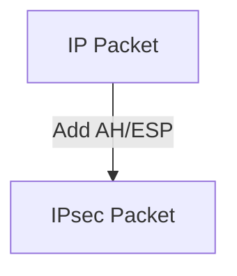

# 8.7 Network-Layer Security: IPsec and Virtual Private Networks

- IPsec secures IP packets with encryption and authentication.
- VPNs use IPsec to create secure tunnels over public networks.

---

## 8.7.1 IPsec and Virtual Private Networks (VPNs)
- **IPsec:** Suite of protocols for securing IP traffic.
- **VPN:** Secure connection over public Internet.

---

## 8.7.2 The AH and ESP Protocols
- **AH (Authentication Header):** Provides integrity, authentication.
- **ESP (Encapsulating Security Payload):** Adds encryption.

---

## 8.7.3 Security Associations
- **Security Association (SA):** Defines security parameters for a connection.

---

## 8.7.4 The IPsec Datagram
- **IPsec adds headers to IP packets for security.**
- **Diagram:**

---

## 8.7.5 IKE: Key Management in IPsec
- **IKE (Internet Key Exchange):** Negotiates keys and SAs.

---

## Practice Questions
1. **What is the difference between AH and ESP in IPsec?**
2. **How does a VPN use IPsec?**
3. **What is a Security Association?**

---

## Summary Table
| Feature   | AH      | ESP     |
|-----------|---------|---------|
| Integrity | Yes     | Yes     |
| Auth      | Yes     | Yes     |
| Encrypt   | No      | Yes     |

---

**Exam Tips:**
- Know IPsec components and VPN use.
- Be able to draw IPsec datagram diagrams. 