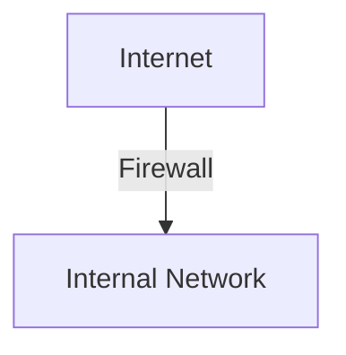

# 8.9 Operational Security: Firewalls and Intrusion Detection Systems

- Firewalls and IDS protect networks from unauthorized access and attacks.

---

## 8.9.1 Firewalls
- **Packet filtering:** Blocks/permits traffic based on rules.
- **Stateful inspection:** Tracks connection state.
- **Application gateway:** Filters at application layer.
- **Diagram:**

---

## 8.9.2 Intrusion Detection Systems
- **IDS:** Monitors network for suspicious activity.
- **Types:** Signature-based, anomaly-based.

---

## More on Firewalls and IDS/IPS
- **Stateless Firewall:** Filters packets based only on headers.
- **Stateful Firewall:** Tracks connection state for more context.
- **Application Firewall:** Filters based on application data (e.g., HTTP).
- **DMZ (Demilitarized Zone):** Isolated network segment for public-facing servers.
- **IDS/IPS:**
  - **IDS (Intrusion Detection System):** Monitors and alerts on suspicious activity.
  - **IPS (Intrusion Prevention System):** Can block or prevent attacks in real time.
  - **Signature-Based:** Matches known attack patterns.
  - **Anomaly-Based:** Detects deviations from normal behavior.
- **VPNs:** Site-to-site and remote access for secure communication.

---

## Practice Questions
1. **What is the difference between a firewall and an IDS?**
2. **List two types of IDS.**

---

## Summary Table
| Device    | Function                |
|-----------|-------------------------|
| Firewall  | Block/permit traffic    |
| IDS       | Detect intrusions       |

---

**Exam Tips:**
- Know firewall types and IDS operation.
- Be able to draw firewall placement diagrams. 