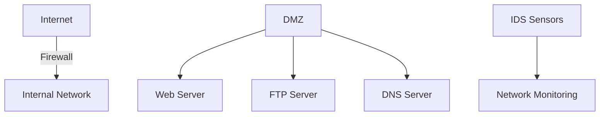

# 8.9 Operational Security: Firewalls and Intrusion Detection Systems

- Firewalls and IDS protect networks from unauthorized access and attacks.

---

## Firewalls

### Purpose
- **Isolates organization's internal network from larger Internet, allowing some packets to pass, blocking others**
- **Administered network vs public Internet**
- **Trusted "good guys" vs untrusted "bad guys"**

---

## Firewalls: Why

### Protection Goals
1. **Prevent denial of service attacks:**
   - **SYN flooding: attacker establishes many bogus TCP connections, no resources left for "real" connections**
2. **Prevent illegal modification/access of internal data:**
   - **e.g., attacker replaces CIA's homepage with something else**
3. **Allow only authorized access to inside network:**
   - **Set of authenticated users/hosts**

### Three Types of Firewalls
1. **Stateless packet filters**
2. **Stateful packet filters**
3. **Application gateways**

---

## Stateless Packet Filtering

### Basic Function
- **Should arriving packet be allowed in? Departing packet let out?**
- **Internal network connected to Internet via router firewall**
- **Filters packet-by-packet, decision to forward/drop packet based on:**
  - **Source IP address, destination IP address**
  - **TCP/UDP source, destination port numbers**
  - **ICMP message type**
  - **TCP SYN, ACK bits**

---

## Stateless Packet Filtering: Examples

### Example 1
- **Block incoming and outgoing datagrams with IP protocol field = 17 and with either source or dest port = 23**
- **Result: all incoming, outgoing UDP flows and telnet connections are blocked**

### Example 2
- **Block inbound TCP segments with ACK=0**
- **Result: prevents external clients from making TCP connections with internal clients, but allows internal clients to connect to outside**

---

## Stateless Packet Filtering: More Examples

| Policy | Firewall Setting |
|--------|------------------|
| No outside Web access | Drop all outgoing packets to any IP address, port 80 |
| No incoming TCP connections, except those for institution's public Web server only | Drop all incoming TCP SYN packets to any IP except 130.207.244.203, port 80 |
| Prevent Web-radios from eating up the available bandwidth | Drop all incoming UDP packets - except DNS and router broadcasts |
| Prevent your network from being used for a smurf DoS attack | Drop all ICMP packets going to a "broadcast" address (e.g., 130.207.255.255) |
| Prevent your network from being tracerouted | Drop all outgoing ICMP TTL expired traffic |

---

## Access Control Lists

### ACL Structure
- **ACL: table of rules, applied top to bottom to incoming packets: (action, condition) pairs**
- **Looks like OpenFlow forwarding (Ch. 4)!**

### Example ACL
| Action | Source Address | Dest Address | Protocol | Source Port | Dest Port | Flag Bit |
|--------|----------------|--------------|----------|-------------|-----------|----------|
| allow | 222.22/16 | outside of 222.22/16 | TCP | > 1023 | 80 | any |
| allow | outside of 222.22/16 | 222.22/16 | TCP | 80 | > 1023 | ACK |
| allow | 222.22/16 | outside of 222.22/16 | UDP | > 1023 | 53 | --- |
| allow | outside of 222.22/16 | 222.22/16 | UDP | 53 | > 1023 | ---- |
| deny | all | all | all | all | all | all |

---

## Stateful Packet Filtering

### Problem with Stateless Filters
- **Stateless packet filter: heavy handed tool**
- **Admits packets that "make no sense," e.g., dest port = 80, ACK bit set, even though no TCP connection established**

### Stateful Solution
- **Stateful packet filter: track status of every TCP connection**
- **Track connection setup (SYN), teardown (FIN): determine whether incoming, outgoing packets "makes sense"**
- **Timeout inactive connections at firewall: no longer admit packets**

---

## Stateful Packet Filtering: Enhanced ACL

### ACL with Connection State Checking
| Action | Source Address | Dest Address | Proto | Source Port | Dest Port | Flag Bit | Check Connection |
|--------|----------------|--------------|-------|-------------|-----------|----------|------------------|
| allow | 222.22/16 | outside of 222.22/16 | TCP | > 1023 | 80 | any | |
| allow | outside of 222.22/16 | 222.22/16 | TCP | 80 | > 1023 | ACK | x |
| allow | 222.22/16 | outside of 222.22/16 | UDP | > 1023 | 53 | --- | |
| allow | outside of 222.22/16 | 222.22/16 | UDP | 53 | > 1023 | ---- | x |
| deny | all | all | all | all | all | all | |

### ACL Augmentation
- **ACL augmented to indicate need to check connection state table before admitting packet**

---

## Application Gateways

### Function
- **Filter packets on application data as well as on IP/TCP/UDP fields**

### Example: Telnet Gateway
- **Allow select internal users to telnet outside**

### Process
1. **Require all telnet users to telnet through gateway**
2. **For authorized users, gateway sets up telnet connection to dest host**
3. **Gateway relays data between 2 connections**
4. **Router filter blocks all telnet connections not originating from gateway**

### Components
- **Application gateway**
- **Host-to-gateway telnet session**
- **Router and filter**
- **Gateway-to-remote host telnet session**

---

## Limitations of Firewalls, Gateways

### IP Spoofing
- **Router can't know if data "really" comes from claimed source**

### Multiple Applications
- **If multiple apps need special treatment, each has own app. gateway**

### Client Configuration
- **Client software must know how to contact gateway**
- **e.g., must set IP address of proxy in Web browser**

### Policy Limitations
- **Filters often use all or nothing policy for UDP**

### Trade-offs
- **Tradeoff: degree of communication with outside world, level of security**
- **Many highly protected sites still suffer from attacks**

---

## Intrusion Detection Systems

### Packet Filtering Limitations
- **Operates on TCP/IP headers only**
- **No correlation check among sessions**

### IDS Capabilities
- **IDS: intrusion detection system**
- **Deep packet inspection: look at packet contents (e.g., check character strings in packet against database of known virus, attack strings)**
- **Examine correlation among multiple packets**

### Detection Types
- **Port scanning**
- **Network mapping**
- **DoS attack**

---

## Intrusion Detection Systems: Architecture

### Multiple IDS Deployment
- **Multiple IDSs: different types of checking at different locations**

### Network Components
- **Web server**
- **FTP server**
- **DNS server**
- **Internet**
- **Demilitarized zone**
- **Firewall**
- **IDS sensors**
- **Internal network**

---

## 8.9.1 Firewalls
- **Packet filtering:** Blocks/permits traffic based on rules.
- **Stateful inspection:** Tracks connection state.
- **Application gateway:** Filters at application layer.
- **Diagram:**

---

## 8.9.2 Intrusion Detection Systems
- **IDS:** Monitors network for suspicious activity.
- **Types:** Signature-based, anomaly-based.

---

## Firewall Types Comparison

### Stateless Firewall
- **Filters packets based only on headers**
- **Fast but limited context**
- **Vulnerable to sophisticated attacks**

### Stateful Firewall
- **Tracks connection state for more context**
- **Better security but more resource intensive**
- **Can detect connection anomalies**

### Application Firewall
- **Filters based on application data (e.g., HTTP)**
- **Highest security but slowest performance**
- **Can block application-specific attacks**

---

## IDS/IPS Systems

### IDS (Intrusion Detection System)
- **Monitors and alerts on suspicious activity**
- **Passive monitoring only**
- **Does not block traffic**

### IPS (Intrusion Prevention System)
- **Can block or prevent attacks in real time**
- **Active response to threats**
- **May cause false positives**

### Detection Methods
- **Signature-Based: Matches known attack patterns**
- **Anomaly-Based: Detects deviations from normal behavior**
- **Behavior-Based: Learns normal behavior patterns**

---

## Network Security Architecture

### DMZ (Demilitarized Zone)
- **Isolated network segment for public-facing servers**
- **Separate from internal network**
- **Additional security layer**

### VPNs
- **Site-to-site and remote access for secure communication**
- **Encrypted tunnels over public networks**
- **Authentication and access control**

---

## More on Firewalls and IDS/IPS
- **Stateless Firewall:** Filters packets based only on headers.
- **Stateful Firewall:** Tracks connection state for more context.
- **Application Firewall:** Filters based on application data (e.g., HTTP).
- **DMZ (Demilitarized Zone):** Isolated network segment for public-facing servers.
- **IDS/IPS:**
  - **IDS (Intrusion Detection System):** Monitors and alerts on suspicious activity.
  - **IPS (Intrusion Prevention System):** Can block or prevent attacks in real time.
  - **Signature-Based:** Matches known attack patterns.
  - **Anomaly-Based:** Detects deviations from normal behavior.
- **VPNs:** Site-to-site and remote access for secure communication.

---

## Practice Questions
1. **What are the three types of firewalls?**
2. **How does stateful packet filtering improve security?**
3. **What is the difference between IDS and IPS?**
4. **What is a DMZ and why is it used?**
5. **How do access control lists work?**

---

## Summary Table
| Firewall Type | Performance | Security | Complexity | Use Case |
|---------------|-------------|----------|------------|----------|
| Stateless | High | Low | Low | Basic filtering |
| Stateful | Medium | Medium | Medium | General purpose |
| Application | Low | High | High | High security |

| System Type | Response | False Positives | Performance Impact |
|-------------|----------|-----------------|-------------------|
| IDS | Alert only | Low | Minimal |
| IPS | Block traffic | High | Moderate |

---

**Exam Tips:**
- Know the three types of firewalls and their characteristics.
- Understand how stateful filtering improves security.
- Know the difference between IDS and IPS.
- Understand DMZ architecture and purpose.
- Know how ACLs work and their limitations. 