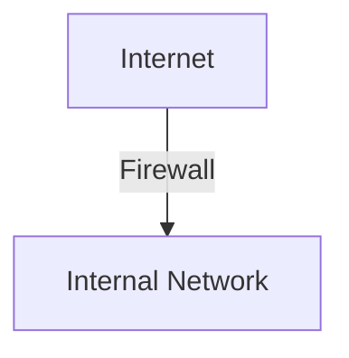
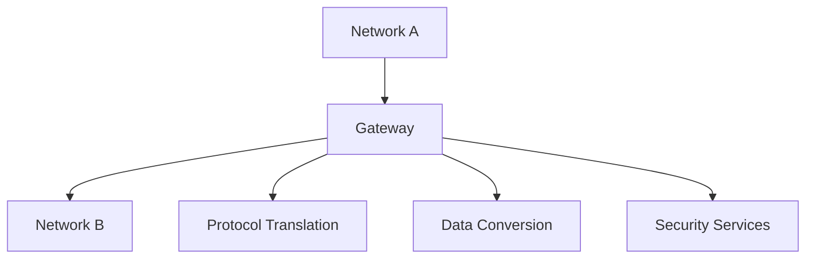

# 8.9 Operational Security: Firewalls and Intrusion Detection Systems

- Firewalls and IDS protect networks from unauthorized access and attacks.

---

## 8.9.1 Firewalls
- **Packet filtering:** Blocks/permits traffic based on rules.
- **Stateful inspection:** Tracks connection state.
- **Application gateway:** Filters at application layer.
- **Diagram:**


---

## 8.9.2 Intrusion Detection Systems
- **IDS:** Monitors network for suspicious activity.
- **Types:** Signature-based, anomaly-based.

---

## More on Firewalls and IDS/IPS
- **Stateless Firewall:** Filters packets based only on headers.
- **Stateful Firewall:** Tracks connection state for more context.
- **Application Firewall:** Filters based on application data (e.g., HTTP).
- **DMZ (Demilitarized Zone):** Isolated network segment for public-facing servers.
- **IDS/IPS:**
  - **IDS (Intrusion Detection System):** Monitors and alerts on suspicious activity.
  - **IPS (Intrusion Prevention System):** Can block or prevent attacks in real time.
  - **Signature-Based:** Matches known attack patterns.
  - **Anomaly-Based:** Detects deviations from normal behavior.
- **VPNs:** Site-to-site and remote access for secure communication.

---

## Gateways

### What is a Gateway?
- **Definition:** A device or system that connects two different networks or protocols.
- **Function:** Acts as an entrance/exit point between networks, performing protocol translation and data conversion.
- **OSI Layers:** Operates at multiple layers (typically Layers 3-7).

### Gateway Types

#### 1. Protocol Gateways
- **Function:** Translate between different network protocols
- **Examples:**
  - **TCP/IP to SNA:** Mainframe connectivity
  - **IPv4 to IPv6:** Protocol translation
  - **HTTP to HTTPS:** Security protocol conversion

#### 2. Application Gateways
- **Function:** Translate between different application protocols
- **Examples:**
  - **Email Gateway:** SMTP to X.400 conversion
  - **Web Gateway:** HTTP to WAP for mobile devices
  - **Database Gateway:** SQL to non-SQL database protocols

#### 3. Network Gateways
- **Function:** Connect different network types
- **Examples:**
  - **LAN to WAN:** Enterprise to Internet connection
  - **Ethernet to Token Ring:** Legacy network connectivity
  - **Wireless to Wired:** WiFi to Ethernet bridge

#### 4. Security Gateways
- **Function:** Provide security services between networks
- **Examples:**
  - **Firewall Gateway:** Network security and access control
  - **VPN Gateway:** Secure remote access
  - **Proxy Gateway:** Content filtering and caching

### Gateway Architecture


### Gateway Functions

#### 1. Protocol Translation
- **Layer 3:** IP address translation (NAT)
- **Layer 4:** Port translation and protocol conversion
- **Layer 7:** Application protocol translation

#### 2. Data Conversion
- **Format Conversion:** Convert data formats between systems
- **Encoding Translation:** Handle different character encodings
- **Media Conversion:** Convert between different transmission media

#### 3. Security Services
- **Authentication:** Verify user identity
- **Authorization:** Control access to resources
- **Encryption:** Secure data transmission
- **Auditing:** Log and monitor access

#### 4. Traffic Management
- **Load Balancing:** Distribute traffic across multiple paths
- **Traffic Shaping:** Control bandwidth usage
- **QoS:** Prioritize different types of traffic

### Gateway vs Router vs Switch

| Feature | Gateway | Router | Switch |
|---------|---------|--------|--------|
| **OSI Layers** | 3-7 | 3 | 2 |
| **Protocol Translation** | Yes | Limited | No |
| **Data Conversion** | Yes | No | No |
| **Security Services** | Yes | Limited | Limited |
| **Performance** | Lower | High | Very High |
| **Complexity** | High | Medium | Low |
| **Use Case** | Protocol conversion | Network routing | Local switching |

### Real-World Gateway Examples

#### 1. Email Gateway
- **Microsoft Exchange:** Connects internal email to Internet
- **Barracuda:** Email security and filtering gateway
- **Functions:**
  - SMTP to internal mail system conversion
  - Spam filtering and virus scanning
  - Email encryption and archiving

#### 2. Web Gateway
- **Blue Coat ProxySG:** Web security and acceleration
- **Cisco Web Security Appliance:** Web filtering and malware protection
- **Functions:**
  - HTTP/HTTPS protocol handling
  - Content filtering and caching
  - SSL inspection and decryption

#### 3. Database Gateway
- **Oracle Database Gateway:** Connects to non-Oracle databases
- **IBM InfoSphere DataStage:** ETL and data integration
- **Functions:**
  - SQL to non-SQL protocol translation
  - Data format conversion
  - Query optimization

#### 4. IoT Gateway
- **AWS IoT Gateway:** Connects IoT devices to cloud
- **Azure IoT Hub:** Device connectivity and management
- **Functions:**
  - Protocol translation (MQTT, HTTP, CoAP)
  - Device authentication and security
  - Data aggregation and filtering

### Gateway Configuration Example

#### Basic Email Gateway Configuration
```
# Postfix configuration for email gateway
smtpd_recipient_restrictions = 
    permit_mynetworks,
    reject_unauth_destination

# Protocol translation
relay_domains = example.com
transport_maps = hash:/etc/postfix/transport
```

#### Web Gateway Configuration
```
# Squid proxy configuration
http_port 3128
http_access allow localnet
http_access deny all

# Content filtering
acl bad_sites dstdomain .porn.com
http_access deny bad_sites
```

### Gateway Security Considerations

#### 1. Authentication and Authorization
- **User Authentication:** Verify gateway users
- **Access Control:** Restrict gateway access
- **Audit Logging:** Monitor gateway usage

#### 2. Data Protection
- **Encryption:** Secure data in transit
- **Data Integrity:** Ensure data hasn't been tampered with
- **Privacy:** Protect sensitive information

#### 3. Network Security
- **Firewall Rules:** Control traffic flow
- **Intrusion Detection:** Monitor for attacks
- **Vulnerability Management:** Regular security updates

### Gateway Performance Optimization

#### 1. Hardware Optimization
- **High-Performance CPUs:** Handle protocol translation
- **Sufficient Memory:** Buffer data during conversion
- **Fast Storage:** Cache frequently accessed data

#### 2. Software Optimization
- **Efficient Algorithms:** Optimize translation processes
- **Connection Pooling:** Reuse connections
- **Caching:** Store frequently accessed data

#### 3. Network Optimization
- **Load Balancing:** Distribute gateway load
- **Traffic Shaping:** Control bandwidth usage
- **QoS:** Prioritize critical traffic

---

## Practice Questions
1. **What is the difference between a firewall and an IDS?**
2. **List two types of IDS.**
3. **What is the function of a gateway?**
4. **Compare gateways, routers, and switches.**

---

## Summary Table
| Device    | Function                | OSI Layer |
|-----------|-------------------------|-----------|
| Firewall  | Block/permit traffic    | 3-7       |
| IDS       | Detect intrusions       | 3-7       |
| Gateway   | Protocol translation     | 3-7       |

---

**Exam Tips:**
- Know firewall types and IDS operation.
- Be able to draw firewall placement diagrams.
- Understand gateway functions and types. 