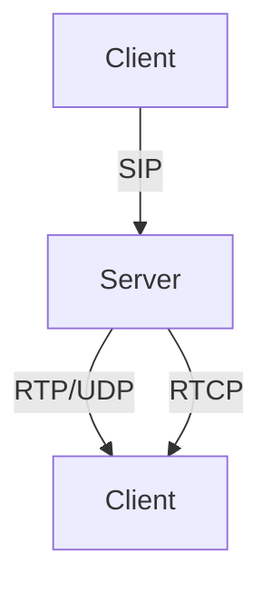

# 9.1 Multimedia Networking Applications

- Multimedia networking: transmission of audio, video, and interactive content over networks.
- Applications: streaming video, VoIP, video conferencing, IPTV, online gaming.

---

## Types of Multimedia Applications
- **Streaming stored audio/video:** YouTube, Netflix.
- **Streaming live audio/video:** Live sports, webinars.
- **Real-time interactive:** VoIP, video calls, online games.

---

## Requirements
- **Bandwidth:** Sufficient for audio/video quality.
- **Delay:** Low for real-time apps.
- **Jitter:** Variation in delay; must be minimized.
- **Loss:** Some loss tolerable for video, less for audio.

---

## Protocols Used
- **RTP (Real-time Transport Protocol):** For audio/video streams.
- **RTCP (RTP Control Protocol):** Monitors transmission stats.
- **SIP (Session Initiation Protocol):** Sets up, manages sessions.

---

## Diagram: Multimedia Streaming

---

## Practice Questions
1. **List three types of multimedia networking applications.**
2. **What is jitter and why is it important?**
3. **Which protocol is used for real-time audio/video transport?**

---

## Summary Table
| Application Type      | Example         | Key Requirement |
|----------------------|-----------------|----------------|
| Streaming (stored)   | YouTube         | Bandwidth      |
| Streaming (live)     | Live sports     | Low delay      |
| Real-time interactive| VoIP, gaming    | Low jitter     |

---

**Exam Tips:**
- Know application types and their requirements.
- Be able to explain protocol roles and draw diagrams.

## 9.1.1 Properties of Video

- **Bit Rate:** Amount of data per second (e.g., 2 Mbps for HD video).
- **Compression:** Reduces data size (e.g., H.264, H.265 codecs).
- **Frame Rate:** Number of frames per second (fps).

## 9.1.2 Properties of Audio

- **Sampling Rate:** Number of samples per second (e.g., 8 kHz for telephony).
- **Bit Depth:** Number of bits per sample.
- **Compression:** MP3, AAC codecs.

## 9.1.3 Types of Multimedia Network Applications

## Adaptive Streaming
- **DASH (Dynamic Adaptive Streaming over HTTP):** Client selects video quality based on bandwidth.
- **HLS (HTTP Live Streaming):** Apple's adaptive streaming protocol.

---

## Case Studies & Real-World Strategies

### 1. Adaptive Streaming and Video Delivery
- **Netflix:** Uses Open Connect CDN, pre-positions popular content at ISP edge servers, and employs adaptive bitrate streaming (DASH) to match user bandwidth.
- **YouTube:** Uses Google's global CDN, edge caching, and adaptive streaming to deliver billions of videos daily. Prefetches video segments to reduce startup delay.
- **Amazon Prime Video:** Uses AWS CloudFront, multi-tier caching, and dynamic scaling to handle global demand.

### 2. Live Streaming and Low-Latency Delivery
- **Twitch:** Uses HLS for live streaming, with edge servers and adaptive chunk sizes for low-latency delivery to millions of viewers.
- **Zoom, Microsoft Teams:** Use custom UDP-based protocols, FEC, and dynamic jitter buffers for real-time video/audio with minimal delay.

### 3. VoIP and Real-Time Communication
- **WhatsApp, Skype, Zoom:** Use Opus codec for high-quality, low-bitrate audio. Employ NAT traversal (STUN/TURN/ICE) and adaptive jitter buffers for reliability.
- **Google Meet:** Uses FEC, adaptive retransmission, and congestion control to maintain call quality over variable networks.

### 4. CDN and Multicast Strategies
- **Akamai, Cloudflare, Fastly:** Operate global CDNs with thousands of edge locations, DNS-based request routing, and real-time load balancing.
- **IPTV Providers:** Use IP multicast (IGMP, PIM) for efficient live TV delivery to millions of subscribers.

### 5. QoS and Traffic Engineering
- **ISPs:** Use DiffServ, IntServ, and traffic shaping (leaky bucket, token bucket) to prioritize streaming and VoIP traffic.
- **Enterprises:** Deploy WAN optimization appliances to ensure smooth video conferencing and streaming for remote workers. 