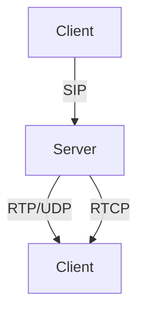

# 9.1 Multimedia Networking Applications

- Multimedia networking: transmission of audio, video, and interactive content over networks.
- Applications: streaming video, VoIP, video conferencing, IPTV, online gaming.

---

## Types of Multimedia Applications
- **Streaming stored audio/video:** YouTube, Netflix.
- **Streaming live audio/video:** Live sports, webinars.
- **Real-time interactive:** VoIP, video calls, online games.

---

## Requirements
- **Bandwidth:** Sufficient for audio/video quality.
- **Delay:** Low for real-time apps.
- **Jitter:** Variation in delay; must be minimized.
- **Loss:** Some loss tolerable for video, less for audio.

---

## Protocols Used
- **RTP (Real-time Transport Protocol):** For audio/video streams.
- **RTCP (RTP Control Protocol):** Monitors transmission stats.
- **SIP (Session Initiation Protocol):** Sets up, manages sessions.

---

## Diagram: Multimedia Streaming

---

## Practice Questions
1. **List three types of multimedia networking applications.**
2. **What is jitter and why is it important?**
3. **Which protocol is used for real-time audio/video transport?**

---

## Summary Table
| Application Type      | Example         | Key Requirement |
|----------------------|-----------------|----------------|
| Streaming (stored)   | YouTube         | Bandwidth      |
| Streaming (live)     | Live sports     | Low delay      |
| Real-time interactive| VoIP, gaming    | Low jitter     |

---

**Exam Tips:**
- Know application types and their requirements.
- Be able to explain protocol roles and draw diagrams.

## 9.1.1 Properties of Video

## 9.1.2 Properties of Audio

## 9.1.3 Types of Multimedia Network Applications 