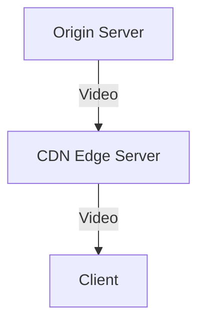

# 9.2 Streaming Stored Video

- Streaming stored video: playing video as it downloads, not waiting for full download.
- Examples: YouTube, Netflix.

---

## Architecture
- **Client-server:** Server streams video to client.
- **CDN (Content Delivery Network):** Distributes video across multiple servers for scalability and reliability.

---

## Protocols
- **HTTP streaming:** Uses standard web servers and HTTP.
- **RTP/UDP streaming:** For lower latency, but less reliable.

---

## Buffering
- **Client buffers data to handle network jitter and delay.**
- **Startup delay:** Time to fill buffer before playback.

---

## CDN Operation Diagram

---

## Practice Questions
1. **What is the purpose of buffering in video streaming?**
2. **How does a CDN improve video streaming?**

---

## Summary Table
| Protocol | Use Case         | Reliability |
|----------|------------------|-------------|
| HTTP     | Most streaming   | High        |
| RTP/UDP  | Low-latency apps | Medium      |

---

**Exam Tips:**
- Know how buffering and CDNs work.
- Be able to draw CDN diagrams. 