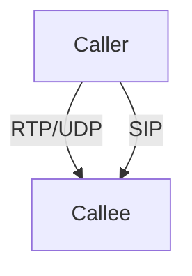

# 9.3 Voice over IP (VoIP)

- VoIP: Transmitting voice calls over IP networks (Internet).
- Examples: Skype, WhatsApp calls.

---

## Architecture
- **Digitization:** Analog voice converted to digital.
- **Packetization:** Voice split into packets.
- **Transport:** Sent over IP using RTP/UDP.

---

## Delay and Loss
- **End-to-end delay:** Should be <150 ms for good quality.
- **Packet loss:** Some loss tolerable, but affects quality.
- **Jitter:** Handled by playout buffer.

---

## Protocols
- **RTP:** Transports voice data.
- **SIP/H.323:** Call setup and management.

---

## Diagram: VoIP Call

---

## Practice Questions
1. **What is the acceptable end-to-end delay for VoIP?**
2. **How does jitter affect VoIP?**
3. **Which protocols are used for VoIP?**

---

## Summary Table
| Issue      | Solution         |
|------------|-----------------|
| Delay      | Playout buffer   |
| Loss       | FEC, retransmit  |
| Jitter     | Buffering        |

---

**Exam Tips:**
- Know VoIP architecture and delay/loss solutions.
- Be able to draw VoIP call diagrams.

## 9.3.1 Limitations of the Best-Effort IP Service

## 9.3.2 Removing Jitter at the Receiver for Audio

## 9.3.3 Recovering from Packet Loss

## 9.3.4 Case Study: VoIP with Skype 