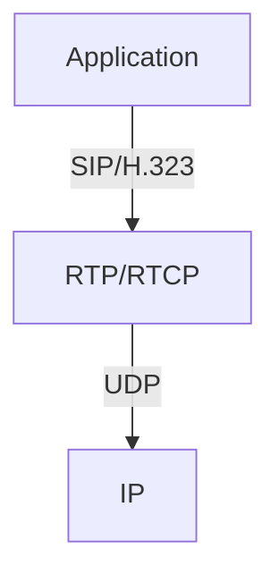

# 9.4 Protocols for Real-Time Conversational Applications

- Real-time conversational apps: VoIP, video conferencing, online gaming.
- Require low delay, low jitter, and loss tolerance.

---

## Key Protocols
- **RTP (Real-time Transport Protocol):** Delivers audio/video streams.
- **RTCP (RTP Control Protocol):** Monitors quality, provides feedback.
- **SIP (Session Initiation Protocol):** Sets up, manages, and tears down sessions.
- **H.323:** ITU standard for multimedia communication.

---

## Protocol Stack Diagram

---

## Practice Questions
1. **What is the role of RTP in real-time applications?**
2. **How does RTCP help maintain quality?**
3. **Compare SIP and H.323.**

---

## Summary Table
| Protocol | Function                |
|----------|-------------------------|
| RTP      | Media transport         |
| RTCP     | Quality monitoring      |
| SIP      | Session management      |
| H.323    | Multimedia comm. std.   |

---

**Exam Tips:**
- Know protocol roles and stack.
- Be able to draw protocol stack diagrams. 