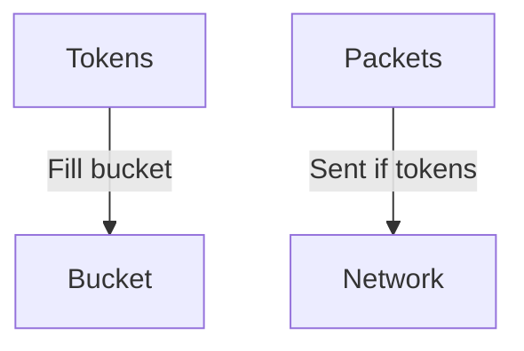

# 9.5 Network Support for Multimedia

- Networks must provide Quality of Service (QoS) for multimedia apps.
- Mechanisms: scheduling, policing, resource reservation.

---

## Scheduling
- **FIFO (First-In, First-Out):** Simple, no priority.
- **Priority queuing:** Higher priority for real-time traffic.
- **Weighted Fair Queuing (WFQ):** Fair bandwidth allocation.

---

## Policing
- **Leaky bucket:** Limits rate by allowing fixed output.
- **Token bucket:** Allows bursts up to a limit.

---

## Resource Reservation
- **RSVP (Resource Reservation Protocol):** Reserves resources along path.

---

## Diagram: Token Bucket

---

## Practice Questions
1. **What is the purpose of scheduling in multimedia networks?**
2. **Compare leaky bucket and token bucket policing.**
3. **What does RSVP do?**

---

## Summary Table
| Mechanism   | Purpose             |
|-------------|---------------------|
| Scheduling  | Prioritize traffic  |
| Policing    | Limit rate/bursts   |
| RSVP        | Reserve resources   |

---

**Exam Tips:**
- Know scheduling and policing mechanisms.
- Be able to draw token bucket diagrams.

---

## More on QoS
- **IntServ (Integrated Services):** Per-flow resource reservation, uses RSVP.
- **DiffServ (Differentiated Services):** Classifies traffic into classes, scalable.

## More on Traffic Shaping and Policing
- **Leaky Bucket:** Smooths traffic, limits rate.
- **Token Bucket:** Allows bursts, controls average rate.

## Multicast Routing
- **IGMP (Internet Group Management Protocol):** Manages group membership.
- **PIM (Protocol Independent Multicast):** Builds multicast distribution trees. 