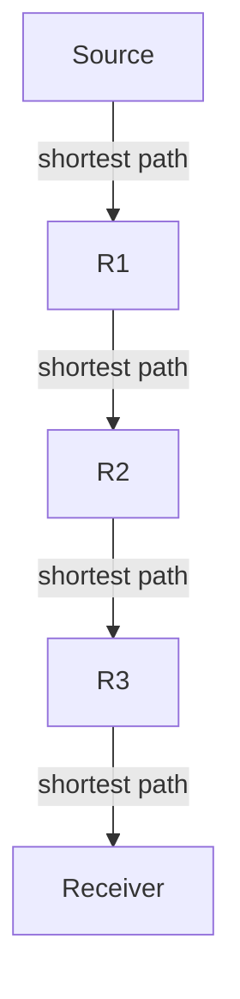
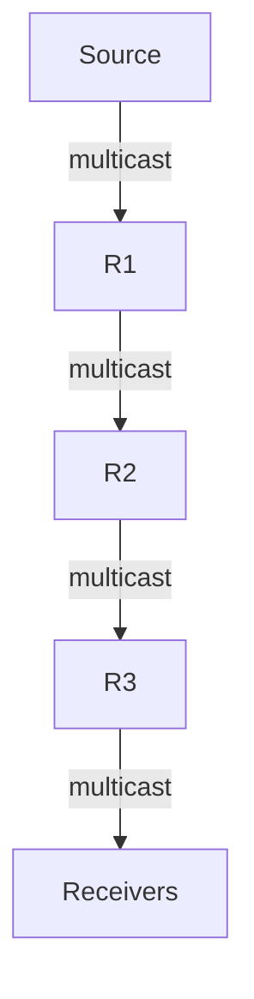
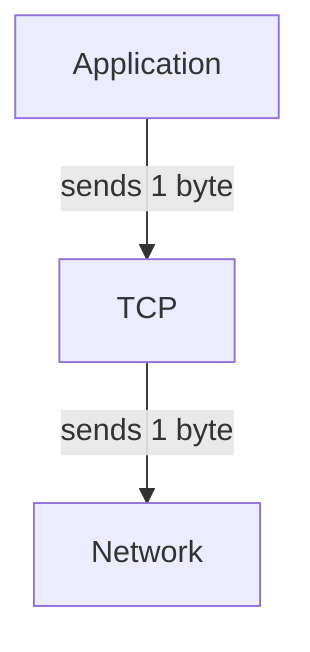
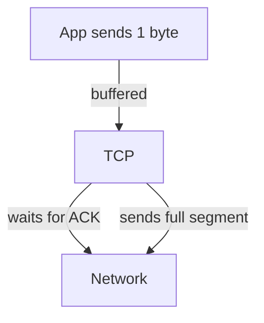
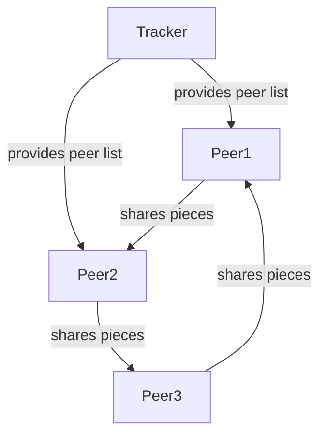

# Missing Topics: Detailed Notes

---

## RPF (Reverse Path Forwarding)

### Explanation
Reverse Path Forwarding (RPF) is a technique used in multicast routing to prevent routing loops and ensure efficient delivery of multicast packets. When a router receives a multicast packet, it checks if the packet arrived on the interface that is on the shortest path back to the source. If yes, the packet is forwarded; otherwise, it is dropped.

### Diagram


### Real-World Example
- Used in protocols like DVMRP and PIM-DM to ensure multicast packets are not duplicated or looped.

### Exam Tips
- Know the RPF check: "Did the packet arrive on the interface used to reach the source?"
- RPF prevents loops and unnecessary traffic in multicast.

### Practice Question
**Q:** What happens if a multicast packet fails the RPF check at a router?
**A:** The router drops the packet to prevent loops.

---

## DVMRP (Distance Vector Multicast Routing Protocol)

### Explanation
DVMRP is a multicast routing protocol based on distance vector algorithms. It builds multicast distribution trees using RPF and periodically exchanges routing tables with neighbors.

### Key Features
- Uses RPF to forward multicast packets.
- Builds source-based multicast trees (flood-and-prune).
- Periodic routing updates (like RIP).

### Diagram


### Real-World Example
- Early multicast deployments in the Internet used DVMRP (e.g., MBone).

### Exam Tips
- DVMRP uses distance vector logic and RPF.
- Understand "flood and prune" mechanism.

### Practice Question
**Q:** How does DVMRP prevent multicast loops?
**A:** By using RPF checks at each router.

---

## Silly-Window Syndrome

### Explanation
Silly-window syndrome is a TCP performance problem where small amounts of data are sent or acknowledged, leading to inefficient use of network resources.

### Causes
- Receiver advertises small window sizes frequently.
- Sender transmits small segments, causing high overhead.

### Solutions
- Receiver: Avoid advertising small window increments.
- Sender: Use Nagle's Algorithm to coalesce small data into larger segments.

### Diagram


### Real-World Example
- Typing characters in a remote terminal session (e.g., Telnet) can trigger silly-window syndrome if not controlled.

### Exam Tips
- Know both sender and receiver solutions.
- Nagle's Algorithm is a sender-side fix.

### Practice Question
**Q:** What is the main effect of silly-window syndrome?
**A:** Inefficient network usage due to many small packets.

---

## Nagle's Algorithm

### Explanation
Nagle's Algorithm is a TCP sender-side algorithm to reduce the number of small packets sent over the network. It coalesces small outgoing messages and sends them as a single segment when possible.

### How It Works
- If there is unacknowledged data in flight, buffer new small data until an ACK is received or enough data accumulates for a full segment.

### Diagram


### Real-World Example
- Used in Telnet, SSH, and other interactive applications to avoid network congestion from many tiny packets.

### Exam Tips
- Nagle's Algorithm helps prevent silly-window syndrome.
- Can be disabled for real-time applications needing low latency.

### Practice Question
**Q:** When does Nagle's Algorithm send a small segment immediately?
**A:** When there is no unacknowledged data in flight.

---

## SYN Flooding Attack

### Explanation
A SYN flooding attack is a type of Denial-of-Service (DoS) attack where an attacker sends many TCP SYN requests to a server, exhausting its resources and preventing legitimate connections.

### How It Works
- Attacker sends a large number of SYN packets with spoofed IP addresses.
- Server allocates resources for each half-open connection (SYN_RCVD state).
- Server's backlog queue fills up, dropping legitimate requests.

### Diagram
```mermaid
graph TD
  Attacker -- SYN --> Server
  Server -- SYN-ACK --> Attacker (no response)
  Attacker -- SYN --> Server
  Server -- SYN-ACK --> Attacker (no response)
```

### Real-World Example
- SYN floods have been used to take down web servers, mail servers, and other Internet services.

### Exam Tips
- Know the TCP state diagram and where SYN flooding exploits it.
- Defenses: SYN cookies, increasing backlog, filtering.

### Practice Question
**Q:** What is a common defense against SYN flooding?
**A:** SYN cookies, which avoid allocating resources until the handshake completes.

---

## Bit-torrent Application (P2P)

### Explanation
BitTorrent is a peer-to-peer (P2P) file sharing protocol that distributes files efficiently by splitting them into pieces and sharing them among many peers.

### How It Works
- File is divided into small pieces.
- Peers download and upload pieces to/from each other.
- Tracker coordinates peer discovery.
- Swarm: All peers sharing a file.

### Diagram


### Real-World Example
- Used for distributing large files (Linux ISOs, game updates) efficiently.

### Exam Tips
- Understand the concepts of swarm, tracker, piece selection, and tit-for-tat.
- BitTorrent reduces server load and increases download speed.

### Practice Question
**Q:** What is the role of the tracker in BitTorrent?
**A:** It helps peers find each other to exchange file pieces. 