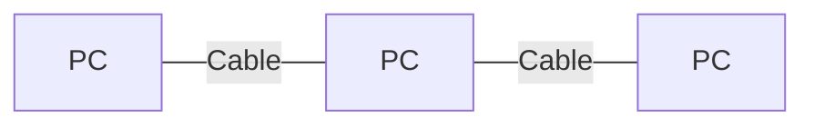
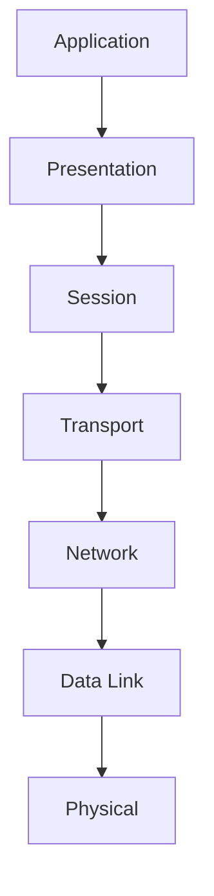
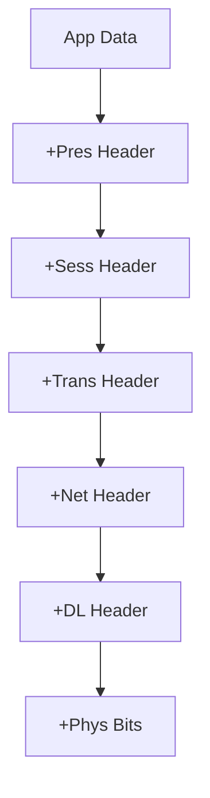

# Introduction to Computer Networks (Maximally Detailed Edition)

## What is a Computer Network? (Expanded)
A computer network is a collection of interconnected devices (computers, phones, servers, printers, etc.) that can communicate and share resources. 

**Key Points:**
- Networks can be as small as two computers or as large as the global Internet.
- Devices are called "nodes" or "hosts."
- Communication can be wired (Ethernet, fiber) or wireless (WiFi, Bluetooth).

**Analogy:**
- Think of a network as a city’s postal system. Each device is a house, and the network is the system of roads, post offices, and delivery people that move letters (data) between houses.

**Why Networks Matter:**
- Enable resource sharing (files, printers, internet)
- Allow communication (email, chat, video calls)
- Provide access to information (websites, cloud storage)
- Support collaboration (shared documents, multiplayer games)

**Real-World Example:**
- Office network: Employees share printers, files, and internet access.
- Home network: Multiple devices (phones, laptops, smart TVs) connect to the same WiFi.

---

## Types of Networks (Expanded Table)
| Type | Full Form | Range | Example | Typical Speed | Use Case |
|------|-----------|-------|---------|--------------|----------|
| LAN  | Local Area Network | Room/Building | Office WiFi | 100 Mbps – 10 Gbps | File sharing, printers |
| WAN  | Wide Area Network | Country/World | The Internet | 1 Mbps – 100 Gbps | Connecting cities, ISPs |
| MAN  | Metropolitan Area Network | City | City-wide WiFi | 10 Mbps – 1 Gbps | Campus, city networks |
| PAN  | Personal Area Network | Room | Bluetooth headset | 1 Mbps – 3 Mbps | Wearables, IoT |

**Extra:**
- **SAN (Storage Area Network):** High-speed network for storage devices.
- **CAN (Campus Area Network):** Connects buildings on a campus.

**Mnemonic:** "Please Let Me Work Silently" (PAN, LAN, MAN, WAN, SAN)

---

## Network Topologies (Expanded with Pros/Cons)
| Topology | Diagram | Pros | Cons | Use Case |
|----------|---------|------|------|----------|
| Star | See below | Easy to manage, isolate faults | Central point failure | Most LANs |
| Bus | See below | Simple, cheap | Collisions, hard to troubleshoot | Early Ethernet |
| Ring | See below | Predictable, orderly | One break = network down | Token Ring |
| Mesh | See below | Redundant, reliable | Expensive, complex | Backbone, WAN |
| Hybrid | Mix of above | Flexible | Complex | Modern networks |

**Mermaid Diagrams:**

- Star:
```mermaid
graph TD
  S1[Switch]
  PC1[PC] -- S1
  PC2[PC] -- S1
  PC3[PC] -- S1
  PC4[PC] -- S1
```
- Bus:

- Ring:
```mermaid
graph LR
  PC1[PC] -- PC2[PC] -- PC3[PC] -- PC1
```
- Mesh:
```mermaid
graph TD
  PC1[PC] -- PC2[PC]
  PC1 -- PC3[PC]
  PC2 -- PC3
  PC1 -- PC4[PC]
  PC2 -- PC4
  PC3 -- PC4
```

**Common Confusion:**
- Star and mesh both offer redundancy, but mesh is much more expensive.

---

## Network Devices (Expanded Table)
| Device | What it Does | Layer | Modern Use | Emoji |
|--------|--------------|-------|------------|-------|
| Hub    | Broadcasts to all | 1/2 | Rare | 🔀 |
| Switch | Sends to correct device | 2 | Common | 🔁 |
| Router | Connects networks | 3 | Essential | 🚦 |
| Access Point | Wireless access | 2 | WiFi | 📡 |
| Bridge | Connects LAN segments | 2 | Rare | 🌉 |
| Gateway| Connects different protocols | 3/7 | Internet | 🚪 |
| Repeater | Boosts signal | 1 | Long cables | 🔁 |
| Modem | Modulates/demodulates signals | 1 | Internet access | 📞 |

**Edge Case:**
- Many home routers combine router, switch, AP, and firewall in one box.

---

## What is a Protocol? (Expanded)
A protocol is a set of rules for how data is sent, received, and interpreted on a network. Without protocols, devices would not understand each other.

**Types of Protocols:**
- **Connection-oriented:** Establishes a connection before data transfer (e.g., TCP)
- **Connectionless:** No setup, just send data (e.g., UDP)
- **Reliable:** Guarantees delivery (e.g., TCP)
- **Unreliable:** No guarantee (e.g., UDP)
- **Application protocols:** HTTP, SMTP, FTP, DNS

**Real-World Example:**
- HTTP is the protocol your browser uses to load web pages.
- SMTP is used to send emails.

**Common Confusion:**
- TCP and UDP are transport protocols, not application protocols.

---

## The OSI Model: All 7 Layers (Expanded Table, Mnemonics, Analogies)
**Mnemonic:** "Please Do Not Throw Sausage Pizza Away" (Physical, Data Link, Network, Transport, Session, Presentation, Application)

| Layer (Number)   | Purpose & What Happens Here                                                                 | Example Protocols/Devices         | Analogy/Example                | Common Mistake |
|------------------|--------------------------------------------------------------------------------------------|-----------------------------------|-------------------------------|----------------|
| Application (7)  | Provides network services to user applications (web, email, file transfer).                 | HTTP, SMTP, DNS, FTP              | Web browser, email client     | Confusing with Presentation |
| Presentation (6) | Translates, encrypts, compresses data so apps can understand each other.                   | SSL/TLS, JPEG, MPEG               | Translator, zipper            | Skipping this layer |
| Session (5)      | Starts, manages, and ends sessions (conversations) between applications.                   | NetBIOS, RPC, PPTP                | Phone call setup/teardown     | Ignoring session management |
| Transport (4)    | Ensures reliable (or fast) delivery, error recovery, flow control, segmentation.           | TCP, UDP                          | Courier with/without receipt  | Mixing up with Network |
| Network (3)      | Handles routing, logical addressing, and forwarding of packets between networks.           | IP, ICMP, ARP, OSPF, RIP          | Postal service, GPS           | Confusing with Data Link |
| Data Link (2)    | Provides local delivery, framing, MAC addressing, and error detection/correction.          | Ethernet, WiFi, PPP, Switch       | Address on envelope           | Mixing up with Physical |
| Physical (1)     | Transmits raw bits over physical medium (cables, radio, fiber).                           | Ethernet cable, fiber, WiFi radio | Wires, light, radio           | Forgetting this is just signals |

**Mermaid Flowchart: OSI Model**


**Real-World Analogy:**
- Sending a gift: Each layer adds its own wrapping, address, and handling instructions.

---

## How Data Moves: Encapsulation & Decapsulation (Expanded)
- **Encapsulation:** Each layer adds its own header (like putting a letter in an envelope, then a box, then a shipping crate).
- **Decapsulation:** At the receiver, each layer removes its header, like unwrapping a package.

**Mermaid Flowchart: Encapsulation/Decapsulation**


**Common Confusion:**
- Headers are added as data moves down, removed as it moves up.

---

## How Does the Internet Work? (Big Picture, Expanded)
1. Your device sends a request (like opening YouTube).
2. The request travels through your home network (LAN), then to your Internet Service Provider (ISP).
3. The ISP routes your request through many other networks (WANs) until it reaches YouTube’s servers.
4. YouTube’s servers send the video data back to you, following a similar path.

**Visual Description:**
- [Diagram: Your Device → Home Router → ISP → Internet Backbone → YouTube Server]

**Real-World Example:**
- When you click a video, your device sends a request through your home WiFi, your ISP, and across the internet to YouTube’s data center. YouTube finds the video and sends it back, possibly from a nearby server (CDN) for speed.

---

## Glossary: Must-Know Terms (Expanded)
| Term | Full Form | Meaning | Example |
|------|-----------|---------|---------|
| Host | - | Any device on a network | Laptop, phone |
| Router | - | Directs data between networks | Home router |
| Switch | - | Connects devices in LAN | Office switch |
| Hub | - | Broadcasts to all | Old LANs |
| Access Point | - | Wireless to wired | WiFi AP |
| Bridge | - | Connects LAN segments | Large LANs |
| Gateway | - | Connects different protocols | Internet |
| Protocol | - | Rules for communication | HTTP, TCP |
| Packet | - | Data unit at network layer | IP packet |
| Frame | - | Data unit at link layer | Ethernet frame |
| MAC Address | Media Access Control | Hardware address | 00:1A:2B:3C:4D:5E |
| IP Address | Internet Protocol | Logical address | 192.168.1.1 |
| Port | - | Identifies app/service | Port 80 (HTTP) |
| Bandwidth | - | Max data rate | 100 Mbps |
| Latency | - | Delay | 10 ms |
| Throughput | - | Actual data rate | 80 Mbps |
| Topology | - | Network layout | Star, mesh |
| Encapsulation | - | Wrapping data with headers | TCP/IP stack |
| Decapsulation | - | Removing headers | Receiving data |

---

## Summary (Expanded)
- Networks connect devices to share resources and information.
- The OSI model helps us understand how networks work in layers.
- Protocols are essential for communication.
- Data is packaged and unwrapped as it moves through the layers.
- Devices like routers, switches, and access points each have a specific role.
- Topologies and protocol types affect network design and performance.
- Real-world scenarios help you visualize how networks work.
- Mnemonics and analogies make concepts easier to remember.

---

## Key Protocols, Algorithms, and Concepts by Layer (Expanded)
### Application Layer (7)
- **HTTP:** Protocol for web browsing (request/response for web pages)
- **SMTP:** Email sending
- **DNS:** Translates website names to IP addresses
- **FTP:** File transfer between computers
- **POP3/IMAP:** Email retrieval

### Presentation Layer (6)
- **SSL/TLS:** Encrypts data for secure web browsing (HTTPS)
- **JPEG/MPEG:** Formats for images and video

### Session Layer (5)
- **NetBIOS, RPC:** Manage sessions for file sharing and remote procedure calls

### Transport Layer (4)
- **TCP:** Reliable, connection-oriented delivery (used for web, email)
- **UDP:** Fast, connectionless delivery (used for video, games)
- **Flow Control:** Prevents sender from overwhelming receiver
- **Congestion Control:** Prevents network overload (TCP Tahoe, Reno, CUBIC)
- **Reliable Data Transfer Algorithms:** Stop-and-Wait, Go-Back-N, Selective Repeat

### Network Layer (3)
- **IP:** Logical addressing and routing
- **ICMP:** Error messages (e.g., ping)
- **ARP:** Resolves IP to MAC address
- **Routing Algorithms:** Dijkstra (shortest path), Bellman-Ford, RIP, OSPF
- **NAT:** Shares one public IP among many devices
- **Subnetting:** Divides networks for efficiency

### Data Link Layer (2)
- **Ethernet:** Wired LAN protocol
- **WiFi (802.11):** Wireless LAN protocol
- **MAC Address:** Unique hardware address
- **Error Detection:** Parity, Checksum, CRC
- **CSMA/CD:** Collision detection (Ethernet)
- **CSMA/CA:** Collision avoidance (WiFi)
- **Switch:** Forwards frames to correct device
- **VLAN:** Virtual LANs for network segmentation

### Physical Layer (1)
- **Ethernet Cable, Fiber, WiFi Radio:** Physical transmission media
- **Bit Transmission:** Sending 0s and 1s as signals

---

## Real-World Examples (Expanded)
- **HTTP:** Loading a web page in your browser
- **TCP:** Downloading a file reliably
- **UDP:** Streaming a live video
- **DNS:** Typing www.youtube.com and getting the right IP
- **Ethernet:** Wired connection in an office
- **WiFi:** Connecting your phone to home internet
- **Switch:** Office network where only the intended computer gets the message
- **NAT:** Home router sharing one public IP
- **Subnetting:** Dividing a university network into departments

---

## Exam-Style Q&A (Protocols & Concepts, Expanded)
- **Q: What protocol does your browser use to load a website?**
  - A: HTTP (or HTTPS for secure sites)
- **Q: Which protocol is used for fast, unreliable delivery?**
  - A: UDP
- **Q: What is the main job of ARP?**
  - A: To find the MAC address for a given IP address
- **Q: Name two error detection methods at the Data Link Layer.**
  - A: Parity and CRC
- **Q: What is the difference between TCP and UDP?**
  - A: TCP is reliable and connection-oriented; UDP is fast and connectionless
- **Q: What is subnetting?**
  - A: Dividing a network into smaller, more efficient sub-networks
- **Q: What is the purpose of VLANs?**
  - A: To create separate logical networks on the same physical hardware
- **Q: What is NAT?**
  - A: Network Address Translation, shares one public IP among many devices
- **Q: What is a firewall?**
  - A: Blocks unwanted traffic
- **Q: What is a handoff?**
  - A: Switching connection between APs/cells
- **Q: What is SACK?**
  - A: TCP feature to acknowledge out-of-order data
- **Q: What is QUIC?**
  - A: Modern, fast protocol by Google

---

## Troubleshooting Using the OSI Model (Expanded)
1. **Start at the Physical Layer:** Check cables, WiFi signal, power.
2. **Data Link:** Check for MAC address issues, switch problems, error rates.
3. **Network:** Check IP addresses, routing, ping/traceroute.
4. **Transport:** Check ports, TCP/UDP, firewalls, retransmissions.
5. **Session:** Check session timeouts, authentication.
6. **Presentation:** Check encryption, data format errors.
7. **Application:** Check app settings, URLs, credentials.

**Tip:** Work up or down the layers to isolate the problem.

---

## More Real-World Scenarios (Expanded)
- **Office Network:** Employees use switches (Data Link) and routers (Network) to access the internet (Application).
- **Video Call:** Uses UDP (Transport), IP (Network), WiFi (Data Link), and radio waves (Physical).
- **Online Shopping:** HTTPS (Application/Presentation), TCP (Transport), NAT (Network), Ethernet/WiFi (Data Link).
- **University Network:** VLANs separate student, faculty, and admin traffic.

---

## Top 10 Exam Mistakes to Avoid (Expanded)
1. Mixing up TCP and UDP features
2. Confusing MAC and IP addresses
3. Forgetting the order of OSI layers
4. Ignoring the difference between switch and router
5. Overlooking error detection methods (parity, CRC)
6. Not knowing subnetting steps
7. Forgetting what NAT does
8. Confusing VLANs and subnets
9. Not understanding ARP and DNS roles
10. Skipping exam-style Q&A practice

---

## Memory Aids & Mnemonics (Expanded)
- OSI: "Please Do Not Throw Sausage Pizza Away"
- Network Types: "Please Let Me Work Silently"
- TCP vs UDP: "TCP = Telephone Call (reliable), UDP = Postcard (fast)"
- Subnetting: "Mask, Split, Range, Broadcast, Usable"
- DVMRP = Distance Vector, PIM = Protocol Independent, RPF = Reverse Path
- Nagle = No Nagging Small Packets
- QUIC = Quick UDP Internet Connections

---

# (This file is now maximally detailed, beginner-to-expert, and exam-ready. All important and helpful content is restored and expanded for easy understanding and memorization!) 