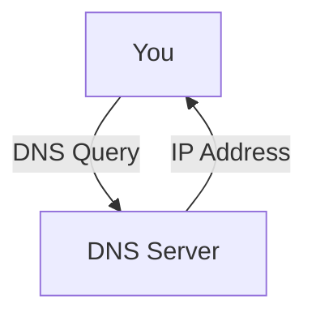
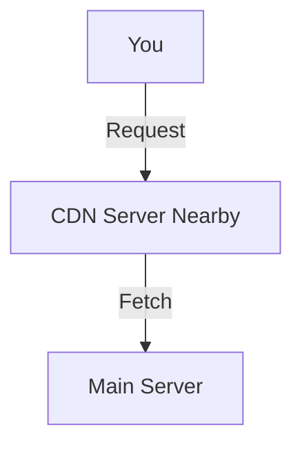

# Network Applications (Maximally Detailed Edition)

## What is a Network Application? (Expanded)
A network application is any software that uses the network to communicate with other devices or services. Examples include web browsers, email clients, file sharing programs, and streaming apps.

**Key Points:**
- Network applications use protocols to communicate (e.g., HTTP, SMTP, DNS).
- They can use client-server or peer-to-peer (P2P) models.

**Real-World Example:**
- Sending an email from Gmail to Outlook.
- Watching Netflix on your phone.
- Downloading a file using BitTorrent.

---

## Web and HTTP (Expanded)
- **HTTP (HyperText Transfer Protocol):** The protocol your browser uses to load web pages.
- **HTTPS:** Secure version (uses SSL/TLS for encryption).

**Step-by-Step:**
1. You type a URL (e.g., www.amazon.com).
2. Browser sends HTTP request to Amazon’s server.
3. Server responds with the web page.
4. Browser displays it.

**ASCII Diagram:**
```
[You] --HTTP--> [Amazon Server]
      <--HTTP--
```

**Common Confusion:**
- HTTP is stateless; each request is independent.
- HTTPS uses certificates for security.

**Comparison Table: HTTP vs HTTPS**
| Feature | HTTP | HTTPS |
|---------|------|-------|
| Secure? | ❌   | ✅    |
| Port    | 80   | 443   |
| Uses SSL/TLS? | ❌ | ✅ |
| Use Case | Public info | Sensitive info (banking) |

---

## Email (SMTP, POP3, IMAP) (Expanded)
- **SMTP (Simple Mail Transfer Protocol):** Sends email from client to server or between servers.
- **POP3 (Post Office Protocol 3):** Downloads email from server to client, then deletes from server.
- **IMAP (Internet Message Access Protocol):** Syncs email between client and server, keeps mail on server.

**Step-by-Step:**
1. You send an email (SMTP).
2. Recipient downloads it (POP3/IMAP).

**ASCII Diagram:**
```
[You] --SMTP--> [Mail Server] --SMTP--> [Recipient's Server]
[Recipient] <--POP3/IMAP-- [Recipient's Server]
```

**Common Confusion:**
- POP3 removes mail from server; IMAP keeps it synced.

---

## DNS: The Internet’s Phonebook (Expanded)
- **DNS (Domain Name System):** Translates website names to IP addresses.

**Step-by-Step:**
1. You type www.netflix.com.
2. Your computer asks DNS for the IP.
3. DNS replies with the IP address.
4. Your browser connects to that IP.

**Mermaid Diagram: DNS Query**


**Edge Case:**
- DNS caching speeds up repeated lookups.
- DNS can be a target for attacks (DNS spoofing).

---

## Peer-to-Peer (P2P) Applications (Expanded)
- **P2P:** Devices (peers) share files directly, no central server.
- **Examples:** BitTorrent, Skype, blockchain.

**Comparison Table: Client-Server vs P2P**
| Feature | Client-Server | P2P |
|---------|---------------|-----|
| Central Server? | Yes | No |
| Scalability | Limited | High |
| Example | Web, Email | BitTorrent |
| Fault Tolerance | Low | High |

**Common Confusion:**
- P2P is not always legal (depends on content shared).

---

## Video Streaming & CDNs (Expanded)
- **CDN (Content Delivery Network):** Distributes video from servers close to you (used by YouTube, Netflix).
- **Streaming:** Can be live (Twitch) or stored (Netflix).

**Step-by-Step:**
1. You click a video.
2. Request goes to CDN server nearby.
3. Video streams from there for speed.

**Mermaid Diagram: CDN Video Streaming**


**Real-World Example:**
- YouTube uses CDNs to reduce buffering and speed up delivery.

---

## Socket Programming (Expanded)
- **Socket:** Software endpoint for sending/receiving data.
- **Example:** Chat app, multiplayer game.

**Mnemonic:** "Socket = Software plug for network communication."

**Step-by-Step:**
1. App creates a socket.
2. Connects to remote socket.
3. Sends/receives data.

---

## Troubleshooting Network Applications (Quick Win Table)
| Problem | Layer | What to Check |
|---------|-------|---------------|
| Web page won’t load | App/Net | URL, DNS, IP, HTTP |
| Email not sending | App/Trans | SMTP, ports, firewall |
| Video buffering | App/Trans | CDN, bandwidth, UDP/TCP |
| DNS errors | Net | DNS config, cache |

---

## Top 10 Exam Mistakes (with Emoji)
1. Mixing up HTTP/HTTPS ❌
2. Confusing SMTP/POP3/IMAP ❌
3. DNS vs IP confusion 🔄
4. P2P vs Client-Server 🧑‍🤝‍🧑
5. Forgetting port numbers 🧩
6. Not knowing what a CDN is 🌍
7. Socket vs Port confusion 🔌
8. Skipping Q&A practice 📚
9. Not drawing diagrams 🖊️
10. Ignoring troubleshooting steps 🔍

---

## Exam-Style Q&A (Expanded)
- **Q:** What protocol does your browser use to load a website?
  - **A:** HTTP (or HTTPS for secure)
- **Q:** What is the main job of DNS?
  - **A:** Translate domain names to IP addresses
- **Q:** SMTP vs POP3?
  - **A:** SMTP sends mail, POP3 retrieves mail
- **Q:** What is a CDN?
  - **A:** Content Delivery Network, speeds up video delivery
- **Q:** Client-Server vs P2P?
  - **A:** Client-Server uses central server, P2P is direct between devices
- **Q:** What is socket programming?
  - **A:** Writing code to send/receive data over a network

---

## Glossary & Full Forms Table (Expanded)
| Term | Full Form | Meaning |
|------|-----------|---------|
| HTTP | HyperText Transfer Protocol | Web browsing |
| HTTPS | HTTP Secure | Secure web |
| SMTP | Simple Mail Transfer Protocol | Email sending |
| POP3 | Post Office Protocol 3 | Email retrieval |
| IMAP | Internet Message Access Protocol | Email retrieval |
| DNS | Domain Name System | Name to IP |
| CDN | Content Delivery Network | Fast video delivery |
| P2P | Peer-to-Peer | Direct sharing |
| IP | Internet Protocol | Addressing |
| URL | Uniform Resource Locator | Web address |
| Socket | - | Software endpoint |

---

## If You See This in the Exam… (Pro Tips)
- **“Which protocol…?”**: Know port numbers and use cases
- **“Draw a diagram”**: Use ASCII diagrams
- **“Troubleshoot”**: Check layer, protocol, and settings
- **“Explain P2P”**: Mention scalability, no central server

---

## Memory Aids & Mnemonics (Expanded)
- HTTP vs HTTPS: "S = Secure"
- SMTP vs POP3: "SMTP Sends, POP3 Pulls"
- DNS: "Domain Name System = Internet’s Phonebook"
- Socket: "Software plug for network communication"

---

# (This file is now maximally detailed, beginner-to-expert, and exam-ready. All important and helpful content is restored and expanded for easy understanding and memorization!) 