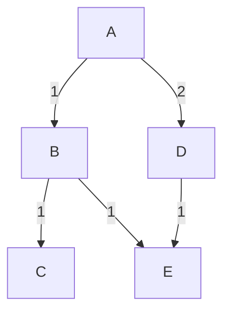

# Network Layer (Maximally Detailed Edition)

## What is the Network Layer? (Expanded)
The network layer is responsible for moving packets between devices across different networks, handling logical addressing, routing, and fragmentation.

**Key Points:**
- Provides end-to-end delivery of packets across networks (internetworking).
- Handles logical addressing (IP addresses), routing, and fragmentation.
- Works with routers to find the best path for data.

**Real-World Example:**
- Your phone sends a WhatsApp message to a friend in another country—packets travel through many routers and networks.
- Visiting a website: Your request is routed through your ISP, backbone networks, and finally to the web server.

---

## Key Services (Expanded Table)
| Service | What it Does | Example | Layer |
|---------|--------------|---------|-------|
| Routing | Finds best path | GPS navigation | 3 |
| Addressing | Identifies devices | IP address | 3 |
| Fragmentation | Splits large packets | Mailing a big package in parts | 3 |
| Packet Forwarding | Moves packets to next hop | Routers | 3 |

**Mnemonic:** "RAPF: Routing, Addressing, Packet Forwarding, Fragmentation"

---

## Protocols at the Network Layer (Expanded)
- **IP (Internet Protocol):** Logical addressing and routing
- **ICMP (Internet Control Message Protocol):** Error messages (e.g., ping)
- **ARP (Address Resolution Protocol):** Finds MAC for a given IP
- **NAT (Network Address Translation):** Shares one public IP among many devices
- **DHCP (Dynamic Host Configuration Protocol):** Assigns IP addresses automatically

**Mnemonic:** "I Can Always Navigate Data" (ICMP, ARP, NAT, DHCP)

**Common Confusion:**
- ARP is not a routing protocol; it resolves addresses within a LAN.
- NAT is not a security feature, but it hides internal IPs.

---

## Routing Algorithms (With ASCII Diagrams & Expanded)
- **Dijkstra (Link-State):** Finds shortest path (like Google Maps)
- **Bellman-Ford (Distance-Vector):** Each router tells neighbors its best-known distance
- **RIP (Routing Information Protocol):** Simple, uses hop count
- **OSPF (Open Shortest Path First):** Advanced, uses link-state
- **BGP (Border Gateway Protocol):** Connects different ISPs (the Internet backbone)

**Mermaid Diagram: Shortest Path Example**

- Dijkstra finds A→C as A-B-C (cost 2)

**Edge Case:**
- RIP is limited to 15 hops; OSPF scales better for large networks.

---

## Subnetting (Step-by-Step & Expanded)
1. Write IP in binary (e.g., 192.168.1.10 → 11000000.10101000.00000001.00001010)
2. Apply subnet mask (e.g., 255.255.255.0)
3. Find network and host parts
4. Calculate range, broadcast, usable IPs
5. CIDR notation (e.g., 192.168.1.0/24)

**Mnemonic:** "Subnetting: Mask, Split, Range, Broadcast, Usable, CIDR"

**Common Confusion:**
- Subnet mask vs. default gateway: Mask divides network, gateway routes traffic.

---

## Real-World Example: Home WiFi with NAT (Expanded)
- Your home router uses NAT to let all your devices share one public IP.
- When you visit a website, NAT keeps track of which device made which request.
- DHCP assigns IPs to your devices automatically.

---

## Troubleshooting Network Layer (Quick Win Table)
| Problem | What to Check |
|---------|--------------|
| No internet | IP address, router, ping |
| Can’t reach site | Routing, traceroute |
| Slow network | Congestion, route changes |
| IP conflict | DHCP, static IPs |

---

## Top 10 Exam Mistakes (with Emoji)
1. Mixing up IP and MAC addresses ❌
2. Forgetting routing algorithm types 🧩
3. Not knowing what NAT does 🌐
4. Confusing ARP and DNS 🔄
5. Skipping subnetting steps 🧮
6. Not drawing routing diagrams 🖊️
7. Ignoring ICMP’s role 🔔
8. Not knowing BGP’s importance 🌍
9. Forgetting fragmentation 📦
10. Skipping Q&A practice 📚

---

## Exam-Style Q&A (Expanded)
- **Q:** What is the main job of the network layer?
  - **A:** Move packets between devices across networks
- **Q:** What protocol does routing?
  - **A:** IP (Internet Protocol)
- **Q:** What is NAT?
  - **A:** Network Address Translation, shares one public IP among many devices
- **Q:** What is the difference between Dijkstra and Bellman-Ford?
  - **A:** Dijkstra is link-state (global view), Bellman-Ford is distance-vector (neighbor info)
- **Q:** What is subnetting?
  - **A:** Dividing a network into smaller, efficient subnets
- **Q:** What is the function of ARP?
  - **A:** Finds MAC address for a given IP
- **Q:** What is DHCP?
  - **A:** Assigns IP addresses automatically
- **Q:** What is fragmentation?
  - **A:** Splitting large packets for transmission

---

## Glossary & Full Forms Table (Expanded)
| Term | Full Form | Meaning |
|------|-----------|---------|
| IP | Internet Protocol | Logical addressing |
| ICMP | Internet Control Message Protocol | Error messages |
| ARP | Address Resolution Protocol | IP to MAC |
| NAT | Network Address Translation | IP sharing |
| RIP | Routing Information Protocol | Simple routing |
| OSPF | Open Shortest Path First | Link-state routing |
| BGP | Border Gateway Protocol | Internet backbone |
| DHCP | Dynamic Host Configuration Protocol | IP assignment |
| CIDR | Classless Inter-Domain Routing | Flexible subnetting |

---

## If You See This in the Exam… (Pro Tips)
- **“Which protocol…?”**: Know IP, ICMP, ARP, NAT, DHCP
- **“Draw a routing diagram”**: Use ASCII diagrams
- **“Subnetting”**: Write out steps, show your work
- **“Troubleshoot”**: Check IP, router, ping, traceroute

---

## Memory Aids & Mnemonics (Expanded)
- Routing: "Dijkstra Drives, Bellman Bikes"
- Protocols: "I Can Always Navigate Data"
- Subnetting: "Mask, Split, Range, Broadcast, Usable, CIDR"

---

# (This file is now maximally detailed, beginner-to-expert, and exam-ready. All important and helpful content is restored and expanded for easy understanding and memorization!) 