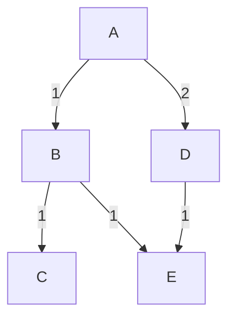

# Routing (Maximally Detailed Edition)

## What is Routing? (Expanded)
Routing is the process of finding the best path for data to travel across networks. Routers use algorithms and tables to decide where to send each packet.

**Key Points:**
- Routing can be static (manual) or dynamic (automatic updates).
- Routers use metrics like hop count, cost, and bandwidth to choose paths.

**Real-World Example:**
- Sending an email from India to the US—data hops through many routers and networks.
- Streaming a video from Netflix—packets may take different routes to reach you.

---

## Types of Routing (Expanded Table)
| Type | What it Does | Example | Pros | Cons |
|------|--------------|---------|------|------|
| Static | Fixed path, manual | Small office | Simple, predictable | Not scalable |
| Dynamic | Routers update paths | The Internet | Scalable, adapts | Complex, needs protocols |

**Mnemonic:** "Static = Set, Dynamic = Decides"

---

## Routing Algorithms (With ASCII Diagrams & Expanded)
- **Dijkstra (Link-State):** Each router knows the whole network, computes shortest path.
- **Bellman-Ford (Distance-Vector):** Routers only know neighbors, share best-known distances.
- **RIP:** Simple, uses hop count, max 15 hops.
- **OSPF:** Advanced, uses link-state, supports large networks.
- **BGP:** Connects ISPs, global Internet, uses path vector.

**Mermaid Diagram: Routing Example**

- Dijkstra finds A→C as A-B-C (cost 2)

**Edge Case:**
- RIP is vulnerable to count-to-infinity problem.
- BGP is policy-based, not just shortest path.

---

## Intra-AS vs Inter-AS Routing (Expanded)
- **Intra-AS (within one network):** OSPF, RIP
- **Inter-AS (between networks):** BGP

**Mnemonic:** "Intra = Inside, Inter = Between"

**Common Confusion:**
- OSPF and RIP are not used between ISPs; BGP is.

---

## Real-World Example: ISP Routing (Expanded)
- Your ISP uses OSPF for its own network, BGP to connect to other ISPs.
- Large companies may use both OSPF (internal) and BGP (external).

---

## Troubleshooting Routing (Quick Win Table)
| Problem | What to Check |
|---------|--------------|
| Can’t reach site | Routing table, traceroute |
| Slow path | Congestion, route changes |
| Loops | Routing algorithm, config |
| Route flapping | BGP stability, link issues |

---

## Top 10 Exam Mistakes (with Emoji)
1. Mixing up Dijkstra and Bellman-Ford ❌
2. Forgetting difference between intra/inter-AS 🧩
3. Not knowing BGP’s role 🌍
4. Confusing static and dynamic routing 🔄
5. Skipping routing diagrams 🖊️
6. Not knowing hop count in RIP 🧮
7. Ignoring OSPF’s link-state nature 🔗
8. Not knowing what a routing table is 📋
9. Forgetting troubleshooting steps 🔍
10. Skipping Q&A practice 📚

---

## Exam-Style Q&A (Expanded)
- **Q:** What is the main job of routing?
  - **A:** Find the best path for data across networks
- **Q:** Dijkstra vs Bellman-Ford?
  - **A:** Dijkstra = link-state, Bellman-Ford = distance-vector
- **Q:** What is BGP?
  - **A:** Border Gateway Protocol, connects ISPs
- **Q:** What is OSPF?
  - **A:** Open Shortest Path First, intra-AS link-state protocol
- **Q:** Static vs Dynamic routing?
  - **A:** Static = manual, Dynamic = routers update automatically
- **Q:** What is route flapping?
  - **A:** Rapid, repeated changes in route availability

---

## Glossary & Full Forms Table (Expanded)
| Term | Full Form | Meaning |
|------|-----------|---------|
| RIP | Routing Information Protocol | Simple routing |
| OSPF | Open Shortest Path First | Link-state routing |
| BGP | Border Gateway Protocol | Internet backbone |
| AS | Autonomous System | Network domain |
| Path Vector | - | BGP routing method |

---

## If You See This in the Exam… (Pro Tips)
- **“Which algorithm…?”**: Know Dijkstra, Bellman-Ford, RIP, OSPF, BGP
- **“Draw a routing diagram”**: Use ASCII diagrams
- **“Troubleshoot”**: Check routing table, traceroute, route flapping

---

## Memory Aids & Mnemonics (Expanded)
- Intra = Inside, Inter = Between
- Dijkstra Drives, Bellman Bikes
- Static = Set, Dynamic = Decides

---

# (This file is now maximally detailed, beginner-to-expert, and exam-ready. All important and helpful content is restored and expanded for easy understanding and memorization!) 