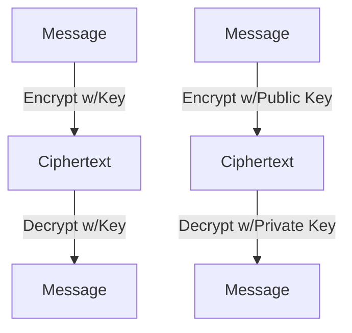
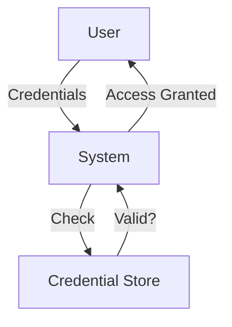
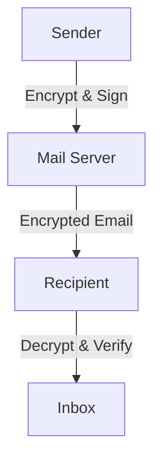

# Network Security (Maximally Detailed Edition)

## What is Network Security? (Expanded)
Network security protects data as it travels, ensuring confidentiality, integrity, and availability (CIA). It uses cryptography, authentication, secure protocols, and network devices to defend against threats.

**Key Points:**
- Protects data in transit and at rest
- Prevents unauthorized access, tampering, and denial of service
- Uses multiple layers of defense (defense in depth)

**Real-World Example:**
- Online banking uses HTTPS (SSL/TLS) to keep your info safe
- VPNs encrypt your internet traffic on public WiFi

---

## Security Principles (Expanded Table)
| Principle | What it Means | Example | Layer |
|-----------|--------------|---------|-------|
| Confidentiality | Only intended can read | Encryption | All |
| Integrity | No tampering | Hashes, digital signatures | All |
| Availability | Always accessible | Redundancy, backups | All |
| Authentication | Prove identity | Passwords, biometrics | All |
| Authorization | Control access | Permissions, firewalls | All |

**Mnemonic:** "CIAAA: Confidentiality, Integrity, Availability, Authentication, Authorization"

**Common Confusion:**
- Authentication = Who are you? Authorization = What can you do?

---

## Cryptography (With Mermaid Diagrams & Expanded)
- **Symmetric:** Same key for encrypt/decrypt (e.g., AES)
- **Asymmetric:** Public/private keys (e.g., RSA)
- **Hashing:** One-way function for integrity (e.g., SHA-256)

**Mermaid Diagram: Symmetric vs Asymmetric Encryption**


**Edge Case:**
- Asymmetric is slower but more secure for key exchange.

---

## Authentication (Step-by-Step & Expanded)
**Mermaid Diagram: Authentication Process**


**Mnemonic:** "Authentication = Are you who you say you are?"

**Common Confusion:**
- Passwords are not the only authentication method; biometrics, tokens, and certificates are used too.

---

## Secure Protocols (SSL/TLS, IPsec, SSH, HTTPS) (Expanded)
- **SSL/TLS:** Encrypts web traffic (HTTPS)
- **IPsec:** Encrypts at network layer (VPNs)
- **SSH:** Secure remote login
- **HTTPS:** Secure web browsing (uses SSL/TLS)

**Comparison Table: SSL/TLS vs IPsec vs SSH**
| Feature | SSL/TLS | IPsec | SSH |
|---------|---------|-------|-----|
| Layer | Application | Network | Application |
| Use Case | Web (HTTPS) | VPN | Remote login |
| Key Exchange | Yes | Yes | Yes |

**Common Confusion:**
- SSL is deprecated; TLS is the modern standard.

---

## Firewalls & Intrusion Detection Systems (IDS) (Expanded)
**Mermaid Diagram: Firewall and IDS**
```mermaid
graph TD
  Internet[Internet] -- Traffic --> FW[Firewall]
  FW -- Allowed Traffic --> Net[Your Network]
  FW -- Blocked Traffic -.-> Trash[Blocked]
  Net -- Suspicious Activity --> IDS[IDS]
  IDS -- Alert --> Admin[Admin]
```

**Edge Case:**
- Firewalls can be hardware or software, stateful or stateless.

---

## Real-World Example: Email Security (Expanded)
**Mermaid Diagram: Secure Email Flow**


---

## Troubleshooting Security (Quick Win Table)
| Problem | What to Check |
|---------|--------------|
| Can’t access site | Firewall, SSL cert |
| Data leak | Encryption, access control |
| Tampered data | Hashes, integrity checks |
| Phishing | Email filters, user training |

---

## Top 10 Exam Mistakes (with Emoji)
1. Mixing up symmetric/asymmetric ❌
2. Forgetting CIA principles 🧩
3. Not knowing SSL/TLS vs IPsec 🔒
4. Confusing authentication and authorization 🔑
5. Skipping diagrams 🖊️
6. Ignoring firewalls/IDS 🧱
7. Not knowing what a digital signature is ✍️
8. Forgetting troubleshooting steps 🔍
9. Not knowing VPN use cases 🌍
10. Skipping Q&A practice 📚

---

## Exam-Style Q&A (Expanded)
- **Q:** What is the main job of network security?
  - **A:** Protect data as it travels
- **Q:** Symmetric vs Asymmetric?
  - **A:** Symmetric = same key, Asymmetric = public/private keys
- **Q:** What is SSL/TLS?
  - **A:** Secure web traffic (HTTPS)
- **Q:** What is a firewall?
  - **A:** Blocks unwanted traffic
- **Q:** What is a digital signature?
  - **A:** Proves message integrity and sender
- **Q:** What is SSH?
  - **A:** Secure remote login protocol
- **Q:** What is MFA?
  - **A:** Multi-factor authentication

---

## Glossary & Full Forms Table (Expanded)
| Term | Full Form | Meaning |
|------|-----------|---------|
| SSL | Secure Sockets Layer | Web encryption |
| TLS | Transport Layer Security | Web encryption |
| IPsec | Internet Protocol Security | VPN encryption |
| VPN | Virtual Private Network | Secure tunnel |
| IDS | Intrusion Detection System | Attack detection |
| IPS | Intrusion Prevention System | Attack blocking |
| CIA | Confidentiality, Integrity, Availability | Security principles |
| MFA | Multi-Factor Authentication | Extra security |
| DMARC | Domain-based Message Authentication, Reporting & Conformance | Email security |

---

## If You See This in the Exam… (Pro Tips)
- **“Which protocol…?”**: Know SSL/TLS, IPsec, VPN, SSH
- **“Draw encryption diagram”**: Use ASCII diagrams
- **“Troubleshoot”**: Check firewall, certs, hashes, phishing

---

## Memory Aids & Mnemonics (Expanded)
- CIAAA: Confidentiality, Integrity, Availability, Authentication, Authorization
- Authentication: "Are you who you say you are?"
- SSL is old, TLS is new

---

# (This file is now maximally detailed, beginner-to-expert, and exam-ready. All important and helpful content is restored and expanded for easy understanding and memorization!) 