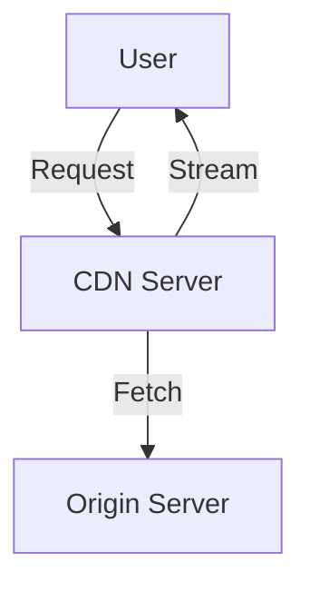
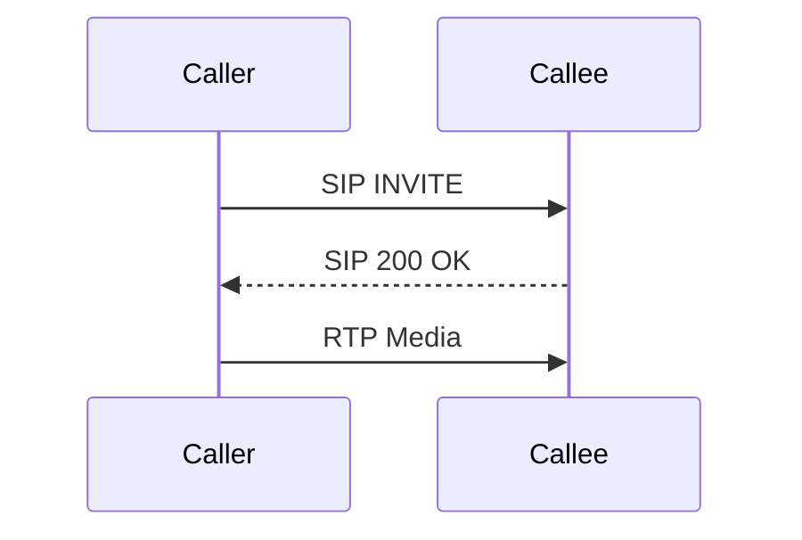

# Multimedia Networking (Maximally Detailed Edition)

## What is Multimedia Networking? (Expanded)
Multimedia networking delivers audio, video, and voice over networks. It requires special protocols and techniques to handle delay, jitter, and loss.

**Key Points:**
- Supports streaming (live and stored), VoIP, and video conferencing
- Needs to manage quality of service (QoS)
- Uses protocols like RTP, RTSP, SIP

**Real-World Example:**
- YouTube uses CDNs to stream video smoothly to millions
- Zoom uses RTP and SIP for real-time video calls

---

## Applications (Expanded Table)
| App | What it Does | Example | Protocols |
|-----|--------------|---------|-----------|
| Streaming | Plays audio/video | Netflix, YouTube | RTP, RTSP |
| VoIP | Voice calls | Skype, WhatsApp | SIP, RTP |
| Live | Real-time events | Twitch, Zoom | RTP, SIP |

**Mnemonic:** "Streaming = Stored or Live, VoIP = Voice over IP"

---

## Protocols (With ASCII Diagrams & Expanded)
- **RTP (Real-time Transport Protocol):** Delivers audio/video
- **RTSP (Real-Time Streaming Protocol):** Controls streaming
- **SIP (Session Initiation Protocol):** Sets up calls
- **H.264, H.265:** Video compression standards

**ASCII Diagram:**
```
[Client]--RTP-->[Server]
[Client]<--RTSP--[Server]
```

**Common Confusion:**
- RTP does not guarantee delivery; it is often used with UDP.

---

## Streaming: Stored vs Live (Step-by-Step & Expanded)
- **Stored:** Video is pre-recorded (Netflix)
- **Live:** Video is sent as it happens (Twitch)
- **Buffering:** Used to smooth out network delays

**Comparison Table: Stored vs Live Streaming (Expanded)**
| Feature | Stored | Live |
|---------|--------|------|
| Buffering | Yes | Minimal |
| Delay | Low | Can be high |
| Example | Netflix | Twitch |
| Protocols | RTP, RTSP | RTP, SIP |

**Edge Case:**
- Live streaming is more sensitive to delay and loss.

---

## QoS (Quality of Service) (Expanded)
- **Delay:** Time for data to arrive
- **Jitter:** Variation in delay
- **Loss:** Packets not arriving
- **Bandwidth:** Amount of data that can be sent
- **Reservation:** Some networks reserve bandwidth for media

**Mnemonic:** "DJ Loves Quality" (Delay, Jitter, Loss, QoS)

**Common Confusion:**
- QoS is not just about speed; it’s about consistency and reliability.

---

## Real-World Example: Video Call on Zoom (Expanded)
- Audio/video sent in real time using RTP
- SIP sets up the call
- RTSP may control the stream
- Buffering helps smooth out network hiccups

---

## Troubleshooting Multimedia (Quick Win Table)
| Problem | What to Check |
|---------|--------------|
| Buffering | Bandwidth, server |
| Poor quality | Delay, jitter, loss |
| Call drops | SIP, network |
| Out-of-sync audio/video | Jitter, buffering |

---

## Top 10 Exam Mistakes (with Emoji)
1. Mixing up RTP, RTSP, SIP ❌
2. Forgetting QoS factors 🧩
3. Not knowing stored vs live streaming 🔄
4. Skipping diagrams 🖊️
5. Ignoring troubleshooting steps 🔍
6. Not knowing what a CDN is 🌍
7. Confusing VoIP and streaming 🧑‍🤝‍🧑
8. Not knowing protocol roles 📡
9. Forgetting what jitter is 🕰️
10. Skipping Q&A practice 📚

---

## Exam-Style Q&A (Expanded)
- **Q:** What is the main job of multimedia networking?
  - **A:** Deliver audio, video, and voice over networks
- **Q:** RTP vs RTSP?
  - **A:** RTP delivers media, RTSP controls streaming
- **Q:** What is QoS?
  - **A:** Quality of Service: delay, jitter, loss
- **Q:** Stored vs live streaming?
  - **A:** Stored = pre-recorded, Live = real-time
- **Q:** What is SIP?
  - **A:** Sets up voice/video calls
- **Q:** What is buffering?
  - **A:** Temporary storage to smooth out network delays

---

## Glossary & Full Forms Table (Expanded)
| Term | Full Form | Meaning |
|------|-----------|---------|
| RTP | Real-time Transport Protocol | Media delivery |
| RTSP | Real-Time Streaming Protocol | Stream control |
| SIP | Session Initiation Protocol | Call setup |
| QoS | Quality of Service | Network quality |
| CDN | Content Delivery Network | Fast video delivery |
| VoIP | Voice over IP | Internet calls |
| H.264/H.265 | Video codecs | Compression |

---

## If You See This in the Exam… (Pro Tips)
- **“Which protocol…?”**: Know RTP, RTSP, SIP, H.264
- **“Draw streaming diagram”**: Use ASCII diagrams
- **“Troubleshoot”**: Check bandwidth, delay, jitter, buffering

---

## Memory Aids & Mnemonics (Expanded)
- DJ Loves Quality: Delay, Jitter, Loss, QoS
- RTP = Real-Time Plays
- Streaming: "Stored = Netflix, Live = Twitch"

---

## Mermaid Diagram: Streaming Video via CDN


## Mermaid Diagram: VoIP Call Flow


---

# (This file is now maximally detailed, beginner-to-expert, and exam-ready. All important and helpful content is restored and expanded for easy understanding and memorization!) 