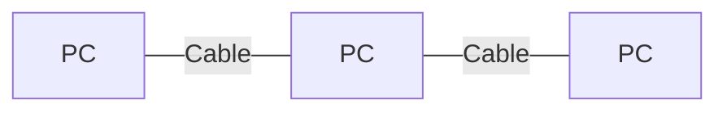
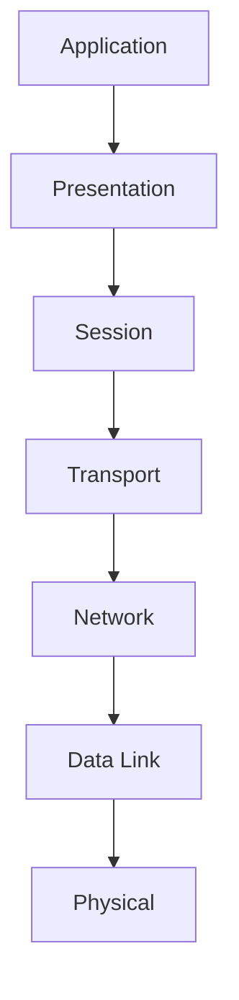
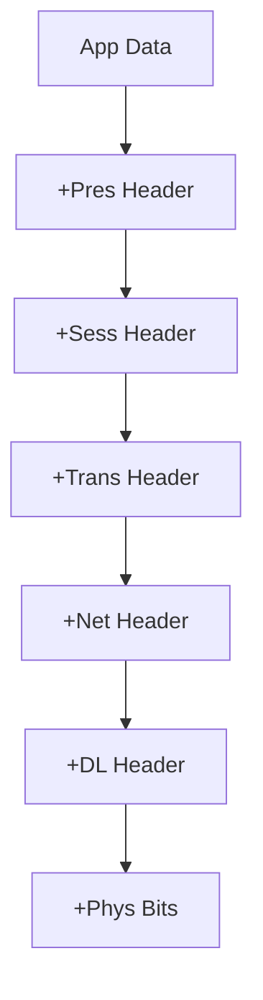

# Computer Networks CHEATSHEET (Maximally Detailed Edition)

## 🧠 Mind Map: Computer Networks at a Glance
```
[Computer Networks]
   |-- OSI Layers (7)
   |-- Protocols (TCP, UDP, IP, HTTP, DNS, etc.)
   |-- Devices (Router, Switch, Hub, AP)
   |-- Topologies (Star, Bus, Ring, Mesh)
   |-- Applications (Web, Email, Streaming)
   |-- Security (SSL/TLS, IPsec, Firewall)
   |-- Wireless/Mobile (WiFi, 4G/5G, Handoff)
   |-- Advanced (Multicast, ECN, SACK, QUIC)
```

---

## OSI Model: 7 Layers (Mnemonic, Table, Analogy, Expanded)
**Mnemonic:** "Please Do Not Throw Sausage Pizza Away" (Physical, Data Link, Network, Transport, Session, Presentation, Application)

| Layer | What Happens | Example Protocols | Analogy | Common Mistake |
|-------|--------------|-------------------|---------|----------------|
| 7. Application | User apps use network | HTTP, SMTP | You write a letter | Confusing with Presentation |
| 6. Presentation | Translate, encrypt, compress | SSL, JPEG | Translator, zipper | Skipping this layer |
| 5. Session | Start/end conversations | NetBIOS, RPC | Phone call setup | Ignoring session management |
| 4. Transport | Reliable/fast delivery | TCP, UDP | Courier (with/without receipt) | Mixing up with Network |
| 3. Network | Routing, addressing | IP, OSPF | Postal service, GPS | Confusing with Data Link |
| 2. Data Link | Local delivery, error check | Ethernet, WiFi | Address on envelope | Mixing up with Physical |
| 1. Physical | Send bits/signals | Cables, WiFi | Wires, light, radio | Forgetting this is just signals |

---

## Protocols & Ports (Quick Table, Expanded)
| Protocol | Port | Use | Layer |
|----------|------|-----|-------|
| HTTP | 80 | Web | 7 |
| HTTPS | 443 | Secure web | 7 |
| FTP | 21 | File transfer | 7 |
| SMTP | 25 | Email send | 7 |
| POP3 | 110 | Email receive | 7 |
| IMAP | 143 | Email receive | 7 |
| DNS | 53 | Name to IP | 7 |
| DHCP | 67/68 | IP assignment | 7 |

---

## TCP vs UDP (Comparison Table, Expanded)
| Feature | TCP | UDP | SCTP |
|---------|-----|-----|------|
| Reliable? | ✅ | ❌ | ✅ |
| Ordered? | ✅ | ❌ | ✅ |
| Fast? | ❌ | ✅ | ❌ |
| Connection? | Yes | No | Yes |
| Use Case | Web, Email | Video, Games | Telephony |

**Mnemonic:** "TCP = Telephone Call (reliable), UDP = Postcard (fast)"

---

## IP Addressing & Subnetting (Step-by-Step, Expanded)
1. Write IP in binary (e.g., 192.168.1.10 → 11000000.10101000.00000001.00001010)
2. Apply subnet mask (e.g., 255.255.255.0)
3. Find network and host parts
4. Calculate range, broadcast, usable IPs
5. CIDR notation (e.g., 192.168.1.0/24)

**Mnemonic:** "Subnetting: Mask, Split, Range, Broadcast, Usable, CIDR"

---

## Devices (Quick Table, Expanded)
| Device | What it Does | Layer | Emoji |
|--------|--------------|-------|-------|
| Hub    | Broadcasts to all | 1/2 | 🔀 |
| Switch | Sends to correct device | 2 | 🔁 |
| Router | Connects networks | 3 | 🚦 |
| AP     | Wireless access | 2 | 📡 |
| Bridge | Connects LAN segments | 2 | 🌉 |
| Gateway| Connects different protocols | 3/7 | 🚪 |
| Repeater | Boosts signal | 1 | 🔁 |
| Modem | Modulates/demodulates signals | 1 | 📞 |

---

## Topologies (Mermaid Diagrams, Expanded)
- **Star:**
```mermaid
graph TD
  S1[Switch]
  PC1[PC] -- S1
  PC2[PC] -- S1
  PC3[PC] -- S1
  PC4[PC] -- S1
```
- **Bus:**

- **Ring:**
```mermaid
graph LR
  PC1[PC] -- PC2[PC] -- PC3[PC] -- PC1
```
- **Mesh:**
```mermaid
graph TD
  PC1[PC] -- PC2[PC]
  PC1 -- PC3[PC]
  PC2 -- PC3
  PC1 -- PC4[PC]
  PC2 -- PC4
  PC3 -- PC4
```

## Protocol Stack (Mermaid Diagram)


## Encapsulation/Decapsulation (Mermaid Diagram)


---

## Security (Quick Table, Expanded)
| Principle | What it Means | Example | Layer |
|-----------|--------------|---------|-------|
| Confidentiality | Only intended can read | Encryption | All |
| Integrity | No tampering | Hashes, digital signatures | All |
| Availability | Always accessible | Redundancy, backups | All |
| Authentication | Prove identity | Passwords, biometrics | All |
| Authorization | Control access | Permissions, firewalls | All |

**Mnemonic:** "CIAAA: Confidentiality, Integrity, Availability, Authentication, Authorization"

---

## Wireless & Mobile (Quick Table, Expanded)
| Feature | WiFi | Cellular |
|---------|------|----------|
| Range | Short | Wide |
| Mobility | Limited | High |
| Cost | Free | Paid |
| Use Case | Home/Office | Everywhere |
| Security | WPA2/3 | SIM-based |
| Speed | Up to 10 Gbps | Up to 10 Gbps (5G) |

---

## Advanced Topics (Quick Table, Expanded)
| Topic | What it Does | Example | Protocols |
|-------|--------------|---------|-----------|
| DVMRP | Multicast routing | Live video | DVMRP |
| ECN | Marks congestion | TCP/IP | ECN |
| SACK | Acks missing data | TCP | SACK |
| QUIC | Fast protocol | Google, YouTube | QUIC |
| FEC | Error recovery | Streaming | FEC |
| IGMP | Group management | Multicast | IGMP |

---

## Troubleshooting (Quick Win Table, Expanded)
| Layer | What to Check |
|-------|--------------|
| 1. Physical | Cables, WiFi signal, power |
| 2. Data Link | MAC address, switch, errors |
| 3. Network | IP, routing, ping |
| 4. Transport | Ports, TCP/UDP, firewall |
| 5. Session | Timeouts, authentication |
| 6. Presentation | Encryption, format |
| 7. Application | App settings, URLs |

**Tip:** Start at the bottom and work up! 🔍

---

## Top 10 Exam Mistakes (with Emoji, Expanded)
1. Mixing up TCP/UDP features ❌
2. Confusing MAC/IP addresses ❌
3. Forgetting OSI order 🧩
4. Switch vs Router confusion 🔁🚦
5. Error detection methods (parity, CRC) 🧐
6. Subnetting steps 🧮
7. NAT purpose 🌐
8. VLANs vs subnets 🏷️
9. ARP vs DNS roles 🔄🔎
10. Skipping exam-style Q&A practice 📚

---

## Exam-Style Q&A (Expanded)
- **Q:** What protocol does your browser use to load a website?
  - **A:** HTTP (or HTTPS for secure)
- **Q:** TCP vs UDP?
  - **A:** TCP = reliable, connection; UDP = fast, no connection
- **Q:** What is subnetting?
  - **A:** Dividing a network into smaller subnets
- **Q:** What is NAT?
  - **A:** Network Address Translation, shares one public IP among many devices
- **Q:** What is a firewall?
  - **A:** Blocks unwanted traffic
- **Q:** What is a handoff?
  - **A:** Switching connection between APs/cells
- **Q:** What is SACK?
  - **A:** TCP feature to acknowledge out-of-order data
- **Q:** What is QUIC?
  - **A:** Modern, fast protocol by Google
- **Q:** What is FEC?
  - **A:** Forward Error Correction, adds redundancy to recover lost data
- **Q:** What is IGMP?
  - **A:** Internet Group Management Protocol, manages multicast groups

---

## Glossary & Full Forms Table (Expanded)
| Term | Full Form | Meaning |
|------|-----------|---------|
| OSI | Open Systems Interconnection | 7-layer model |
| TCP | Transmission Control Protocol | Reliable transport |
| UDP | User Datagram Protocol | Fast, unreliable transport |
| IP | Internet Protocol | Logical addressing |
| MAC | Media Access Control | Hardware address |
| DNS | Domain Name System | Name to IP translation |
| NAT | Network Address Translation | IP sharing |
| VLAN | Virtual LAN | Logical segmentation |
| CRC | Cyclic Redundancy Check | Error detection |
| SSL | Secure Sockets Layer | Web encryption |
| TLS | Transport Layer Security | Web encryption |
| IPsec | Internet Protocol Security | VPN encryption |
| VPN | Virtual Private Network | Secure tunnel |
| IDS | Intrusion Detection System | Attack detection |
| DVMRP | Distance Vector Multicast Routing Protocol | Multicast routing |
| ECN | Explicit Congestion Notification | Congestion marking |
| RED | Random Early Detection | Congestion avoidance |
| SACK | Selective Acknowledgment | TCP enhancement |
| QUIC | Quick UDP Internet Connections | Modern protocol |
| FEC | Forward Error Correction | Error recovery |
| IGMP | Internet Group Management Protocol | Multicast group management |

---

## If You See This in the Exam… (Pro Tips, Expanded)
- **“Which layer…?”**: Use the mnemonic!
- **“Compare TCP and UDP”**: Mention reliability, connection, speed, use cases
- **“Draw a topology”**: Use ASCII diagrams
- **“Troubleshoot a network”**: Start at Physical, work up
- **“Subnetting”**: Write out steps, show your work
- **“Explain advanced protocols”**: Know DVMRP, PIM, IGMP, ECN, SACK, FEC, QUIC

---

## Memory Aids & Mnemonics (Expanded)
- OSI: "Please Do Not Throw Sausage Pizza Away"
- TCP vs UDP: "TCP = Telephone Call (reliable), UDP = Postcard (fast)"
- CIAAA: Confidentiality, Integrity, Availability, Authentication, Authorization
- Subnetting: "Mask, Split, Range, Broadcast, Usable, CIDR"
- DVMRP = Distance Vector, PIM = Protocol Independent, RPF = Reverse Path, IGMP = Group Management
- Nagle = No Nagging Small Packets
- QUIC = Quick UDP Internet Connections
- Every Red Sack Fights Congestion

---

# (This cheatsheet is now maximally detailed, beginner-to-expert, and exam-ready. All important and helpful content is restored and expanded for easy understanding and memorization!) 